# Understanding Kubernetes Architecture and Internals

## How Things Ran Before cgroups

### Era 1: One App Per Physical Server (1970s–1990s)

The simplest era. You bought a server, you installed an OS, you installed an application. Process schedular, Memory, Disk and Network were all shared with host OS.

**Problems** : Wasted hardware, Slow procurement, No isolation between apps if you co-located them, Manual everything

### Era 2: chroot (1979 onward)

During the development of Unix V7 in 1979, the chroot system call was introduced, changing the root directory of a process and its children to a new location in the filesystem. This advance was the beginning of process isolation: segregating file access for each process.

| Problem | Status under chroot |
|---|---|
| Filesystem isolation | ✓ Yes |
| Process list isolation | ✗ No — `ps aux` saw everything |
| Network isolation | ✗ No — all chroots shared the same network stack |
| CPU limits | ✗ No |
| Memory limits | ✗ No |
| Disk I/O limits | ✗ No |
| Root user safety | ✗ No — root inside chroot could escape |

### Era 3: FreeBSD Jails and Solaris Zones (2000–2005)

**FreeBSD Jails (2000):**

In 2000, FreeBSD added Jails, Each jail got: own filesystem root (like chroot), own IP address, own process tree — `ps` inside the jail only showed the jail's processes, A constrained root user — root inside the jail couldn't affect the host

**Solaris Zones / Containers (2004):**

Zones added what Jails were missing: real resource controls. CPU shares, memory caps, I/O bandwidth — all enforced by the kernel. The combination of Solaris Zones and workload resource management became known as Solaris Containers, thus the term "container" entered our language.

**Why didn't this take over the world?** : FreeBSD and Solaris were minority operating systems. The web was running on Linux.

### Era 4: The Virtual Machine Stopgap (2001–2010)

A different path: **hardware virtualization**. VMware, Xen, KVM, and Hyper-V let you run multiple complete OS instances on one physical machine. Each VM had its own kernel, its own memory, its own virtual disk, its own NICs.

**What VMs solved** : Strong isolation, Resource caps, Multi-tenancy, Same hardware multiple OSes

**Problems** : Memory overhead, Disk overhead, Boot time, Hypervisor tax, Noisy neighbors, Operational complexity

### Namespaces (Linux 2.4.19, 2002 onward)

The idea behind a namespace is to wrap certain global system resources in an abstraction layer.

Namespaces solved **what a process can see**. Mount namespace (filesystem view), PID namespace (process list), network namespace (its own network stack), UTS namespace (its own hostname), IPC namespace (its own message queues), and later user and cgroup namespaces.

**Problem:** namespaces only handled visibility, not consumption.

### Google's internal problem (the catalyst)

Google was running this exact problem at planetary scale. They had thousands of services per machine, all competing. The kernel team at Google needed a way to say "Gmail backend gets 30% of this machine's CPU, web crawler gets 10%, ad serving gets 50%, system overhead gets 10%."

No such mechanism existed. So Process Containers (launched by Google in 2006) was designed for limiting, accounting and isolating resource usage (CPU, memory, disk I/O, network) of a collection of processes. It was renamed "Control Groups (cgroups)" a year later and eventually merged to Linux kernel 2.6.24.

### Insight That Made cgroups Work

The Google engineers (Paul Menage and Rohit Seth) recognized that all previous attempts had treated each resource separately and each process individually. Their insight was to treat resource control as a **hierarchical, group-level concern**:

- Create a named group of processes
- Attach controllers to that group: CPU controller, memory controller, I/O controller, network controller
- Each controller enforces its limit on the entire group, not on individual processes
- Groups can nest — `/production/databases/postgres` is a child of `/production/databases`, which is a child of `/production`
- A parent's limit caps the sum of its children

This gave Linux for the first time:

```
/production    (80% CPU, 100 GB RAM total)
├── /databases  (40% CPU, 60 GB RAM)
│   ├── /postgres (gets up to 40% CPU and 60 GB RAM)
│   └── /redis    (gets up to 40% CPU and 60 GB RAM, shares with postgres)
└── /webapps    (40% CPU, 40 GB RAM)
    ├── /api    (gets up to 40% CPU)
    └── /worker (gets up to 40% CPU)
```

Once cgroups landed in Linux 2.6.24 in 2008, the foundation for containers was complete. Combined with namespaces (for visibility) and a packaging layer (later, Docker), Linux finally had everything Solaris Zones had — but in mainline, free, on every Linux distribution.

## Origin story

**The lineage: cgroups → Borg → Omega → Kubernetes**

In 2006, Google engineers started work on "Process Containers" — later renamed cgroups (control groups) — which was merged into the Linux kernel in January 2008. This was the kernel feature that made all modern containerization possible.

Around the same time, Google built an internal system called **Borg** to schedule and manage its massive workloads across hundreds of thousands of machines. Borg was a cluster manager Google used internally to orchestrate workloads across massive numbers of servers. Search, Gmail, YouTube, Maps — everything Google ran was scheduled by Borg. Borg taught Google's engineers what worked and what didn't at planetary scale.

Borg had a successor at Google called **Omega**, which refined the architectural ideas — particularly the move toward an API-driven, declarative approach instead of imperative orchestration scripts.

**The 2013 turning point**

In March 2013, Docker had its initial public release. Suddenly, the broader industry had access to containers — but no good way to manage them at scale across many machines. Google had already solved that problem internally with Borg/Omega, and recognized the opportunity (and arguably inevitability) of an open-source cluster manager to complement Docker.

A small team at Google — Joe Beda, Brendan Burns, and Craig McLuckie, who were quickly joined by other Google engineers including Brian Grant and Tim Hockin — started building what would become Kubernetes.

**Naming and symbolism**

The original codename for Kubernetes within Google was Project 7, a reference to the Star Trek ex-Borg character Seven of Nine. The seven spokes on the wheel of the Kubernetes logo are a reference to that codename.

The public name came from Greek: Kubernetes means "helmsman" or "pilot" in Greek. Kubernetes is often abbreviated as K8s, counting the eight letters between the K and the s.

**Key dates**

June 6, 2014: The Kubernetes project is open-sourced with the first code commit pushed to GitHub. Just days later, on June 10th, Google's Eric Brewer announced Kubernetes to the world during a keynote at DockerCon 2014.

Kubernetes 1.0 was released on July 21, 2015. Google worked with the Linux Foundation to form the Cloud Native Computing Foundation (CNCF) and offered Kubernetes as a seed technology.

Unlike Borg, which was written in C++, Kubernetes source code is in the Go language — a deliberate choice for portability, simpler concurrency, and faster compilation.

**Why it succeeded over competitors**

By 2014, several container orchestrators existed or emerged simultaneously: Docker Swarm, Apache Mesos, and Nomad. By 2017 Kubernetes was already outpacing rival orchestration platforms (Docker Swarm, Apache Mesos, etc.) and was on its way to becoming the de facto industry standard for container orchestration. The early decision to open-source under CNCF had paid off: by fostering a multi-vendor community, Kubernetes evolved far faster than any proprietary project could.

The combination — **15 years of Borg lessons, Google's engineering credibility, immediate Docker compatibility, open-source from day one under a neutral foundation, and broad multi-vendor backing** (Microsoft, Red Hat, IBM, CoreOS) — made the outcome almost inevitable.

## Problems Kubernetes Solved

To understand the problems, think about what deploying an application looked like before Kubernetes existed.

### Era 1: The bare-metal / VM world (pre-2010)

You had VMs. You deployed apps directly onto them. Problems:

| Problem | What it looked like |
|---|---|
| **Environment drift** | "Works on my laptop, fails on production." Different OS versions, library versions, system packages on each machine |
| **Slow startup** | A new VM took minutes to boot. Scaling for traffic spikes was reactive, not real-time |
| **Wasted resources** | Each VM had a full OS — easily 1–2 GB RAM and significant CPU just for the OS, before the app even started |
| **Manual scaling** | Adding capacity meant filing tickets, provisioning hardware, configuring it, deploying code. Days or weeks |
| **Manual healing** | When a server died at 3 AM, an on-call engineer woke up, SSH'd in, restarted services or rebuilt the box |
| **Bin-packing was manual** | Engineers had to decide which app runs on which server, balancing CPU and RAM. As app count grew, this became impossible |

### Era 2: Docker arrives (2013) — solved some, created new ones

Docker solved the packaging problem brilliantly. Apps shipped with their dependencies. "Works on my laptop" became real.

But Docker only solved the **single-machine** problem. New problems appeared:

| Problem | What it looked like |
|---|---|
| **No multi-host scheduling** | If you had 50 servers, you still had to manually decide which Docker container ran where |
| **No service discovery** | Container IPs changed on every restart. How do other containers find them? Manual config files |
| **No automated healing** | If a container crashed, nothing brought it back |
| **No rolling updates** | Updating an app meant stopping all containers and starting new ones — downtime |
| **No load balancing across containers** | If you ran 3 copies of an app for HA, you had to set up an external LB and update it manually |
| **No persistent storage abstraction** | Containers were stateless by design. Storing data meant tying a container to a specific host |
| **No secret/config management** | Credentials lived in environment files copied around servers |
| **No multi-tenancy** | One team's runaway container could starve another team's container of CPU/RAM |

### What Kubernetes solved

This is what made Kubernetes succeed — it solved **all** of the above in one coherent system:

| Kubernetes feature | Problem solved |
|---|---|
| **Declarative state via YAML** | You describe *what* you want, not *how*. No more imperative deployment scripts |
| **Scheduler** | Automatically picks the best node for each pod based on resources, affinity, taints |
| **ReplicaSet / Deployment** | "Always keep 3 copies running." Crashed pod? Automatically replaced |
| **Services + kube-proxy** | Stable virtual IPs and DNS names regardless of pod IP churn. Built-in load balancing |
| **Rolling updates and rollback** | Zero-downtime deploys. Single command to undo a bad release |
| **ConfigMaps and Secrets** | Centralized config management. Same image, different configs per environment |
| **Persistent volumes** | Storage abstraction works across AWS EBS, GCP disks, NFS, Ceph. Same YAML, any backend |
| **Namespaces + RBAC** | Multi-tenancy. Multiple teams share one cluster safely |
| **HPA / VPA / Cluster Autoscaler** | Automatic scaling at three levels — pod replicas, pod resources, node count |
| **Self-healing** | Liveness/readiness probes. Crashed containers restart. Unhealthy nodes get pods rescheduled |
| **Ingress + Service mesh ecosystem** | HTTP routing, TLS termination, advanced traffic management |
| **CRDs + Operators** | Extend Kubernetes itself. Anything operational can become "code" |
| **Cloud-agnostic abstraction** | Same YAML runs on AWS, GCP, Azure, on-premises. Avoid vendor lock-in |

### How it compared to direct rivals

Container orchestration platforms like Kubernetes, Docker Swarm, Nomad, and Apache Mesos automate deployment, scaling, monitoring, and recovery of containerized applications, allowing organizations to maintain high availability, reduce downtime, and efficiently manage resources.

| | Docker Swarm | Apache Mesos | Kubernetes |
|---|---|---|---|
| Ease of setup | Easiest | Hardest | Medium |
| Built-in autoscaling | No — must be done manually or via third-party | Yes (via frameworks) | Yes (HPA built-in) |
| Built-in load balancing | Ingress only | No native | Yes (Services, Ingress) |
| Service discovery | Yes | No — third-party projects attempt to solve this | Yes (CoreDNS) |
| Scale ceiling | ~1,000 nodes | Tested up to 50,000 nodes | 5,000+ nodes |
| Ecosystem | Small | Smaller | Massive — CNCF |
| Workload types | Containers only | Containerized and non-containerized | Containers + VMs (via KubeVirt) |
| Active development | Mostly frozen | Declining | Most active OSS project |

Mesos was older and more battle-tested at extreme scale, but operationally complex. Swarm was simple but limited. Kubernetes hit the sweet spot — sufficient power, reasonable complexity, and the most active community.

## Kubernetes Milestones Timeline

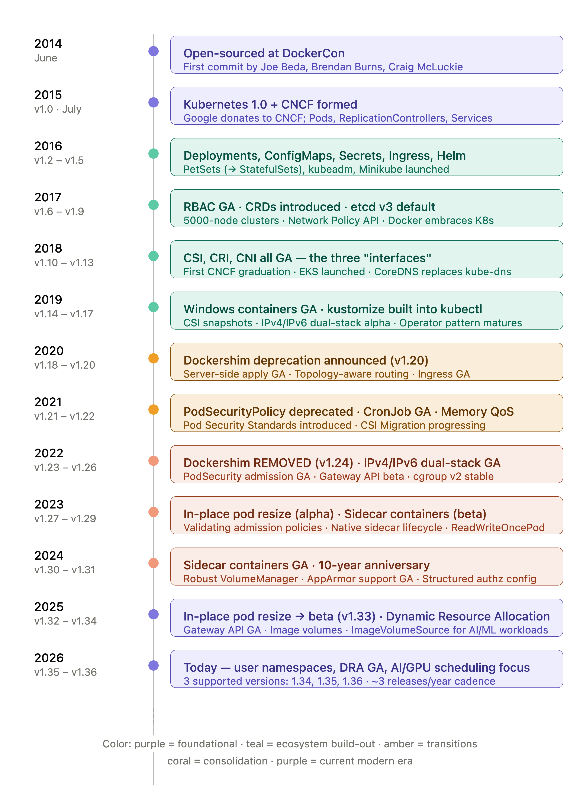

### 2014 — The Beginning

**June 6:** First commit pushed to GitHub. Joe Beda, Brendan Burns, and Craig McLuckie at Google, later joined by Brian Grant and Tim Hockin, start the project.

**June 10:** Eric Brewer announces Kubernetes at DockerCon 2014. The world sees it for the first time.

Why it mattered: Google chose to open-source Borg's successor concepts at exactly the moment Docker had created industry demand for container orchestration. The timing was decisive.

### 2015 — Kubernetes 1.0 and CNCF

**July 21:** Kubernetes 1.0 released. Marked production-ready. Concurrently, Google partners with the Linux Foundation to form the **Cloud Native Computing Foundation (CNCF)** and donates Kubernetes as the seed project.

**Why this was the decisive moment:** Kubernetes wasn't a Google product anymore — it belonged to a neutral foundation. This convinced Microsoft, AWS, IBM, Red Hat, and others to invest in it without fearing vendor lock-in. No competitor (Docker Swarm, Mesos) had this neutral governance.

Core primitives at 1.0:
- Pods (the unit of deployment)
- ReplicationControllers (predecessor to ReplicaSets)
- Services (stable networking)
- Labels and selectors
- Basic kubectl

### 2016 — The Building Blocks Year (v1.2 – v1.5)

The year Kubernetes became *usable*, not just possible.

| Release | Notable additions |
|---|---|
| **v1.2** (March) | Deployments (declarative rolling updates), ConfigMaps, horizontal scaling beta |
| **v1.3** (July) | Federation alpha, PetSets alpha (renamed StatefulSets later), Minikube launched |
| **v1.4** (Sept) | kubeadm introduced to improve installability, Helm matured |
| **v1.5** (Dec) | StatefulSets graduated to beta, PodDisruptionBudget beta, kubefed federation alpha, alpha support for Windows Server 2016 nodes |

Critical adds:
- **Deployments** replaced manual rolling updates. Single command rollback became possible.
- **StatefulSets** unlocked databases, queues, anything requiring stable identity.
- **Helm** gave the community its package manager.
- **Minikube and kubeadm** dropped the barrier to entry from "build your own cluster" to "one command."

### 2017 — Enterprise Readiness (v1.6 – v1.9)

The year Kubernetes became enterprise-grade. This is when serious adoption began.

**v1.6** (March): etcd v3 became default. Scale ceiling jumped to 5,000 nodes.

**v1.7** (June): Network Policy API graduated, StatefulSet updates introduced, API aggregation layer added in beta, allowing users to add Kubernetes-style pre-built, user-defined or 3rd party APIs. **Custom Resource Definitions (CRDs) introduced** — the foundation of every operator that came after.

**v1.8** (September): RBAC promoted to general availability — a fundamental building block for securing Kubernetes clusters. Roles Based Access Control (RBAC) promoted to general availability, and a stable release of the lightweight container runtime CRI-O.

Critical adds:
- **RBAC GA** — multi-tenancy became safe. Banks, governments, regulated industries could now adopt.
- **CRDs** — the extensibility model that birthed Prometheus Operator, cert-manager, Argo CD, Istio, and the operator ecosystem.
- **CRI** — separated Kubernetes from Docker forever. Suddenly containerd and CRI-O were viable runtimes.

Industry signal: **Docker, Inc. embraced Kubernetes** at DockerCon 2017. Microsoft launched AKS preview. AWS confirmed EKS would come.

### 2018 — The Three Interfaces Year (v1.10 – v1.13)

Kubernetes finalized its pluggability story with three standardized interfaces that decoupled it from any specific vendor:

- **CRI** (Container Runtime Interface) — pluggable runtimes
- **CNI** (Container Network Interface) — pluggable networking (Calico, Cilium, Flannel)
- **CSI** (Container Storage Interface) — pluggable storage (any vendor, any cloud)

Critical adds:
- **CSI** let storage vendors ship out-of-tree drivers. AWS EBS, GCP PD, Ceph, Portworx, Pure Storage — all became first-class.
- **CoreDNS replaced kube-dns** as the default cluster DNS in v1.13.
- **AWS EKS launched** (June 2018). All major clouds now had managed Kubernetes.
- Kubernetes became the **first project to graduate from CNCF** (March 2018) — formal recognition of maturity.

### 2019 — Broadening the Tent (v1.14 – v1.17)

**v1.14** (March): Windows containers GA. Kubernetes reached a significant milestone with the release of version 1.14, which introduced Windows container support. This broadened its appeal and usability across different operating systems.

**v1.14:** `kustomize` built into `kubectl` as `kubectl apply -k`.

**v1.16:** CRDs graduated to GA. The extensibility story was now production-ready.

Critical adds:
- **Windows support** brought enterprise .NET workloads into the fold.
- **kustomize integration** gave users a template-free alternative to Helm.
- **CSI snapshots, ephemeral volumes** — storage capabilities matured rapidly.
- The **operator pattern** matured. Operator Framework, Operator SDK, OperatorHub.io all became central.

### 2020 — Inflection Point (v1.18 – v1.20)

Kubernetes was the cloud-native standard by now. But this year planted the seeds of the biggest transition in its history.

**v1.18** (March): Server-side apply GA, topology-aware service routing.

**v1.19** (August): **Ingress GA** at last (it had been beta since 2015). Support cycle extended from 9 months to 12 months.

**v1.20** (December): **Dockershim deprecation announced.** The internet panicked, then engineers explained that this didn't mean "Docker images stop working" — it meant kubelet would stop bundling support for Docker's API. Images are OCI standard and still work.

Why dockershim mattered: Kubernetes had carried code to translate between kubelet and Docker since the beginning. After CRI matured, this layer was dead weight. Removing it cleaned up a major maintenance burden.

### 2021 — Security Reckoning (v1.21 – v1.22)

**v1.21**: PodSecurityPolicy deprecated. PSP was deprecated mainly because it was difficult to manage at scale, had confusing RBAC bindings, lacked audit or dry-run modes, and behaved inconsistently across clusters.

**v1.22**: 56 enhancements, RuntimeClass GA, Pod Security Standards as the replacement for Pod Security Policies. It's simpler, easier to use, and less complex than its predecessor.

Critical transitions:
- **PSP → Pod Security Admission**. PSP was the cluster-level admission controller pattern; PSS is namespace-level with three tiers (Privileged, Baseline, Restricted) and `enforce/warn/audit` modes.
- **CronJob GA** finally.
- **Memory QoS** with cgroup v2 became viable.

### 2022 — Major Cleanup (v1.23 – v1.26)

The year of removals and consolidation.

**v1.24** (May): Kubernetes 1.24 removed the support for Docker through Dockershim. The deprecation that started in 1.20 was complete. Anyone still using Docker as a runtime had to migrate to containerd or CRI-O, or use `cri-dockerd` as an external shim.

**v1.25** (August): PodSecurityPolicy was deprecated in v1.21 and completely removed in v1.25. Pod Security Admission becomes stable. Ephemeral Containers became stable — they can be used in a pod for inspection and troubleshooting when a container cannot be effectively kubectl exec'd.

**v1.26**: cgroup v2 stable. Gateway API beta — the eventual replacement for Ingress.

Other notable removals in this era: GlusterFS in-tree driver, OpenStack Cinder in-tree, Flocker, Quobyte, StorageOS — all migrated to CSI.

### 2023 — Quality of Life (v1.27 – v1.29)

The year of features that solved real production pain points.

**v1.27** (April): In-place pod resize introduced as alpha — allows users to resize CPU/memory resources allocated to pods without restarting the containers. The resources field in a pod's containers now allow mutation for cpu and memory resources. This was a long-requested feature. Before this, changing CPU/memory limits required a pod restart, blocking VPA in production.

**v1.28** (August): Sidecar containers became beta. The new sidecar feature enables restartable init containers — implemented as init containers with restartPolicy: Always that start before application containers, run throughout the pod lifecycle.

**v1.29** (December): Sidecar Containers feature, allowing for the deployment of additional containers alongside the main container in a Pod. In-Place Update of Pod Resources. Common Expression Language (CEL) for Admission Control & CRD Validation.

Critical adds:
- **Sidecar containers as first-class** finally fixed a years-old pain point — sidecars (Istio proxies, log shippers) used to terminate before the main container, breaking logs and metrics on shutdown. Now they have proper lifecycle.
- **CEL for admission control** — replaces the need to write custom admission webhooks for many use cases.
- **ValidatingAdmissionPolicy** — declarative policy without a webhook server.

### 2024 — Maturity (v1.30 – v1.31) and Ten-Year Anniversary

**June 6, 2024:** Kubernetes turns 10. The project is now the largest CNCF graduated project, runs at every major cloud, and powers most production internet workloads.

**v1.30**: Support for using Common Expression Language (CEL) for admission control. Beta support for Linux-based user namespacing in Pods, which can help contain security risks.

**v1.31**: AppArmor support GA, robust VolumeManager reconstruction (no more "stuck volumes" after kubelet restarts).

The cadence shifted: Kubernetes ships a new minor version approximately every 3 months, targeting January, April, July, and October. Three releases per year became the norm.

### 2025 — In-Place Resize Matures, AI Workloads Emerge (v1.32 – v1.34)

**v1.33** (April): In-Place Pod Resize Graduated to Beta. Modifying Pod resources must now be done via the Pod's resize subresource. Resize Status via Conditions: PodResizePending and PodResizeInProgress. Sidecar Support: Resizing sidecar containers in-place is now supported.

**v1.34**: In-Place Pod Resource Resize promoted to beta, allowing dynamic updates to CPU and memory resources for existing Pods without restarts — enabling vertical scaling of stateful workloads with zero downtime. Sidecar Containers Now Stable, implementing sidecars as special init containers with restartPolicy: Always that start before application containers, run throughout the pod lifecycle.

Critical theme: **AI/ML workloads.** Dynamic Resource Allocation (DRA) replaces the older device plugin framework for GPUs and accelerators. Image volumes (mounting OCI artifacts as volumes) target model weight distribution. Multi-cluster scheduling work intensifies.

### 2026 — Today (v1.35 – v1.36)

The Kubernetes project maintains release branches for the most recent three minor releases (1.36, 1.35, 1.34). Kubernetes 1.19 and newer receive approximately 1 year of patch support.

Current focus areas:
- **User namespaces graduating** (1.35 beta) — containerized root no longer means host root
- **Dynamic Resource Allocation maturing** for AI/GPU workloads
- **In-place resize on the path to GA**
- **Sidecar containers stable**, ecosystem catching up
- **Gateway API GA** — modern replacement for Ingress, supports L4 and L7

### The Patterns Across Twelve Years

A few themes are visible when you step back from this timeline:

**Decoupling from Docker.** This took six years (2015 CRI introduced → 2017 CRI GA → 2020 dockershim deprecated → 2022 dockershim removed). Kubernetes started as "Docker orchestration" and ended as a container-runtime-agnostic platform.

**The interface pattern.** Three letters that explain Kubernetes' success: CRI (runtimes), CNI (networking), CSI (storage). Each let vendors build without modifying Kubernetes core. The same pattern was later applied to device plugins (GPUs), the metrics API, custom schedulers, and admission control.

**CRDs unlocked the ecosystem.** Adding CRDs in 2017 turned Kubernetes from a container platform into a *platform for building platforms*. Every operator — Prometheus, cert-manager, ArgoCD, Crossplane, Strimzi — exists because CRDs exist.

**Steady removals.** Kubernetes has aggressively deprecated and removed features it learned were wrong: PSP, dockershim, in-tree volume drivers, beta APIs. Few projects of this scale maintain that discipline. It's why upgrades stay possible.

**Security maturation in waves.** RBAC (2017) → NetworkPolicy (2017) → PodSecurityPolicy → Pod Security Admission (2022) → ValidatingAdmissionPolicy with CEL (2024) → User namespaces (2025+). Each wave addressed gaps the previous one revealed.

**From orchestration to platform.** Early Kubernetes was *how* to run containers. Modern Kubernetes is the *API* for running anything — Pods, VMs (via KubeVirt), serverless (Knative), batch ML jobs, AI inference. The container is one workload type among many now.

The trajectory points clearly forward: more workload types (AI especially), better in-place mutability, tighter security defaults, and a continued shift toward declarative everything — including policy, networking, and now resource allocation itself.

## Architecture Deep Dive

### Layer 1 : High level architecture

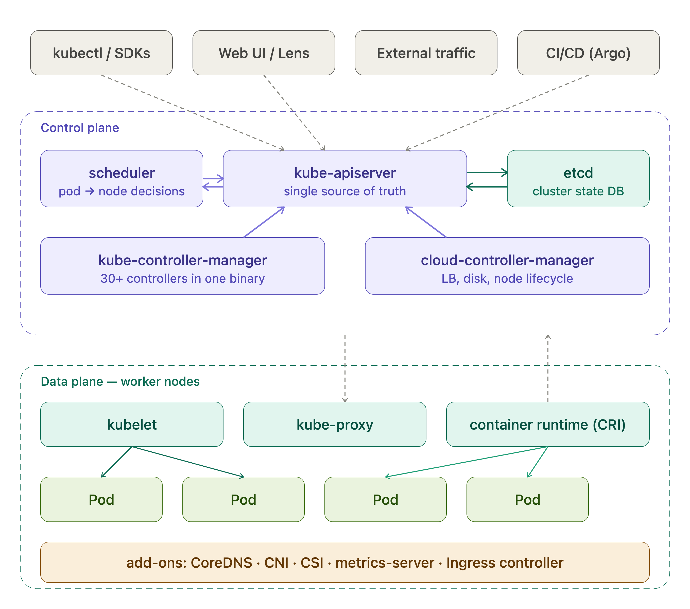

The cluster splits into two planes. The **control plane** makes decisions — what should run, where, and how many. The **data plane** (worker nodes) executes those decisions. The **API server is the only component anything talks to** — controllers, kubelets, kubectl, operators all go through it. Nothing else touches etcd. This single-entry-point design is what makes Kubernetes secure, auditable, and consistent.

The control plane components are themselves stateless. All state lives in etcd. You can kill the scheduler, restart it, and it picks up immediately because all its inputs come from the API server.

Everything sits in one of two zones: the *control plane* (the brain) and the *worker nodes* (the muscles).

**Request flow — what happens when you run `kubectl apply`**

1. `kubectl` sends a REST request to the **API server**.
2. The API server authenticates you, checks RBAC, runs admission webhooks, validates the schema, then writes the object to **etcd**.
3. The relevant **controller** (e.g. Deployment controller inside `kube-controller-manager`) is watching the API server via an Informer. It sees the new object and creates a ReplicaSet + unscheduled Pods.
4. The **Scheduler** sees unscheduled pods, scores every node (CPU, memory, affinity, taints), picks the best one, and writes the node assignment back to the API server.
5. The **Kubelet** on that node is watching the API server. It sees a pod assigned to it, calls the **container runtime** (containerd) via CRI, which pulls the image and starts the container.
6. Kubelet mounts **Secrets, ConfigMaps, and Volumes** into the pod.
7. **kube-proxy** on every node watches for Service changes and updates `iptables`/IPVS rules so traffic routes correctly to the new pod.
8. Kubelet continuously runs liveness/readiness probes and reports pod status back to the API server → etcd.

### Layer 2 : The Declarative Control Loop

The most important architectural idea in Kubernetes: **everything is a control loop**.

You don't tell Kubernetes "create 3 pods." You tell it "the desired state is 3 pods running." A controller continuously compares desired state to actual state and works to close the gap. If a pod dies, the actual state diverges from desired — and the controller acts to restore it.

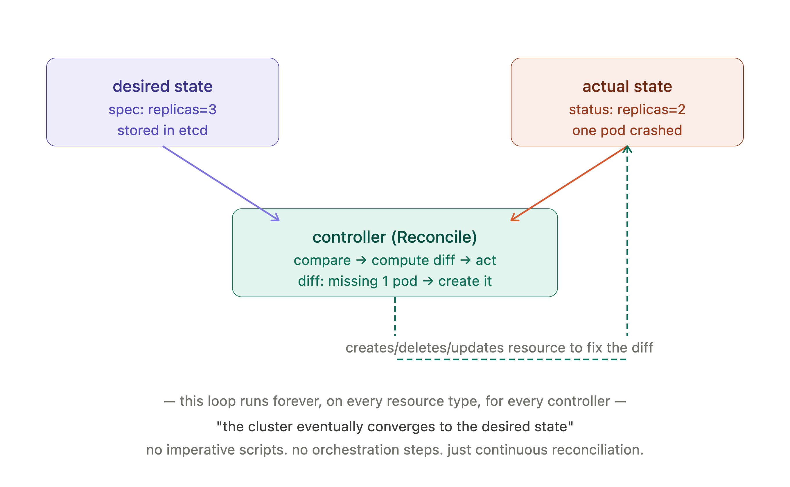

Kubernetes uses a set of independent, composable control processes (controllers) that continuously drive the current state towards a desired state. This is the move away from traditional orchestration. Traditional orchestration says "first do A, then B, then C." Kubernetes says "this is the target — figure out how to get there, and keep us there."

The Deployment controller, ReplicaSet controller, Endpoints controller, Node controller — every one of these is the same shape: watch, compare, act. Your custom operators follow the exact same pattern. This is what makes the system extensible. Adding a new behavior means adding a new controller — not modifying the core.

### Layer 3 : The Complete Lifecycle of a Deployment

This is what actually happens when you run `kubectl apply -f deployment.yaml`. Every numbered step involves a different component.

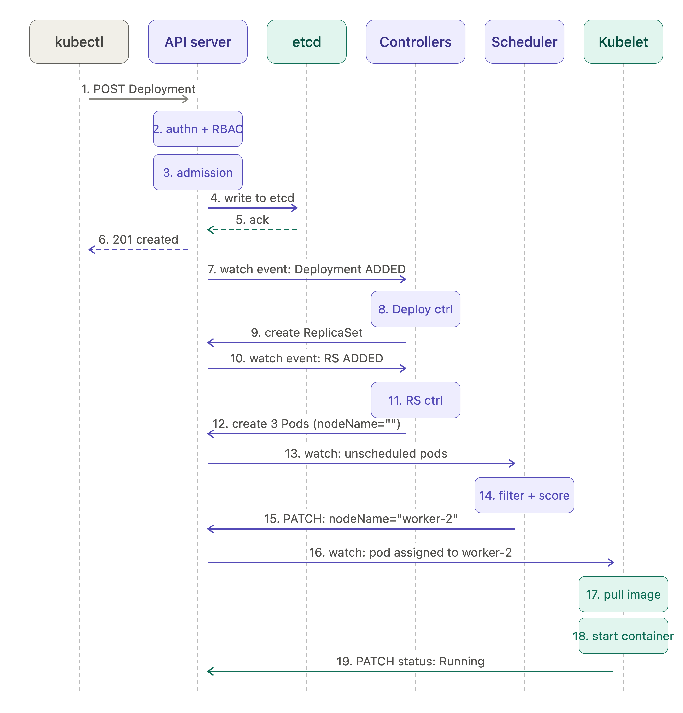

Let me walk through what's happening at each step in plain terms:

**Steps 1–6 — the API server admission pipeline.** Your YAML arrives. The API server authenticates you, runs RBAC checks, then passes the object through admission webhooks (which can mutate or validate it), then schema validation, and finally writes the Deployment object to etcd. Only after etcd confirms the write does the API server return success to kubectl.

**Steps 7–8 — Deployment controller wakes up.** It has a watch open on the Deployment resource. The API server pushes the ADD event over that watch connection. The Deployment controller's reconcile function fires.

**Steps 9–12 — controller cascade.** The Deployment controller creates a ReplicaSet (one level down). That triggers the ReplicaSet controller's watch, which creates 3 Pod objects — but critically, the pods have `nodeName: ""` (empty). They exist in etcd but aren't running anywhere yet. Status: `Pending`.

**Steps 13–15 — scheduler claims the pods.** The scheduler is watching specifically for pods where `nodeName == ""`. It sees three. For each one it runs the filter phase (eliminate nodes that can't run this pod) and the score phase (rank the remaining nodes). It picks the best node and patches the pod with the chosen `nodeName`.

**Steps 16–18 — kubelet picks it up.** The kubelet on worker-2 has a watch filtered to "pods assigned to me." It sees the new pod, calls the container runtime (containerd or CRI-O) over the CRI gRPC interface to pull the image, set up cgroups, configure networking via CNI, mount volumes, and finally start the container.

**Step 19 — status closes the loop.** Kubelet patches the pod's `status` field on the API server with `phase: Running`. This propagates back to anyone watching — including kubectl if you ran `kubectl get pods -w`.

**Why this design is brilliant:** every component does one thing and only talks to the API server. The Deployment controller doesn't know how scheduling works. The scheduler doesn't know about container runtimes. The kubelet doesn't know about ReplicaSets. You can replace any component with a custom one (e.g. a GPU-aware scheduler) without touching the others.


### Layer 4 : How Components Stay in Sync

Every component uses the same mechanism to stay updated: **a long-lived HTTP watch connection to the API server**. This is *not* polling.

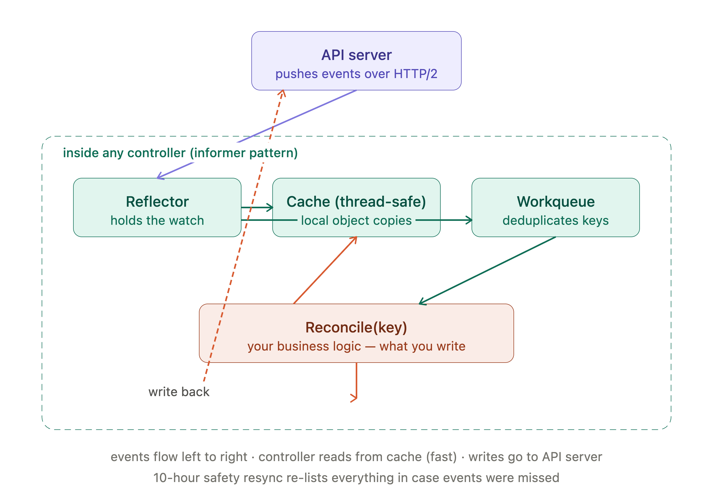

This pattern is called the **informer pattern**, and it's how every controller, kubelet, kube-proxy, CoreDNS, and your custom operators all stay in sync.

The Reflector holds one long-lived HTTP/2 connection to the API server with a watch request. The API server pushes ADD/UPDATE/DELETE events down that connection the moment something changes in etcd. The Reflector writes the full object into a local thread-safe Cache (a hash table indexed by namespace/name). It also enqueues just the *key* into the Workqueue.

The Workqueue does three important things:
- **Deduplicates**: 100 events for the same object collapse to 1 key. Your Reconcile runs once with the latest state.
- **Rate-limits**: exponential backoff (5ms → 1000s) when Reconcile fails.
- **Parallelism**: multiple worker goroutines pop keys concurrently.

Your Reconcile function pops a key, looks up the object in the local Cache (no API call — microsecond latency), compares spec to status, and calls the API server to fix any diff.

**The reason this scales:** thousands of watch connections are cheap because the API server doesn't push if nothing changes. But thousands of `kubectl get` polls every second would crush it. Reads are always from the local cache. Writes are always through the API server. This separation is what lets a single cluster handle 5,000+ nodes and hundreds of thousands of objects.

### The Architectural Principles That Make It Work

Pulling it all together, six design decisions explain why Kubernetes succeeded where others struggled:

**Declarative, not imperative.** You describe the goal. Controllers figure out how to reach it. This eliminates an entire class of bugs around partial deployments and orchestration sequence errors.

**Single source of truth.** All state lives in etcd, accessed only through the API server. This makes the system auditable, secure, and consistent. There is no second place to look.

**Decoupled controllers.** Every controller does one thing. They don't know about each other. They only know the API server. This means you can extend the system endlessly without modifying the core.

**Level-triggered, not edge-triggered.** Controllers don't react to "an event happened" — they react to "the current state differs from desired state." If a controller is restarted, it picks up wherever things are, no special recovery logic needed.

**API-driven extensibility.** Custom Resource Definitions let anyone add new object types. Operators let anyone add new controllers. The same patterns used internally are exposed externally. The mechanism that runs Deployments is the same mechanism that runs your custom Database resource.

**Eventual consistency over strict consistency.** The system promises to converge to desired state — not that every part is in sync at every instant. This is what lets it handle node failures, network partitions, and rolling updates without manual intervention.

Understanding this lineage is critical because Kubernetes' architecture — specifically its use of API-driven control loops and decoupled scheduling — is a direct result of lessons learned from running these massive internal systems at Google. Borg ran for fifteen years before any of this was open-sourced. Kubernetes is what those fifteen years taught Google about how to manage applications at scale.

## Control Plane

**What it is:** The brain of the cluster. It makes all decisions — scheduling, scaling, healing.

| Component | Job |
|---|---|
| **kube-apiserver** | single entry point to the cluster database etcd. |
| **etcd** | Distributed key-value DB. Stores all cluster state. Source of truth. |
| **kube-scheduler** | Watches for unscheduled pods, picks best node based on resources, affinity, taints |
| **kube-controller-manager** | Runs all built-in controllers in one process |
| **cloud-controller-manager** | Provisions cloud LBs, disks, node IPs |

**Important facts:**
- In production, run **3 or 5 control plane replicas** for HA (odd number = etcd quorum).
- Worker nodes can run without the control plane temporarily — existing pods keep running.
- etcd is the most critical piece — **back it up regularly**.
- Control plane nodes should **not** run workloads (use taints to prevent this).

### Control Plane HA

The control plane does not run on a single node in production. It runs on multiple nodes (typically 3 or 5) for high availability.

**What each component does under failure:**

| Component | HA mechanism |
|---|---|
| etcd | Raft consensus. 3 nodes = tolerates 1 failure. If leader dies, remaining nodes elect a new leader in seconds |
| API server | Stateless. Multiple replicas sit behind a load balancer. One dies → others keep serving |
| Scheduler | Active/standby leader election. Only one schedules at a time; if it dies the standby takes over |
| Controller manager | Same as scheduler — leader election, one active at a time |

**What happens to running workloads if the entire control plane goes down?**

Existing pods keep running. The kubelet on each worker node runs them independently. The control plane going down means:
- No new pods can be scheduled
- No scaling or healing happens
- `kubectl` commands fail
- But your live application traffic continues uninterrupted

This is why Kubernetes is used for reliability — your app stays up even during control plane maintenance.

## Worker Node

**A worker node is simply a machine (VM or bare metal) that runs your application pods.** The control plane decides *what* to run; the worker node *actually runs it*.

**Why use worker nodes separately from the control plane?**

- Separation of concerns — you don't want your database pods competing for CPU with the scheduler. Worker nodes are also the thing you scale horizontally: need more capacity? Add more worker nodes.

**Who manages worker nodes?**

- In managed Kubernetes (EKS/GKE/AKS): the cloud provider manages the node OS, patching, and replacement. You manage node count and size via node groups/auto-scaling.
- In self-hosted: you manage everything — OS updates, kubelet version, disk, network. Tools like `kubeadm` help join nodes to the cluster.

The control plane manages nodes **logically** — the Node controller watches node health, marks them `NotReady` if they stop reporting, and evicts pods after a timeout (default 5 minutes).

## Node Group

A node group (also called a node pool) is a set of worker nodes that share the same configuration: same VM size, same OS image, same labels, same taints.

Why it matters: you often need different types of nodes for different workloads.

```
Cluster
├── node-group: general     (4 CPU, 16GB)  — web servers, APIs
├── node-group: compute     (32 CPU, 64GB) — batch processing
└── node-group: gpu         (8 GPU, 128GB) — ML training
```

You schedule pods onto a specific group using `nodeSelector` or `nodeAffinity`. The cluster autoscaler scales each group independently — if your ML jobs pile up, only the GPU group scales out.

**Must know facts**
- Node groups and Node pools are mostly synonymous. EKS managed node groups are an abstraction *on top of* ASGs. AWS handles the lifecycle, AMI updates, and cordon-drain-replace during upgrades. You configure: instance types, min/max size, subnets, labels, taints. EKS creates the underlying ASG.
- You use **nodeSelector**, **taints**, or **affinity** to target workloads to the right pool.
- **Karpenter** removes the need for pre-defined pools — it provisions instances directly based on pending pod requirements, no ASGs.

## Remembering Kubernetes YAML Structure

Every Kubernetes object follows the same four-field skeleton:

```yaml
apiVersion: <group>/<version>    # WHERE in the API this lives
kind: <Type>                     # WHAT object this is
metadata:                        # WHO this object is (name, namespace, labels)
  name: my-object
  namespace: default
  labels:
    key: value
spec:                            # WHAT YOU WANT (desired state)
  ...
```

A fifth field `status` is added by Kubernetes itself — you never write it.

**Remembering apiVersion:**

The pattern is `<group>/<version>`. Core objects (Pod, Service, ConfigMap, Secret, PersistentVolume) have no group — they use just `v1`.

| Kind | apiVersion |
|---|---|
| Pod, Service, ConfigMap, Secret, PV, PVC, Namespace | `v1` |
| Deployment, ReplicaSet, StatefulSet, DaemonSet | `apps/v1` |
| Ingress | `networking.k8s.io/v1` |
| HPA | `autoscaling/v2` |
| NetworkPolicy | `networking.k8s.io/v1` |
| CronJob, Job | `batch/v1` |
| Role, ClusterRole | `rbac.authorization.k8s.io/v1` |
| CRDs | `apiextensions.k8s.io/v1` |
| StorageClass | `storage.k8s.io/v1` |

**Remembering spec structure — the "owns pods" pattern:**

Any object that owns pods has this nested structure:

```yaml
spec:
  replicas: 3            # how many pods
  selector:              # which pods this object manages
    matchLabels:
      app: web
  template:              # pod template (what the pods look like)
    metadata:
      labels:
        app: web         # must match selector
    spec:                # this is the actual pod spec
      containers:
        - name: web
          image: nginx
```

**The mental mnemonic: "AKMS"**

```
A — apiVersion  (group/version, or just v1 for core)
K — kind        (the object type)
M — metadata    (name, namespace, labels)
S — spec        (what you want)
```

Every YAML you write starts with these four. The only thing that changes is what goes inside `spec` — and that's unique per `kind`.

## Object

A **Kubernetes object** is a persistent record in the cluster's database (etcd) that describes *what you want*. Examples: Pod, Service, Deployment, ConfigMap, Secret, Node, Namespace.

Every object has:
- **spec** — desired state (you write this)
- **status** — actual state (Kubernetes writes this)

**How they fit:**
```
You → kubectl → API Server → etcd (stores object)
                     ↓
                Controllers watch → make real world match spec
                     ↓
                Kubelet runs pods on nodes
```

Objects are the *nouns* of Kubernetes. Controllers are the *verbs*.

## Controller

Kubernetes ships a binary called `kube-controller-manager` that bundles ~30 built-in controllers, one per resource type: Deployment controller, ReplicaSet controller, Node controller, Job controller, etc.

Exceptions:
- One controller can watch *multiple* resources (Deployment controller watches Deployments *and* the ReplicaSets it owns).
- Custom resources need you to provide the controller (no controller = CRD does nothing).

## kube-system namespace

`kube-system` is a reserved namespace where Kubernetes runs its own internal components as pods. You never deploy your apps here.

**What runs there:**

| Pod | Purpose |
|---|---|
| `coredns-*` | Cluster DNS server |
| `kube-proxy-*` | iptables/IPVS rules on every node |
| `etcd-*` | etcd (in self-managed clusters) |
| `kube-apiserver-*` | API server (in self-managed clusters) |
| `kube-scheduler-*` | Scheduler |
| `kube-controller-manager-*` | Controller manager |
| `metrics-server-*` | CPU/RAM metrics for HPA and `kubectl top` |

**Must-know facts:**
- On managed clusters (EKS/GKE), control plane pods don't appear here — they're hidden on the provider's infrastructure.
- These pods are "static pods" on control plane nodes — managed by kubelet directly from files in `/etc/kubernetes/manifests/`, not by the API server.
- Don't delete or modify resources here unless you know exactly what you're doing.
- RBAC in this namespace is heavily locked down.


## etcd

etcd is a distributed key-value store. Think of it as the cluster's single source of truth — a simple database where every Kubernetes object (pods, services, secrets, configmaps, nodes) lives as a JSON blob under a path like `/registry/pods/default/my-pod`.

**Why is it used?**
Kubernetes needs a durable, consistent place to store cluster state. etcd provides:
- Strong consistency (every read sees the latest write)
- Watch API (push changes to subscribers immediately)
- Distributed consensus via the Raft algorithm

**Must-know facts:**

| Fact | Detail |
|---|---|
| Only the API server talks to etcd | No other component reads/writes etcd directly |
| Raft consensus | Requires a quorum — majority of nodes must agree. Run 3 or 5 nodes for HA, never 2 or 4 |
| Quorum math | 3 nodes → tolerates 1 failure. 5 nodes → tolerates 2 failures |
| Data format | Protobuf (binary, not plain JSON) |
| Default port | 2379 (client), 2380 (peer-to-peer) |
| Watch API | Clients open a long-lived connection; etcd pushes every change instantly |
| Backup | Critical. Use `etcdctl snapshot save`. A lost etcd = lost cluster state |
| Size limit | Default 2 GB, max 8 GB. Large clusters need compaction and defragmentation |
| Encryption at rest | Not on by default. Enable via `--encryption-provider-config` on the API server |
| Managed K8s | EKS/GKE/AKS manage etcd for you — you never touch it |

### How etcd Stores Data During a Deployment

etcd stores everything as **JSON-encoded objects** (actually Protocol Buffers, but conceptually JSON) under a hierarchical key path.

**Key format:** `/registry/<resource>/<namespace>/<name>`

Walking through a `kubectl apply deployment.yaml`:

**T+0 — Before apply:**
```
etcd contents:
  (no entries for our app)
```

**T+1 — Deployment object written:**
```
/registry/deployments/default/web-app  →  {
  "spec": {"replicas": 3, "template": {...}},
  "status": {},
  "metadata": {"resourceVersion": "1001"}
}
```

The resourceVersion is etcd's revision number. Every write increments it globally.

**T+2 — Deployment controller creates ReplicaSet:**
```
/registry/deployments/default/web-app             (rv 1001)
/registry/replicasets/default/web-app-7d4b9c     (rv 1002)  ← new
```

**T+3 — ReplicaSet controller creates 3 Pods (no node yet):**
```
/registry/deployments/default/web-app             (rv 1001)
/registry/replicasets/default/web-app-7d4b9c     (rv 1002)
/registry/pods/default/web-app-7d4b9c-abc1       (rv 1003)  ← new
/registry/pods/default/web-app-7d4b9c-xyz2       (rv 1004)
/registry/pods/default/web-app-7d4b9c-def3       (rv 1005)
```

Pods exist in etcd before they exist on any node. Their `spec.nodeName` is empty. Their `status.phase` is `Pending`.

**T+4 — Scheduler assigns nodes (patches pods):**
```
/registry/pods/default/web-app-7d4b9c-abc1       (rv 1006)
  spec.nodeName: "worker-1"      ← patched
/registry/pods/default/web-app-7d4b9c-xyz2       (rv 1007)
  spec.nodeName: "worker-2"
/registry/pods/default/web-app-7d4b9c-def3       (rv 1008)
  spec.nodeName: "worker-3"
```

**T+5 — Kubelet on each worker starts containers and reports status:**
```
/registry/pods/default/web-app-7d4b9c-abc1       (rv 1009)
  status.phase: "Running"
  status.podIP: "10.0.1.5"
  status.containerStatuses: [{ready: true, restartCount: 0}]
```

**T+6 — Endpoints controller updates EndpointSlice as pods become Ready:**
```
/registry/endpointslices/default/web-app-abcd    (rv 1012)
  endpoints: [
    {addresses: ["10.0.1.5"], conditions: {ready: true}},
    {addresses: ["10.0.2.7"], conditions: {ready: true}},
    {addresses: ["10.0.3.8"], conditions: {ready: true}}
  ]
```

**Each write is a separate etcd transaction.** The resourceVersion is global — every write to any key bumps it. This is how watch clients track progress.

**etcd internally uses MVCC (multi-version concurrency control)** — old versions are kept briefly to support watch resumes and historical reads. Old versions are eventually compacted.

You can inspect this directly:

```bash
ETCDCTL_API=3 etcdctl get /registry/pods/default/web-app-7d4b9c-abc1
```

The output is binary protobuf, but tools can decode it.

## Raft Consensus Algorithm

Raft solves one problem: how do multiple servers agree on a single value even when some servers crash?

**The analogy: a team with one leader**

Imagine 3 people (A, B, C) must always agree on "what is the latest cluster state."

Rules:
- One person is elected leader. Only the leader accepts new writes.
- Before confirming a write, the leader asks the others: "did you get this?" At least a majority must say yes before the write is committed.
- If the leader goes silent, the others hold an election and pick a new leader.

**Mapped to etcd:**

```
Client writes "pods/my-pod = running"
       ↓
Leader etcd node receives it
       ↓
Leader replicates to followers: "append this to your log"
       ↓
Majority (2 of 3) confirm receipt
       ↓
Leader commits and replies "success" to client
       ↓
If leader crashes → followers detect timeout →
election → new leader in ~150-300ms
```

**The crux:** A write only succeeds if the majority agrees. This means you can never have two conflicting "truths" — only one majority can exist at a time. With 3 nodes, 1 can die and writes still succeed (2 of 3 = majority). With 5 nodes, 2 can die.

## kubeConfig

A kubeconfig is a YAML file that tells `kubectl` (or any Kubernetes client) **how to connect to a cluster and as whom**. Without it, kubectl has no idea where the API server is or what credentials to use.

kubectl looks for kubeconfig in this order:

```
1. --kubeconfig=/path/to/file    flag wins
2. $KUBECONFIG env var           can be colon-separated list (merges multiple)
3. ~/.kube/config                default location
```

**What it contains**

Three sets of objects, joined by named contexts:

```
clusters    — where is the API server? what's its CA cert?
users       — who am I? (credentials)
contexts    — combine cluster + user + namespace = a usable identity
current-context — which context is active right now
```

**Example ~/.kube/config**

```yaml
apiVersion: v1
kind: Config

clusters:
  - name: prod-cluster
    cluster:
      server: https://api.prod.example.com:6443     # API server URL
      certificate-authority-data: LS0tLS1CRUdJTi...  # base64 CA cert
  - name: dev-cluster
    cluster:
      server: https://192.168.50.10:6443
      insecure-skip-tls-verify: true                # dev only

users:
  - name: alice@prod
    user:
      client-certificate-data: LS0tLS1CRUdJTi...    # client cert
      client-key-data: LS0tLS1CRUdJTi...            # private key
  - name: alice@dev
    user:
      token: eyJhbGc...                              # bearer token
  - name: alice@eks
    user:
      exec:                                          # dynamic credential
        apiVersion: client.authentication.k8s.io/v1
        command: aws
        args: [eks, get-token, --cluster-name, prod]

contexts:
  - name: prod
    context:
      cluster: prod-cluster
      user: alice@prod
      namespace: payments                            # default namespace
  - name: dev
    context:
      cluster: dev-cluster
      user: alice@dev
      namespace: default

current-context: prod
```

When you run `kubectl get pods`, it reads `current-context: prod`, finds the matching context, uses `prod-cluster`'s server URL with `alice@prod`'s credentials, and lists pods in the `payments` namespace.

**Must-know facts**

-  AWS EKS : `aws eks update-kubeconfig --name my-cluster` appends/updates a context 
- Internal pods (ServiceAccount) : kubelet auto-mounts a kubeconfig-equivalent at `/var/run/secrets/kubernetes.io/serviceaccount/`
- Use `kubectx`, set a colored prompt, or in CI pipelines always use `--context=` flag explicitly.

| Fact | Detail |
|---|---|
| Multiple contexts in one file | Standard practice — one file, many clusters |
| Active context | Stored as `current-context` in the file itself, not as state |
| Bearer token vs client cert | Tokens common in managed clouds and ServiceAccounts; certs in self-managed |
| `exec` plugins | Most managed clusters use them — kubectl calls `aws`/`gcloud` to get a fresh token per request |
| Cluster name is local | The name in your kubeconfig has nothing to do with the cluster's actual name |
| **Most dangerous gotcha** | Wrong context = right command, wrong cluster. Use [`kube-ps1`](https://github.com/jonmosco/kube-ps1) or [`kubectx`](https://github.com/ahmetb/kubectx) to show current context in your shell prompt |
| In-cluster pods | Don't use kubeconfig — they use the ServiceAccount mounted at `/var/run/secrets/kubernetes.io/serviceaccount/` |
| Permissions | Only `kubectl auth can-i` shows what you can actually do — having a context doesn't mean you have RBAC permission |

## kube-apiServer

**What it is:** The **single entry point** to the cluster. Nothing talks to etcd directly — everything goes through the API server.

```
kubectl / operator / kubelet / controller
              ↓
         API Server          ← the only door
              ↓
            etcd             ← the database
```

**Stages every request passes through:**

```
Request → Authentication → Authorization → Admission Control → Validation → etcd
```

| Stage | What happens |
|---|---|
| **Authentication** | Who are you? (certificate, token, OIDC) |
| **Authorization** | Are you allowed? (RBAC rules checked) |
| **Admission Control** | Should this be modified or blocked? (webhooks, policies like PodSecurity) |
| **Validation** | Does the YAML match the schema? |
| **etcd write** | Object stored |

**Important facts:**
- Exposes a **REST API** — every object (Pod, Service, CRD) is a REST resource.
- Supports **watch** — clients open a long-lived HTTP connection, API server pushes changes.
- **Stateless** — all state lives in etcd. Multiple API server replicas can run for HA.
- Uses **SSL/TLS** for all communication.
- Cloud providers (EKS/GKE/AKS) fully manage it — you can't `ssh` into it.
- Crucially, **the API server doesn't know or care which etcd node is the leader.** The API server connects to etcd using an etcd client library that does leader discovery internally. The etcd client handles this transparently — if you connect to a follower and try to write, the follower either proxies to the leader or returns a redirect, and the client retries. From the API server's perspective, it just calls `etcd.Put(key, value)` and the etcd client handles the rest.


**Who manages it:** It runs on the **control plane** nodes.
- **Managed Kubernetes (EKS, GKE, AKS):** the cloud provider manages it — you never touch it.
- **Self-managed (kubeadm, kops):** you manage it as a static pod or systemd service.

It's stateless and horizontally scalable — etcd holds the actual data.

### API Server Discovery

**Key clarification:** the API server is **not** leader-elected. It's stateless. You can run 1, 3, or 100 API server replicas simultaneously. All of them serve requests in parallel.

The leader-elected components are: **scheduler**, **controller-manager**, and **cloud-controller-manager** (one active leader at a time per component). But the API server has no leader concept.

**So how do kubelets find an API server?**

There are two answers depending on managed vs self-hosted.

**Managed Kubernetes (EKS/GKE/AKS):**
- The cloud provider provides a **stable DNS endpoint** like `https://abc123.gr7.us-east-1.eks.amazonaws.com`
- Behind that DNS is a cloud load balancer (AWS NLB, GCP LB, etc.)
- The LB fronts 2-3 API server replicas
- Kubelet's `kubeconfig` has this DNS name
- Kubelet connects to the LB → LB picks any healthy API server replica → request is served

**Self-managed (kubeadm):**
- Admins create a **virtual IP via keepalived/HAProxy** or use an external LB
- Or use DNS round-robin
- Kubelet's `kubeconfig` points to that VIP or DNS name
- Same outcome: a load-balanced front to multiple API server replicas

**What happens when an API server replica dies:**
- The LB's health check fails for that replica
- LB stops sending traffic there
- Other replicas keep serving
- Kubelet doesn't notice — it just keeps using the LB's DNS name

**What if all API servers die?**
- Kubelet keeps running existing pods on its node (it has local pod state)
- Reconnection attempts continue with backoff
- Existing pods keep serving traffic
- New pods can't be scheduled or modified

The **leader-elected components (scheduler, controllers)** discover each other via a **Lease object in etcd**:

```yaml
# /registry/leases/kube-system/kube-controller-manager
holderIdentity: "controller-manager-pod-abc"
leaseDurationSeconds: 15
renewTime: "2026-06-04T10:30:42Z"
```

Each replica tries to write its own identity to the Lease. Only the first one wins. The winner renews every few seconds. If renewal fails for 15s, another replica takes the lease. This is **leader election via etcd's atomic compare-and-swap**.


### API Server HA

- In production it always runs as multiple replicas behind a load balancer
- it's not a normal Kubernetes workload. 
- The number of replicas is decided by **the cluster administrator at installation time**, not by Kubernetes itself.
- Each control plane node runs exactly one API server as a static pod.
- **clients don't pick api server individually.** They talk to a single DNS name, and a load balancer routes the request.

```
                    All clients use one DNS name
                    https://api.mycluster.example.com
                                    ↓
                            Load balancer
                          (cloud LB / HAProxy /
                           keepalived + VIP)
                                    ↓
                ┌──────────────┬──────────────┐
                ↓              ↓              ↓
        API server 1    API server 2    API server 3
                ↓              ↓              ↓
                └──────────────┴──────────────┘
                                    ↓
                                  etcd
```
- Every client — kubectl, kubelet, controllers, operators — has a kubeconfig pointing at this single DNS name.

**Configuration in kubeconfig:**

```yaml
apiVersion: v1
clusters:
  - name: prod
    cluster:
      server: https://api.mycluster.example.com:6443
      certificate-authority-data: <CA cert>
```

That `server:` field is the LB endpoint. Every kubelet, controller, and user has the same URL.

- Health checks: The LB pings each API server on /livez and /readyz. If a replica fails, it's removed from rotation within seconds. Clients don't notice.

### What happens if all API servers die?

- Existing pods keep running (kubelet has local state)
- New pods can't be scheduled
- No new deployments, no scaling, no healing
- Service discovery still works (kube-proxy's iptables are already programmed)
- DNS still works (CoreDNS pods are already running with cached data)

The cluster degrades gracefully — your apps keep serving traffic. This is why API server availability is critical but not the same as "the cluster goes down."


## kube-controller-manager

A single binary that runs approximately 30 built-in controllers, each in its own goroutine. If you killed one controller, the others would keep running.

**Most important controllers inside it:**

| Controller | What it does |
|---|---|
| Deployment | Ensures the right number of ReplicaSets and pods exist |
| ReplicaSet | Ensures the exact pod count matches `replicas` |
| Node | Marks nodes `NotReady`, evicts pods after timeout |
| Job | Runs pods to completion, retries on failure |
| CronJob | Creates Job objects on a cron schedule |
| ServiceAccount | Auto-creates default ServiceAccounts in new namespaces |
| Endpoints | Keeps Service endpoint lists in sync with pod IPs |
| Namespace | Cleans up all resources when a namespace is deleted |

**Must-know facts:**
- Every controller follows the same pattern: watch → compare → act.
- Only one instance is active at a time (leader election via lease object in etcd).
- Separate from `cloud-controller-manager`, which handles cloud-specific things (LBs, node IPs).
- You can write your own controllers and run them independently — they don't go inside this binary.

## kube-scheduler

The scheduler has exactly one job: **assign nodes to pods whose `spec.nodeName` is empty**. That's it. It doesn't create pods, doesn't start containers, doesn't restart anything. It just patches one field — `nodeName` — and lets kubelet take over from there.

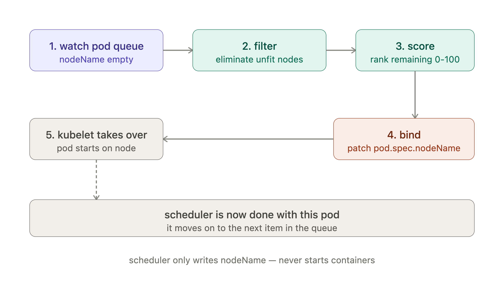

**Where the Scheduler Runs**

The scheduler is one Go binary called `kube-scheduler` that runs as a static pod on every control plane node. With multiple control plane nodes (3 or 5 in production), you'd have multiple scheduler replicas — but **only one is active at a time** via leader election. The others are standby.

```
Control plane node 1: kube-scheduler pod (LEADER, actively scheduling)
Control plane node 2: kube-scheduler pod (standby, watching the lease)
Control plane node 3: kube-scheduler pod (standby)
```

The leader writes to a Lease object in etcd every few seconds. If the leader dies, the lease expires, and a standby grabs it within ~15 seconds.

Inside the leader's pod is a Go process with several internal components:

```
kube-scheduler process
├── Informer        → watches Pods, Nodes, Services, PVCs, etc.
├── Cache           → local thread-safe snapshot of all objects
├── SchedulingQueue → priority queue of pods needing scheduling
├── Scheduling Framework → runs filter and score plugins
└── Binder          → patches pod.spec.nodeName via API server
```

The scheduler talks to the API server only over HTTPS — exactly like every other controller. 

**How it works (two phases):**

Filtering — eliminate nodes that can't run this pod:
- Not enough CPU or RAM
- Node has a taint the pod doesn't tolerate
- Pod requires a specific node label (affinity) that node doesn't have
- Volume zone mismatch (pod needs us-east-1a disk, node is in us-east-1b)

Scoring — rank the remaining nodes (0–10 each):
- Prefer nodes with more available resources
- Prefer spreading replicas across different nodes/zones
- Custom priority functions (image already pulled, preferred affinity, etc.)

The highest-scoring node wins. The scheduler writes the node name into the pod's spec. Kubelet on that node picks it up.

**Must-know facts:**
- The scheduler doesn't start containers — it only assigns the node. Kubelet does the rest.
- You can run multiple schedulers in one cluster (e.g. a GPU-aware scheduler alongside the default one).
- Pods can bypass the scheduler entirely with `nodeName: my-node` in spec.
- `PriorityClass` lets critical pods evict lower-priority pods when resources are tight.
- Scheduling is pluggable via the Scheduling Framework — you can add custom filter/score plugins.


### The SchedulingQueue

The first non-obvious internal: the scheduler doesn't process pending pods in arbitrary order. It uses **three internal queues**:

| Queue | Purpose |
|---|---|
| `activeQ` | Pods ready to be scheduled right now. Priority heap ordered by `priorityClass`. |
| `backoffQ` | Pods that failed scheduling recently. Held until backoff expires. |
| `unschedulableQ` | Pods that nothing fits. Held until the cluster state changes. |

When pods enter the system:

```
New pod (nodeName empty)
       ↓
Pod added to activeQ
       ↓
Scheduler pops highest-priority pod
       ↓
Tries to schedule it
       ↓
   ┌───┴───┐
Success      Failure
   ↓            ↓
bind        check why
            ↓
        ┌───┴───┐
    transient   no fit
    (move to    (move to
    backoffQ)   unschedulableQ)
```

**Why three queues?**

- **Priority** matters — `system-cluster-critical` pods (etcd, scheduler itself) must schedule before `app-low-priority` batch jobs.
- **Backoff** prevents the same pod hammering the scheduler in a loop. If a pod failed to schedule, wait 1s, then 2s, then 4s before retrying.
- **Move-on-event** — when something in the cluster changes (a node was added, a pod was deleted, more resources freed up), pods waiting in `unschedulableQ` are moved back to `activeQ` to retry. The scheduler subscribes to specific events that might unblock those pods.

---

### The Snapshot

Before scheduling each pod, the scheduler takes a **snapshot** of cluster state from its informer caches. This is critical:

```
For pod P, at time T:
   1. Take snapshot of all Nodes (CPU, memory, pod count, conditions)
   2. Take snapshot of NodeInfo (already running pods on each node)
   3. Run filter and score against THIS snapshot
   4. If anything changes during scheduling, P uses the old snapshot
```

Why snapshot? Because filter and score evaluate dozens of nodes. If state were live-mutating, results would be inconsistent — node A might look free at the start of scoring and full by the end. The snapshot freezes a consistent view.

This is also what enables the scheduler's most subtle feature: **assumed pods**. When the scheduler binds a pod, the API server commit is asynchronous. To prevent over-scheduling (assigning multiple pods to the same node believing they all fit), the scheduler immediately updates its local cache as if the pod is already running. Next pod's snapshot reflects this. If the bind actually fails, the cache is reverted.

---

### Filter Phase — Detailed

Filter eliminates nodes that **cannot** run the pod. It's a hard yes/no per node. Each filter plugin returns true (pass) or false (fail with reason).

The default filter plugins run in this order:

| Plugin | What it checks |
|---|---|
| `NodeUnschedulable` | Skip nodes with `spec.unschedulable: true` (cordoned nodes) |
| `NodeName` | Skip if pod has `spec.nodeName` set to a specific node and this isn't it |
| `NodePorts` | Pod's `hostPort` not in use on this node |
| `NodeAffinity` | Node matches pod's `nodeSelector` and `nodeAffinity` |
| `NodeResourcesFit` | Node has enough CPU, memory, ephemeral-storage, extended resources |
| `VolumeRestrictions` | Node hasn't exceeded max attached volumes |
| `VolumeBinding` | PVCs can bind on this node (zone-aware) |
| `VolumeZone` | PV's zone matches node's zone |
| `EBSLimits` / `GCEPDLimits` | Cloud-specific volume attach limits |
| `TaintToleration` | Pod tolerates the node's taints |
| `PodTopologySpread` | Pod's topology spread constraints are satisfiable |
| `InterPodAffinity` | Pod's anti-affinity rules don't conflict with existing pods |

Filter runs in parallel across nodes — by default 16 goroutines, configurable. For 1,000 nodes the scheduler doesn't check them sequentially; it fans out and collects results.

There's also an optimization: if filter finds **enough** feasible nodes quickly, it stops checking the rest. By default, once 50% of nodes (or a configurable threshold) pass filter, the rest are skipped. This is `percentageOfNodesToScore` — explicitly designed to prevent the scheduler from being slow on huge clusters.

---

### Score Phase — Detailed

Score runs only on the filtered survivors. Each plugin returns a 0-100 number; higher is better.

Default score plugins:

| Plugin | What it favors |
|---|---|
| `NodeResourcesFit` | Configurable: spread (less-loaded nodes) or pack (more-loaded) |
| `NodeAffinity` | Soft `preferredDuringScheduling` matches with their weights |
| `InterPodAffinity` | Soft pod affinity matches |
| `TaintToleration` | Nodes with fewer taints to tolerate |
| `ImageLocality` | Nodes that already have the container image cached |
| `PodTopologySpread` | Better-balanced distribution across zones |
| `NodePreferAvoidPods` (deprecated) | Nodes without `prefer-avoid` annotations |
| `VolumeBinding` | Faster local PV binding when possible |

Each plugin runs and returns its score per node. The scheduler then computes a **weighted sum** across all plugins. Plugin weights are configurable.

```
Node A scores:
  NodeResourcesFit: 80 (weight 1)
  ImageLocality:    60 (weight 1)
  NodeAffinity:     90 (weight 1)
  Total: 80 + 60 + 90 = 230

Node B scores:
  NodeResourcesFit: 50
  ImageLocality:     0  (image not cached)
  NodeAffinity:    100
  Total: 50 + 0 + 100 = 150

Winner: Node A
```

If multiple nodes tie for the highest score, **one is picked at random** to avoid herding all new pods onto the same node.

---

### Bind Phase — Detailed

Bind is the simplest phase conceptually but has subtle behavior. The scheduler calls a **subresource** of the API server:

```
POST /api/v1/namespaces/default/pods/web-1/binding
{
  "target": {
    "kind": "Node",
    "name": "worker-2"
  }
}
```

This is a special endpoint — it's not the regular PATCH. The binding subresource exists for two reasons:

1. **Authorization separation** — the scheduler has RBAC permission to bind but not to modify pod specs in general. Binding is a discrete privilege.
2. **Atomic operation** — binding is a one-shot write that updates `spec.nodeName`. Either it succeeds or it doesn't. There's no half-bind.

After bind succeeds:
- The API server emits a watch event for the pod
- Kubelet on worker-2 sees the event and starts the pod
- The scheduler updates its local cache to reflect the assignment
- The scheduler moves to the next pod in `activeQ`

If bind fails (network blip, conflict, etc.), the pod goes to `backoffQ` and is retried with backoff.

---

### The Scheduling Framework (Extension Points)

Modern kube-scheduler is built on the **Scheduling Framework** — a plugin architecture introduced in 1.19. The pipeline has more than just filter/score/bind:

| Extension Point | When it runs | Purpose |
|---|---|---|
| `QueueSort` | Pop from queue | Order pods within the queue (priority) |
| `PreFilter` | Before filter | Cache expensive data (e.g., affinity lookups) |
| `Filter` | Per node | Hard yes/no |
| `PostFilter` | If no node passes filter | Try preemption |
| `PreScore` | Before score | Compute shared data for scoring plugins |
| `Score` | Per node | 0-100 rank |
| `NormalizeScore` | After all scores | Normalize each plugin's scores |
| `Reserve` | Pre-bind | Tentatively reserve resources |
| `Permit` | Pre-bind | Hold/deny/allow (for gang scheduling) |
| `PreBind` | Before bind | Last-chance operations (volume provisioning) |
| `Bind` | The actual write | Patch nodeName |
| `PostBind` | After bind | Logging, metrics |

This is how you extend the scheduler **without forking it**. You write a plugin that implements one or more of these hooks, register it via configuration, and the scheduler runs it at the appropriate phase.

---

### Preemption — When No Node Has Room

If the filter phase eliminates every node, the scheduler doesn't just give up. It runs **PostFilter**, which (by default) tries preemption.

```
Pod P has priority 1000. No node has resources for it.
        ↓
Scheduler scans nodes:
  Node A: running 3 low-priority (priority 100) pods using exactly enough resources
        ↓
"If I evict those 3 pods, P fits here."
        ↓
Scheduler picks the node requiring the fewest victims with the lowest combined priority
        ↓
Sends graceful delete to the victim pods (respecting PodDisruptionBudgets)
        ↓
Waits for them to terminate
        ↓
P now has room — proceeds to score and bind on Node A
```

Important details:
- Only happens if P's priority > victims' priority
- PodDisruptionBudgets are respected (partially — they make preemption "nice-to-have")
- Victim eviction goes through normal API channels — they get SIGTERM, grace period, etc.
- A pod is the preemptor only once it's been scheduled — preemption doesn't reschedule the preemptor in the same loop iteration (it has to retry)

---

### What Determines "Best Node" — The Real Defaults

The default scheduling profile is biased toward:

1. **Spreading** — `NodeResourcesFit` defaults to `LeastAllocated` scoring strategy. New pods go to less-loaded nodes.
2. **Topology spread** — replicas of the same Deployment are spread across zones/nodes by default in modern Kubernetes.
3. **Image locality** — slightly prefers nodes that have the image already, to avoid pull delays.

You can change these globally via a `KubeSchedulerConfiguration` file. Common changes:

```yaml
apiVersion: kubescheduler.config.k8s.io/v1
kind: KubeSchedulerConfiguration
profiles:
  - schedulerName: default-scheduler
    plugins:
      score:
        enabled:
          - name: NodeResourcesFit
            weight: 2                # double the weight of resource fit
          - name: ImageLocality
            weight: 1
    pluginConfig:
      - name: NodeResourcesFit
        args:
          scoringStrategy:
            type: MostAllocated      # bin-pack instead of spread
                                     # useful for autoscaling cost savings
```

`MostAllocated` (bin-packing) is popular with cluster autoscalers because it keeps nodes full, making it easier to drain underutilized nodes.

---

### Running Multiple Schedulers

You can run more than one scheduler in the same cluster. The default scheduler is always there. You can add custom ones — a GPU-aware scheduler, a topology-aware scheduler, a batch scheduler like Volcano.

Pods opt into a non-default scheduler:

```yaml
spec:
  schedulerName: my-gpu-scheduler   # name in the scheduler's config
  containers:
    - name: trainer
      image: torch:latest
```

Each scheduler watches the API server with a filter for its own `schedulerName`. The default scheduler ignores pods that name another scheduler. They don't conflict.

---

### Performance Characteristics

Performance facts at scale:

| Metric | Typical value |
|---|---|
| Scheduling throughput | 100-200 pods/sec (default scheduler, 5000-node cluster) |
| End-to-end latency per pod | 10-50ms (decision time) |
| `percentageOfNodesToScore` default | Auto-tuned: 50% for clusters >100 nodes, capped at 5% for clusters >5000 nodes |
| Max nodes per filter goroutine | 16 (configurable via `parallelism`) |
| Snapshot rebuild cost | Lazy — only updates the part that changed |

The hard upper bound on scheduling latency is dominated by **filter parallelism × number of nodes**. On a 5000-node cluster, the scheduler doesn't actually filter all 5000 nodes per pod — it samples some percentage, finds enough feasible candidates, and stops.

### What the Scheduler Does NOT Do

Common misconceptions:

- ❌ Does not create pods (the ReplicaSet controller does)
- ❌ Does not start containers (kubelet does)
- ❌ Does not pull images (kubelet via container runtime does)
- ❌ Does not manage running pods (kubelet handles all of that)
- ❌ Does not handle node failures (Node controller in kube-controller-manager does)
- ❌ Does not enforce resource limits at runtime (kubelet + kernel cgroups do)
- ❌ Does not move pods after scheduling — once a pod is bound to a node, the scheduler is done

The scheduler's *only* output is a single field write: `spec.nodeName`. Everything else flows from that.

This minimalism is why the scheduler can be replaced without breaking anything. The scheduling-framework plugin model, multiple scheduler support, and clear input/output contract make it one of the cleanest pieces of Kubernetes architecture.

### PriorityClass and Pod Eviction

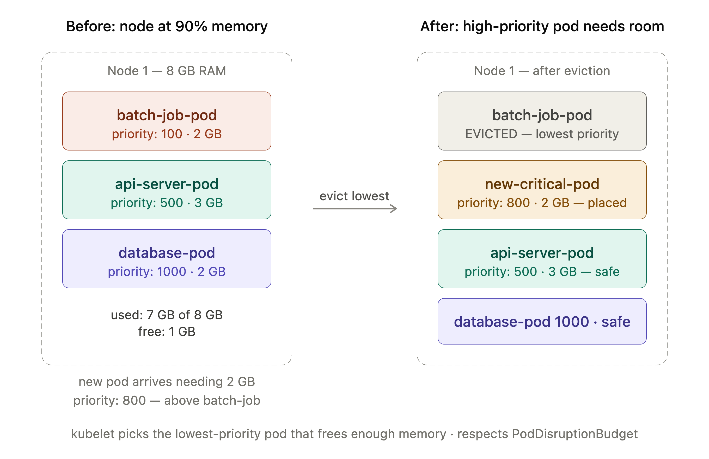

A PriorityClass assigns an integer priority to a pod. Higher number = more important. When a node runs out of resources, the kubelet (not the scheduler) evicts lower-priority pods to make room for higher-priority ones.### Two different mechanisms — preemption vs eviction

People confuse these. They're triggered by different conditions.

**Scheduler preemption** — happens when a pod cannot be scheduled because no node has room. The scheduler picks a node, evicts lower-priority pods there to make room, then schedules the new pod.

**Kubelet eviction** — happens when a node is *already* under memory or disk pressure at runtime. The kubelet evicts running pods (lowest priority first) to protect node stability. This is independent of the scheduler.

#### PriorityClass YAML

```yaml
# Define priority tiers
apiVersion: scheduling.k8s.io/v1
kind: PriorityClass
metadata:
  name: critical-database
value: 1000              # higher = more important
globalDefault: false
preemptionPolicy: PreemptLowerPriority   # default
description: "Reserved for stateful databases"

---
apiVersion: scheduling.k8s.io/v1
kind: PriorityClass
metadata:
  name: standard-app
value: 500
preemptionPolicy: PreemptLowerPriority
description: "Normal application workloads"

---
apiVersion: scheduling.k8s.io/v1
kind: PriorityClass
metadata:
  name: batch-job
value: 100
preemptionPolicy: Never      # can be evicted but won't preempt others
description: "Best-effort batch processing"

---
# Pod using a priority class
apiVersion: v1
kind: Pod
metadata:
  name: my-database
spec:
  priorityClassName: critical-database  # reference by name
  containers:
    - name: postgres
      image: postgres:16
      resources:
        requests:
          memory: 4Gi
          cpu: 2
```

#### Built-in PriorityClasses

Kubernetes ships two that you should never touch:

| Name | Value | Purpose |
|---|---|---|
| `system-cluster-critical` | 2000000000 | etcd, kube-apiserver, kube-scheduler |
| `system-node-critical` | 2000001000 | kubelet, kube-proxy |

These are why control plane components survive even extreme node memory pressure.

#### What happens to the evicted pod?

The evicted pod is terminated (SIGTERM → SIGKILL after grace period). If it belongs to a Deployment or ReplicaSet, the controller creates a replacement — which then enters the scheduler queue and may land on a different node. Eviction doesn't destroy the pod object's controller ownership.

## kubelet

Kubelet runs on every node in the cluster — both worker nodes and control plane nodes. It is a node-level agent, not a worker-node-only agent.

On worker nodes: kubelet runs pods assigned by the scheduler via the API server.

On control plane nodes: kubelet runs *static pods* — a special mode where kubelet reads pod manifests directly from `/etc/kubernetes/manifests/` on disk, completely bypassing the API server. These static pod files are:

```
/etc/kubernetes/manifests/
  etcd.yaml
  kube-apiserver.yaml
  kube-controller-manager.yaml
  kube-scheduler.yaml
```

Kubelet watches this folder. If you delete `etcd.yaml`, kubelet stops etcd. If you put it back, kubelet starts it again. The API server has no involvement — this is intentional, because the API server itself is one of those static pods. If it depended on the API server to start, it could never boot.


**What it is:** An agent that runs on **every worker node**. It's the link between the control plane and the actual containers running on that node.

**Purpose:** "Make sure the containers described in PodSpecs are running and healthy."

**How it works:**
```
API Server tells kubelet: "Run these pods"
       ↓
Kubelet tells container runtime (Docker/containerd): "Start this container"
       ↓
Kubelet reports back: "Pod is Running / CrashLoopBackOff / etc."
```

**Important facts:**
- Runs as a **systemd service** on the node, not as a pod.
- Talks to the **container runtime** via CRI (Container Runtime Interface) — supports containerd, CRI-O.
- Runs **liveness and readiness probes** — restarts containers that fail health checks.
- Mounts **Volumes, Secrets, and ConfigMaps** into pods.
- Reports **node status** (CPU/RAM/disk) to the API server.
- Does **not** manage containers it didn't create (e.g., containers started manually with `docker run`).

## CoreDNS

CoreDNS is the cluster's DNS server. It runs as a Deployment (usually 2 replicas) in `kube-system`.

**How it works:**

When a pod does `curl http://payments-svc`, the OS sends a DNS query. The container's `/etc/resolv.conf` (set by kubelet) points to CoreDNS's ClusterIP. CoreDNS looks up `payments-svc` in its in-memory table of Services and returns the ClusterIP.

**DNS name format:** `<service>.<namespace>.svc.cluster.local`

From inside the same namespace, `payments-svc` works. Cross-namespace requires `payments-svc.finance.svc.cluster.local`.

**Must-know facts:**
- CoreDNS watches the API server for Service and Pod changes and updates its table instantly.
- Configurable via a `ConfigMap` called `coredns` in `kube-system`. You can add custom DNS zones, upstream resolvers, rewrite rules.
- Headless Services return A records for each pod IP — no virtual IP, just the real pod IPs.
- Pod DNS follows a pattern too: `10-0-1-5.default.pod.cluster.local` (dots in IP become dashes).
- Replaced `kube-dns` in Kubernetes 1.11+.
- Plugins system — CoreDNS is extensible. The `hosts`, `forward`, `rewrite`, `cache` plugins are commonly used.

### CoreDNS Plugins

CoreDNS uses a config file called a `Corefile`. The cluster's Corefile lives in a ConfigMap named `coredns` in `kube-system`. Each plugin is a line in the Corefile.

```bash
kubectl get configmap coredns -n kube-system -o yaml

kubectl edit configmap coredns -n kube-system
# CoreDNS automatically reloads (the `reload` plugin watches the Corefile)

# Or force reload:
kubectl rollout restart deployment coredns -n kube-system
```

- `hosts` plugin — serve custom DNS entries from a static file
- `forward` plugin — send unresolved queries upstream
- `rewrite` plugin — modify DNS queries before resolving
- `cache` plugin — reduce upstream load


## kube-proxy

kube-proxy runs as a DaemonSet (one pod on every node). Its job: program the Linux kernel so that traffic to Service virtual IPs reaches actual pod IPs.

**How it works:**

kube-proxy watches the API server for Service and EndpointSlice objects. When something changes, it updates `iptables` (or IPVS) rules on the node's kernel:

```
Rule: traffic to 10.96.45.23:80 → randomly pick one of:
        10.0.1.5:8080  (pod 1)
        10.0.1.6:8080  (pod 2)
        10.0.1.7:8080  (pod 3)
```

The kernel does the IP rewrite. No proxy process sits in the actual traffic path.

**Three modes:**

| Mode | How | Scale |
|---|---|---|
| `iptables` (default) | Linear rule chain in kernel | Slow at 10k+ services |
| `IPVS` | Hash table in kernel | O(1) lookup, handles 10k+ services |
| `nftables` | Modern replacement for iptables (K8s 1.29+) | Better performance |

**Must-know facts:**
- kube-proxy handles only east-west traffic (pod to service). Ingress/LoadBalancer handles north-south (external to cluster).
- In some CNI setups (Cilium with eBPF mode), kube-proxy is replaced entirely — Cilium handles service routing in eBPF directly.
- kube-proxy does not handle DNS — that's CoreDNS's job.
- Session affinity (`sessionAffinity: ClientIP`) can be set on a Service to always route a client to the same pod.
- kube-proxy does not load balance perfectly uniformly under iptables — each rule has an equal probability, which compounds to slight imbalance. IPVS supports weighted round-robin, least connection, and other algorithms.

**Why kube-proxy Watches Both Service AND EndpointSlice**

Neither object alone is sufficient. The Service tells kube-proxy *what virtual IP to intercept*. The EndpointSlice tells it *where to forward the traffic*. kube-proxy must combine both to write a complete iptables rule:

```
intercept: 10.96.45.23:80 (from Service.spec.clusterIP + port)
forward to: 10.0.1.5:8080 OR 10.0.2.7:8080 (from EndpointSlice.endpoints + ports)
```

### kube-proxy Modes

#### Mode 1: iptables (default everywhere)

kube-proxy writes chains in the Linux kernel's NAT table. No special config required.

```yaml
apiVersion: kubeproxy.config.k8s.io/v1alpha1
kind: KubeProxyConfiguration
mode: "iptables"
iptables:
  masqueradeAll: false         # SNAT all traffic (not just NodePort)
  masqueradeBit: 14            # which bit in fwmark to use
  minSyncPeriod: 0s            # how often to sync at minimum (0=immediately)
  syncPeriod: 30s              # how often to do full resync
```

Verify it's working:

```bash
# On a node
iptables -t nat -L KUBE-SERVICES | head -20
# Shows chains like:
# KUBE-SVC-XXXXX for each service
# KUBE-SEP-XXXXX for each endpoint (pod IP)
```

#### Mode 2: IPVS — for large clusters

IPVS (IP Virtual Server) uses kernel hash tables instead of sequential iptables chains. O(1) lookup vs O(N).

**Prerequisites:** The `ip_vs`, `ip_vs_rr`, `ip_vs_wrr`, `ip_vs_sh` kernel modules must be loaded on every node:

```bash
# On each node
modprobe ip_vs ip_vs_rr ip_vs_wrr ip_vs_sh nf_conntrack
```

**kube-proxy config:**

```yaml
apiVersion: kubeproxy.config.k8s.io/v1alpha1
kind: KubeProxyConfiguration
mode: "ipvs"
ipvs:
  scheduler: "rr"              # round-robin (options: rr, lc, dh, sh, sed, nq, wrr)
  strictARP: true              # required: kube-proxy needs to respond to ARP for Service IPs
  syncPeriod: 30s
  minSyncPeriod: 5s
  tcpTimeout: 900s
  tcpFinTimeout: 120s
  udpTimeout: 300s
```

Verify IPVS rules:

```bash
ipvsadm -ln
# IP Virtual Server version 1.2.1 (size=4096)
# Prot LocalAddress:Port Scheduler Flags
#   -> RemoteAddress:Port     Forward Weight ActiveConn InActConn
# TCP  10.96.45.23:80 rr
#   -> 10.0.1.5:8080         Masq    1      5          0
#   -> 10.0.2.7:8080         Masq    1      3          0
```

IPVS adds a dummy interface called `kube-ipvs0` and binds all Service ClusterIPs to it — that's how the kernel knows to intercept packets destined for virtual IPs.

#### Mode 3: nftables (1.29+ beta, modern replacement for iptables)

```yaml
apiVersion: kubeproxy.config.k8s.io/v1alpha1
kind: KubeProxyConfiguration
mode: "nftables"
nftables:
  masqueradeAll: false
  minSyncPeriod: 1s
  syncPeriod: 30s
```

Verify:

```bash
nft list ruleset | grep kube
```

**How to apply kube-proxy config**

kube-proxy reads its config from a ConfigMap at startup:

```bash
kubectl edit configmap kube-proxy -n kube-system
# Edit the config.conf section
# Then restart kube-proxy DaemonSet:
kubectl rollout restart daemonset kube-proxy -n kube-system
```

Or pass on the kube-proxy command line:

```bash
kube-proxy --config=/etc/kube-proxy/config.yaml
```

The trend in managed Kubernetes is to replace kube-proxy entirely with eBPF-based CNIs (Cilium, Calico eBPF, AWS VPC CNI with eBPF). On those clusters, kube-proxy may not run at all.

### kube-proxy internals

kube-proxy's job is to write `iptables` rules into the kernel *ahead of time*. After that, kube-proxy steps out of the data path entirely. The kernel does the rewriting — but only because kube-proxy programmed it to.

**What kube-proxy actually runs:**

kube-proxy is a long-running process but it only does two things:
1. Watch the API server for Service and EndpointSlice changes
2. When something changes, call `iptables-restore` (a Linux command) to atomically replace the rules

Between changes, kube-proxy is essentially idle. No packets pass through it.

**You can see this yourself:**

```bash
# On any node, see the rules kube-proxy wrote
iptables -t nat -L KUBE-SERVICES -n --line-numbers

# See a specific service's chain
iptables -t nat -L KUBE-SVC-XXXXXX -n

# See individual endpoint rules
iptables -t nat -L KUBE-SEP-XXXXXX -n

# See active connections in conntrack
conntrack -L | grep 10.96.45.23
```

**The key insight:** kube-proxy and the kernel are separate processes, but kube-proxy *programs the kernel* by writing rule tables. The rule evaluation and IP rewriting happen inside the kernel, at line rate, with no process context switch, no Kubernetes code in the hot path.

## CoreDNS vs kube-proxy

These two are often confused because both are cluster infrastructure. They do completely different things.

**Simple rule:**
- CoreDNS answers "what IP is that name?"
- kube-proxy answers "which pod should this packet go to?"**CoreDNS in one sentence:** It is a DNS server that knows about every Kubernetes Service and returns its ClusterIP when asked. It watches the API server for Service changes and updates its records instantly.

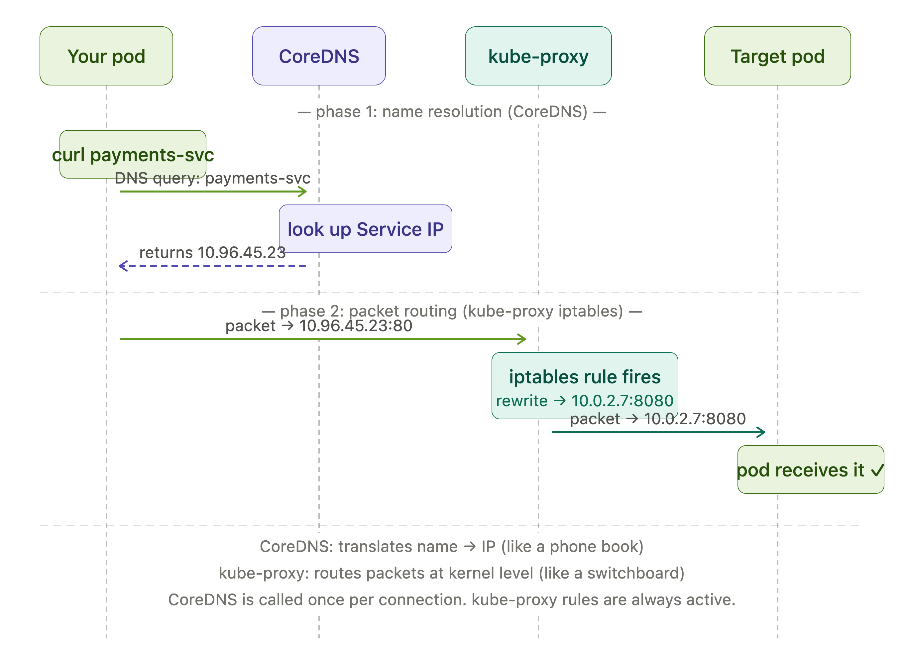

**kube-proxy in one sentence:** It programs Linux kernel rules on every node so that packets sent to a Service's virtual IP get redirected to a real pod IP. It never sees your application traffic — the kernel handles the rewrite transparently.

**Why you need both:** DNS gives you human-readable names. iptables gives you the actual delivery mechanism. Removing CoreDNS means your code can't use service names — it would need hardcoded IPs. Removing kube-proxy means packets sent to Service IPs go nowhere — no rules exist to forward them.

## Watcher Loop Architecture

**You do NOT write the watch loop yourself.** Kubernetes provides a library called **client-go** with reusable building blocks. Operator SDK and Kubebuilder wrap this further.

**Architecture:**

```
API Server ──watch (HTTP streaming)──▶ Informer
                                          │
                                          ▼
                                       Cache (local copy of objects)
                                          │
                                          ▼
                                       Workqueue
                                          │
                                          ▼
                                       Your Reconcile() function
```

**Key points:**
- The API server **pushes events** (ADD/UPDATE/DELETE) over a long-lived HTTP connection. No polling.
- The **Informer** maintains a local cache so your code reads are fast.
- A **Workqueue** deduplicates events and handles retries with exponential backoff.
- Your code only implements `Reconcile(object)` — compare spec vs status, take action.

**"Reconciliation mechanism"** — There's no fixed interval by design. It's event-driven plus a periodic full resync every ~10 hours.

The workqueue uses a set to silently drop duplicate keys, a list to preserve order, and exponential backoff to slow retries on failure — so a flood of 100 events for the same object turns into exactly one reconcile call with the latest state.

### Watcher Loop Sequence Diagram

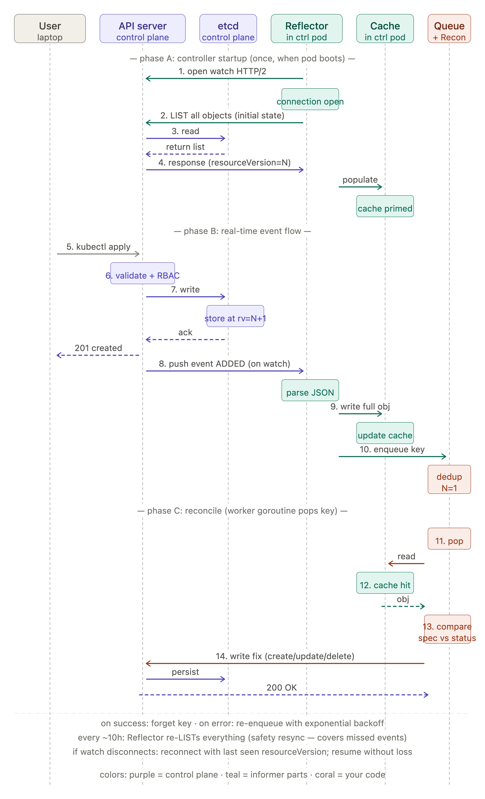

The diagram has six lanes — three colors mapped to three different machines.

**Where each lane physically runs:**

| Lane | Process | Runs on |
|---|---|---|
| User | `kubectl` | Your laptop |
| API server | `kube-apiserver` binary | Control plane node(s) |
| etcd | `etcd` binary | Control plane node(s) |
| Reflector | Library inside the controller | **Inside the controller pod** (any worker node) |
| Cache | In-memory map inside the controller | **Same pod as the Reflector** |
| Workqueue + Reconcile | Goroutines in the controller | **Same pod** |

The key insight: **only the API server and etcd live on the control plane**. The Reflector, Cache, Workqueue, and Reconcile function all run inside the controller pod itself — which is scheduled on whichever worker node Kubernetes picked. The Deployment controller, ReplicaSet controller, and Endpoints controller all run inside one process (`kube-controller-manager`), which is a static pod on the control plane node. Your custom operator runs as a pod on a worker node. Both connect to the API server the same way — over HTTP/2.

**Three phases of the loop:**

**Phase A — controller startup (happens once when the pod boots):**

The Reflector inside the controller pod opens a long-lived HTTP/2 connection to the API server. First it issues a regular GET LIST to fetch all existing objects (the initial state). This populates the Cache. Now the controller knows what currently exists in the world.

**Phase B — real-time event flow (happens forever after):**

When you run `kubectl apply`, the API server validates and writes to etcd. Crucially, the API server then **pushes** the event down the open HTTP/2 watch connection to the Reflector. There is no polling — the API server initiates the push the instant etcd confirms the write.

The Reflector parses the JSON event, writes the full object into the Cache (which is just a thread-safe hash map keyed by `namespace/name`), and enqueues only the **key** (a short string like `default/my-pod`) into the Workqueue. The Workqueue deduplicates — if 100 events fire in a burst, the same key collapses to one entry.

**Phase C — reconcile (a worker goroutine consumes the queue):**

A worker goroutine in the controller pops a key from the Workqueue. It reads the full object from the local Cache — this is a microsecond memory lookup, no network call. It runs your `Reconcile(key)` function which compares spec vs status and decides what action to take. The action is a write to the API server (create/update/delete some other resource).

The API server persists that change to etcd, which then triggers *another* watch event back to the Reflector — completing the cycle.

**Two safety nets:**

If the watch connection drops (network blip, API server restart, anything), the Reflector reconnects automatically with the last `resourceVersion` it saw. The API server replays any events that happened during the disconnect, ensuring no event is lost.

Every ~10 hours, the Reflector does a full re-LIST anyway, as belt-and-suspenders insurance against any silently missed event. Anything found in the re-list that's not in the Cache gets enqueued for reconcile.

**Why this design scales:**

Reads come from the local Cache, not the API server — so a controller with 50,000 objects under management doesn't generate 50,000 reads per second. Writes go through the API server only when the controller actually needs to make a change. One HTTP/2 connection per controller per resource type is enough to keep everything in sync, no matter how big the cluster grows.

### Watcher Loop Components Deep Dive

**Why not reconcile directly on every event:**

If 100 events fire in a burst (a rolling deploy creating 100 pods), reconciling 100 times would be wasteful. You only need to reconcile once with the *final* state. The Informer+Workqueue pair solves this.

**What each piece does:**

| Piece | Job | What happens without it |
|---|---|---|
| **Reflector** | Holds the HTTP watch connection. Receives raw events. | You'd write watch loops yourself per controller |
| **Cache (Store)** | Local copy of every object. Read-fast. | Reconcile would hammer the API server for reads |
| **Workqueue** | Deduplicates events, applies retry/backoff. | 100 events → 100 reconciles. Failures retry instantly without backoff. |
| **Reconcile** | Your business logic. | — |

**Why the cache and workqueue are separate:**

- The cache holds **what objects look like right now**. It's a key-value lookup.
- The workqueue holds **what work still needs doing**. It's a queue of object keys (not the objects themselves).
- When 100 events arrive for the same pod, the cache gets updated 100 times (very fast), but the workqueue collapses them to 1 key. Reconcile runs once and reads the latest state from the cache.

**Why two-layer cache:**

- **The Reflector's cache** is owned by the Informer. It's a single source of truth for that controller.
- **The Workqueue** is just a list of keys (`namespace/name` strings), not objects.
- Reconcile receives a key, looks the object up in the cache. If the object was deleted between event and reconcile, the cache returns `nil` and Reconcile handles deletion logic.

**Concurrency:** A single Informer has one watch connection, one cache. But it can drive multiple controllers. Several worker goroutines pop keys from the workqueue in parallel, all reading from the same shared cache.

### How the long-lived HTTP connection actually works

This uses **HTTP/2 with chunked transfer encoding**. Here's the request:

```
GET /api/v1/pods?watch=true&resourceVersion=12345 HTTP/2
Authorization: Bearer eyJhbGc...
```

The API server responds with `200 OK` and keeps the connection open. As events occur, the server writes JSON events line by line:

```
{"type":"ADDED","object":{"kind":"Pod","metadata":{"name":"web-1",...}}}
{"type":"MODIFIED","object":{"kind":"Pod","metadata":{"name":"web-1",...}}}
{"type":"DELETED","object":{"kind":"Pod","metadata":{"name":"web-2",...}}}
```

Each event is a newline-delimited JSON object. The client parses them as they arrive. The connection stays open for hours.

**The `resourceVersion` is the key to reliability.** Every object has a monotonically increasing version number. When the client opens a watch, it tells the server: "I've seen up to resourceVersion 12345 — give me everything after that." If the connection drops, the client reconnects with the last version it saw and the server resumes from there. No events lost.

**What happens if the connection drops:**
- The Reflector detects the disconnect immediately (TCP keepalive or HTTP/2 ping)
- It backs off briefly (jittered, seconds)
- Reopens the watch with the last known resourceVersion
- If etcd has compacted that version away (events too old), the Reflector does a full re-list of all objects and resumes

### Where Do Informer and Controller Actually Run?

Excellent question. **They are not on the API server's node.** They run inside the **controller process itself**, wherever that controller runs.

```
Control plane node
├── kube-apiserver pod          ← HOSTS the watch endpoint
├── etcd pod                    ← stores data
├── kube-scheduler pod          ← contains its own Informer + Reconcile
└── kube-controller-manager pod ← contains 30+ Informers + Reconcile loops

Worker node 1
├── kubelet (systemd service)   ← contains its own Informer for its pods
└── kube-proxy pod              ← contains its own Informer for Services/EndpointSlices

Worker node 2
└── your-operator pod           ← contains its own Informer + Reconcile loop
    ↑
    (this pod opens a watch HTTP connection to the API server)
```

**Key clarifications:**

- **Informer is a library** (`client-go`). It runs *inside* whatever process imports it.
- The kube-controller-manager binary contains 30+ Informers — one per resource type it watches (one for Deployments, one for ReplicaSets, one for Pods, etc.). All inside one process.
- Your custom operator pod contains its own Informer for its custom resources. It runs on whichever worker node Kubernetes scheduled it on.
- The watch HTTP connection goes **from the controller process to the API server**, over the pod network. The two can be on the same node or different nodes — doesn't matter.

**Mental model:** the API server is a fancy HTTP server. Controllers are HTTP clients. Every controller, no matter where it runs, opens an HTTP connection to the API server. The Informer is just the client library inside the controller process that manages that connection efficiently.


## Deployment Sequence

A pod absolutely gets created before a node is assigned. Here is the exact sequence:

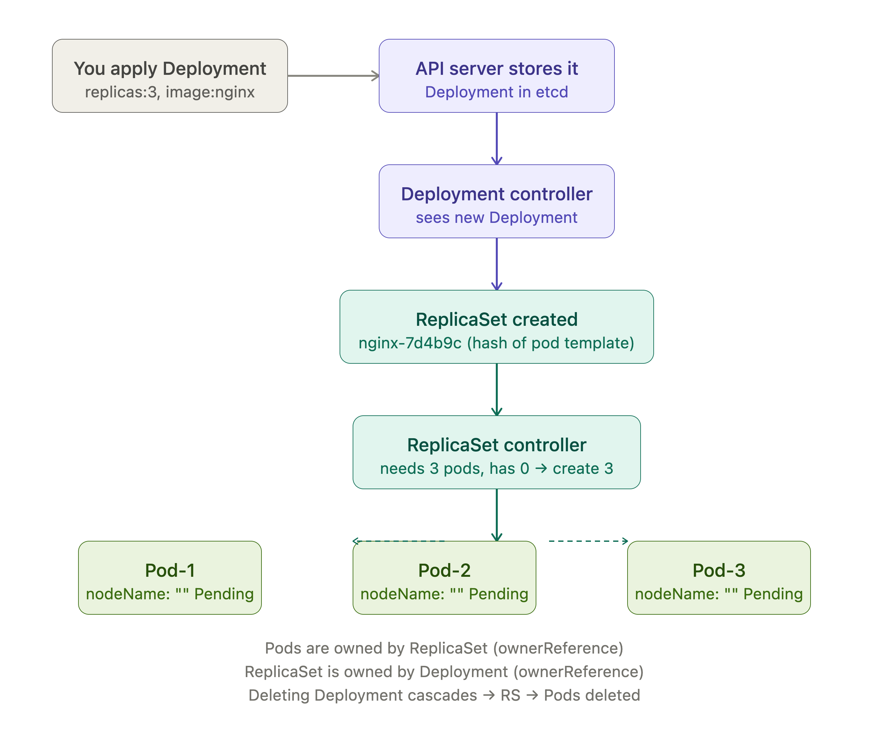

The pod object exists in etcd in `Pending` state the entire time before scheduling. The scheduler's watch query is literally filtering on `spec.nodeName == ""`. This is why `kubectl get pods` shows `Pending` — the pod exists, it just has no home yet.

**Why the three-layer design?**

Deployment manages *rollouts*. When you update an image, the Deployment controller creates a *new* ReplicaSet (with the new template hash) and gradually scales it up while scaling the old one down. This gives you rolling updates and rollback for free — `kubectl rollout undo deployment/nginx` just scales the old ReplicaSet back up.

ReplicaSet's only job is keeping the exact pod count correct. It doesn't know about rollouts.

Pod is the unit of execution — it doesn't know it's part of a ReplicaSet.

**ownerReferences** are the glue — every object carries a reference to its owner, which is how cascading deletes work.

## Change Detection Mechanism via API Server Watch

**The watch mechanism**
- every component uses the same underlying HTTP watch stream from the API server. 
- The key insight is that this is not polling — it's a long-lived connection where the API server pushes changes as they happen. 
- Every component opens one persistent HTTP connection per resource type it cares about and just waits. The API server pushes events down that connection the moment something changes in etcd. 
- No component ever asks "anything changed?" on a timer — the API server tells them.

**Now the sequence of what actually happens internally when a component receives a watch event**

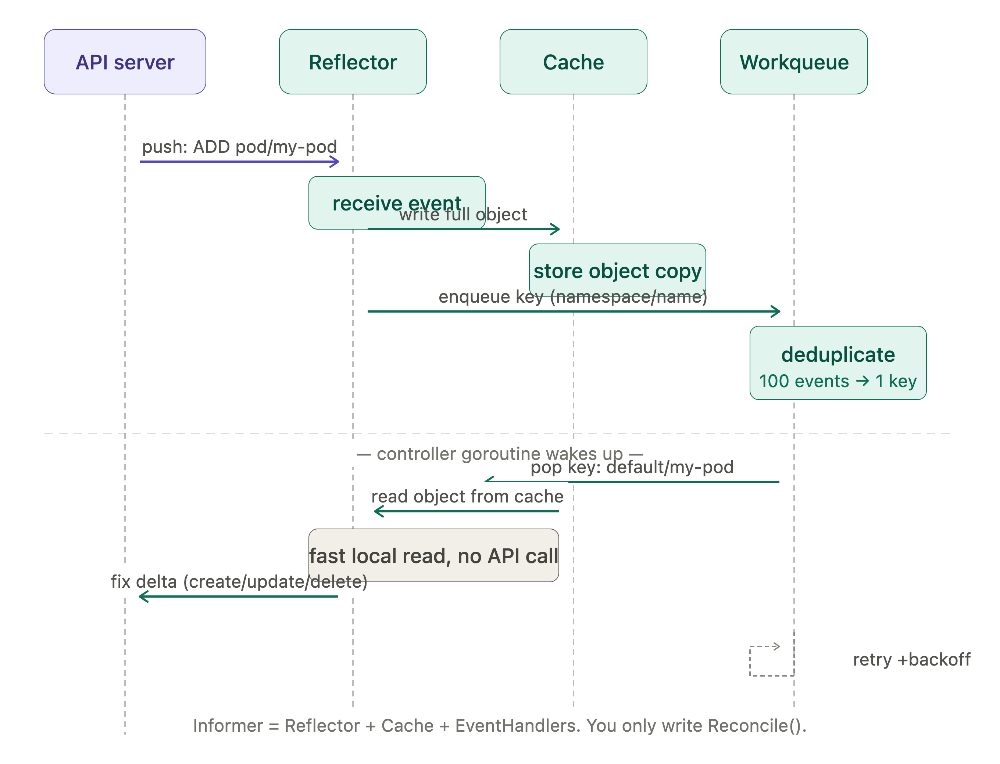

Three things to notice here that are easy to miss:

The Reflector is the piece that actually holds the open HTTP connection to the API server. It is not the controller — the controller never talks to the API server for reads. All reads go to the local cache.

The workqueue is the deduplication buffer. If 100 events fire in a burst (a rolling deploy, for example), the workqueue collapses them to a single key. Your `Reconcile()` runs once and handles the final state — it doesn't run 100 times.

The controller only calls the API server to *write* (create/update/delete), never to read. This is why large clusters don't overwhelm the API server — thousands of watch connections are cheap, but thousands of read requests per second would not be.

## Managed vs Self-Hosted Kubernetes

| Feature | Managed (EKS/GKE/AKS) | Self-Hosted (kubeadm/kops) |
|---|---|---|
| Control plane setup | Done for you, one click | You install and configure everything |
| etcd management | Fully managed, auto-backups | Your responsibility |
| K8s upgrades | Push a button | Manual, step-by-step, risky |
| Control plane HA | Built-in | You configure 3+ replicas |
| Cost | Pay per cluster + nodes | Pay for control plane VMs yourself |
| Visibility | No SSH to control plane | Full access |
| Maintenance overhead | Low | High |
| Custom API server flags | Limited | Full control |
| Compliance/air-gapped | Hard | Possible |
| Time to production | Hours | Days to weeks |

**Rule of thumb:** Use managed unless you have a compliance, cost at massive scale, or control reason not to.

## Complete Pod Lifecycle 

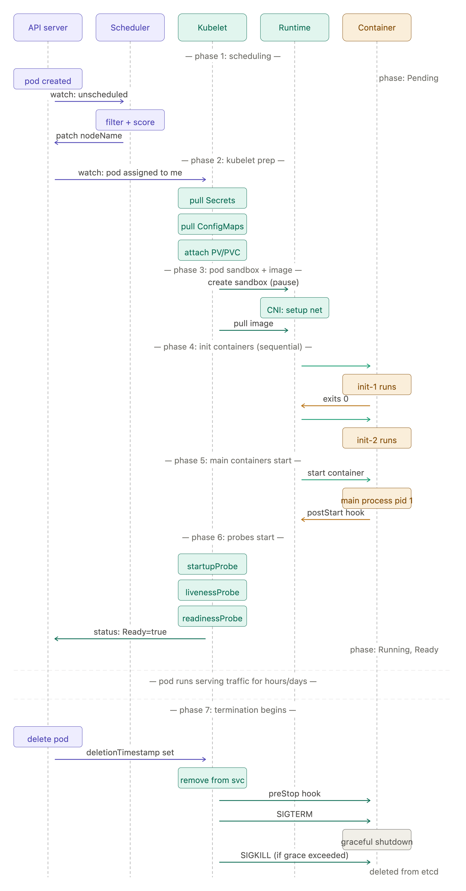

**Walkthrough of every step:**

**Phase 1 — Scheduling:** Pod object is created in etcd with `nodeName: ""`. Scheduler watches for these, runs filter+score, patches the chosen node.

**Phase 2 — Kubelet prep:** Kubelet on the target node fetches:
- All Secrets referenced in `envFrom`, `valueFrom`, or as volume sources
- All ConfigMaps referenced similarly
- All PersistentVolumes via CSI driver (call to cloud API to attach disk)

**Phase 3 — Pod sandbox + image:** Kubelet calls the container runtime to create a "pause container" (the sandbox). This pause container holds the pod's network namespace. CNI plugin is invoked to set up the network (assign pod IP, create veth pair). Then image pull happens.

**Phase 4 — Init containers (sequential):** If any are defined, they run one at a time. Each must exit 0 before the next starts. Common uses: wait for DB to be ready, run schema migrations, populate config files.

**Phase 5 — Main containers start:** Main containers start in parallel (one per container in `spec.containers`). The `postStart` hook fires asynchronously immediately after the container process starts. If postStart fails, the container is restarted.

**Phase 6 — Probes:**
- **startupProbe** runs first. Useful for slow-starting apps. Liveness and readiness are disabled until this succeeds.
- **livenessProbe** then runs continuously. Failure → restart the container.
- **readinessProbe** runs continuously. Failure → remove pod from Service endpoints (but keep running).

**Pod runs.** Could be hours, days, weeks.

**Phase 7 — Termination:**

1. `kubectl delete pod` or controller scaling down. API server sets `deletionTimestamp`. Pod is now "Terminating."
2. **Endpoints controller removes the pod from all Service EndpointSlices.** New traffic stops flowing.
3. Kubelet on the node sees the deletionTimestamp via watch.
4. **`preStop` hook fires synchronously.** Common use: flush buffers, drain connections, deregister from external systems.
5. After `preStop` completes, kubelet sends **SIGTERM** to PID 1 in each container.
6. **Grace period starts** (default 30 seconds, configurable via `terminationGracePeriodSeconds`).
7. If the container exits before grace period ends: clean shutdown ✓
8. If grace period exceeds without exit: **SIGKILL** sent. Container forcefully killed.
9. Volumes unmounted. CNI cleans up network namespace.
10. Pod object is deleted from etcd (via finalizers if any).

**Critical detail about preStop:** the SIGTERM doesn't go to the container *during* preStop — preStop runs first, then SIGTERM is sent. This is why preStop is the right place to start graceful shutdown logic for apps that don't handle SIGTERM well.

## Pod Templates

A pod template is a `spec` for creating pods embedded inside a higher-level resource. It's not a standalone API object — it's a field (`spec.template`) inside Deployments, StatefulSets, DaemonSets, Jobs, and ReplicaSets.

```yaml
# Inside a Deployment:
spec:
  selector:
    matchLabels:
      app: web
  template:               # ← this is the pod template
    metadata:
      labels:
        app: web          # must match selector above
    spec:
      containers:
        - name: web
          image: nginx:1.25
          ports:
            - containerPort: 80
```

The pod template has the same structure as a standalone Pod's `spec`, minus the `apiVersion`, `kind`, and top-level `metadata.name` (pods get auto-generated names).

**Who creates and manages them:** You write them. The controller (Deployment/StatefulSet controller) reads `spec.template` and creates pods from it. When the template changes (new image, new env var, new resource limit), the controller detects the change and performs a rolling update.

### How the template hash creates different ReplicaSet names

When you create a Deployment, the Deployment controller hashes the entire pod template `spec` to produce a deterministic short string. This hash becomes part of the ReplicaSet name and also a label on every pod.

```bash
kubectl get replicasets
# NAME                        DESIRED   CURRENT   READY
# web-deployment-7d4b9c8f6b   3         3         3    ← hash: 7d4b9c8f6b
```

The hash is computed from the pod template spec using Go's `fnv` (Fowler–Noll–Vo) hash function. The input is a JSON-marshaled representation of the template spec. Any change to the template — even a single character in a label value — produces a completely different hash.

**Why this matters for rolling updates:**

```
Initial deploy: image=nginx:1.24
  ReplicaSet: web-7d4b9c8f6b  (replicas: 3)

kubectl set image deployment/web web=nginx:1.25

New template hash computed: e8c4b2a1f9
  ReplicaSet: web-e8c4b2a1f9  (replicas: 0 → 1 → 2 → 3)
  ReplicaSet: web-7d4b9c8f6b  (replicas: 3 → 2 → 1 → 0)

Old RS kept at 0 replicas (not deleted) for rollback
```

The old ReplicaSet is kept because if you run `kubectl rollout undo`, the Deployment controller simply scales the old RS back up and scales the new one back down. No pods are re-created from scratch — they already exist in the old RS definition.

**Rollback history:** `spec.revisionHistoryLimit` (default 10) controls how many old ReplicaSets are kept. Beyond that limit, old ones are deleted.

## StatefulSet vs Deployment

| | Deployment | StatefulSet |
|---|---|---|
| Pod identity | Interchangeable (`pod-xyz123`) | Stable, ordered (`pod-0`, `pod-1`, `pod-2`) |
| Storage | Shared or none | Each pod gets its own persistent volume |
| Startup order | Parallel | Sequential (0 → 1 → 2) |
| Use case | Stateless apps (web, API) | Databases, queues |

**MongoDB replica set with 3 nodes:**
- `mongo-0` = primary, `mongo-1` and `mongo-2` = secondaries.
- Each needs its own disk (data must persist across restarts).
- `mongo-1` must join *after* `mongo-0` is ready, so it knows who the primary is.
- DNS names like `mongo-0.mongo.default.svc` must stay stable so replicas find each other.

A Deployment can't guarantee any of this. A StatefulSet can. That's why MongoDB, MySQL, Cassandra, and Kafka all use StatefulSets.

## DaemonSet

### What it is

A DaemonSet ensures **exactly one pod runs on every node** in the cluster. When a new node joins, a pod is automatically created on it. When a node is removed, its pod is garbage collected.

Think of it as: "this pod is node-level infrastructure — every node needs one."

### How it differs from a Unix/Linux Daemon

| | Unix/Linux Daemon | Kubernetes DaemonSet |
|---|---|---|
| What it is | A background process (systemd service, init.d script) running on one machine | A Kubernetes object that schedules one pod per node |
| Runs on | The host OS directly | Inside a container on the node |
| Managed by | systemd / init / launchd | Kubernetes control plane |
| Scaling | Manual — you SSH in and start/stop it | Automatic — follows node count |
| New machine added | You must install the daemon manually | Pod appears automatically |
| Config/updates | SSH + restart | `kubectl rollout` |
| Isolation | No container isolation | Full container isolation |
| Monitoring | OS-level tools (journalctl, ps) | `kubectl logs`, `kubectl describe` |

The conceptual purpose is the same — "something that always runs in the background on every machine." The mechanism is completely different.

### When to use a DaemonSet

Anything that is **node-scoped infrastructure**, not application-level:

- Log collectors (Fluentd, Filebeat) — must read logs from every node's filesystem
- Metrics agents (Datadog, Prometheus node-exporter) — must collect per-node CPU/RAM/disk
- Network plugins (Calico, Cilium, Flannel) — must configure networking on every node
- Storage agents (Ceph, GlusterFS) — must manage disks on every node
- Security agents (Falco, Sysdig) — must watch every node's syscalls

### Full YAML example — Fluentd log collector

```yaml
apiVersion: apps/v1
kind: DaemonSet
metadata:
  name: fluentd                        # name of this DaemonSet
  namespace: kube-system               # node infra lives here by convention
  labels:
    app: fluentd

spec:
  selector:
    matchLabels:
      app: fluentd                     # DaemonSet manages pods with this label

  updateStrategy:
    type: RollingUpdate                # update one node at a time
    rollingUpdate:
      maxUnavailable: 1               # at most 1 pod down at a time during update

  template:                           # pod template — same as Deployment
    metadata:
      labels:
        app: fluentd                  # must match selector above

    spec:

      # ── Tolerations: run on ALL nodes including tainted ones ──
      tolerations:
        - key: node-role.kubernetes.io/control-plane
          operator: Exists
          effect: NoSchedule          # run on control plane nodes too
        - key: node.kubernetes.io/not-ready
          operator: Exists
          effect: NoExecute           # don't get evicted on unhealthy nodes
        - key: node.kubernetes.io/unreachable
          operator: Exists
          effect: NoExecute           # don't get evicted on unreachable nodes

      # ── Run before regular app pods ───────────────────────────
      priorityClassName: system-node-critical  # high priority — evict others first

      containers:
        - name: fluentd
          image: fluent/fluentd:v1.16

          # ── Resource limits: must be conservative ─────────────
          resources:
            requests:
              cpu: 100m               # 0.1 CPU
              memory: 200Mi
            limits:
              cpu: 500m
              memory: 500Mi

          # ── Environment from node metadata ────────────────────
          env:
            - name: NODE_NAME
              valueFrom:
                fieldRef:
                  fieldPath: spec.nodeName   # inject the node name at runtime

          # ── Mount host filesystem to read logs ─────────────────
          volumeMounts:
            - name: varlog
              mountPath: /var/log              # see all pod logs on this node
              readOnly: true
            - name: varlibdockercontainers
              mountPath: /var/lib/docker/containers
              readOnly: true
            - name: fluentd-config
              mountPath: /fluentd/etc          # config file from ConfigMap

      # ── Volumes: access the node's real filesystem ─────────────
      volumes:
        - name: varlog
          hostPath:
            path: /var/log                     # real path on the node OS
        - name: varlibdockercontainers
          hostPath:
            path: /var/lib/docker/containers   # real container log files
        - name: fluentd-config
          configMap:
            name: fluentd-config               # ConfigMap with fluentd config

      # ── Schedule on every node including control plane ─────────
      hostNetwork: false            # use pod network, not host network
      terminationGracePeriodSeconds: 30
```

### hostPath — the key DaemonSet pattern

Unlike regular pods, DaemonSet pods often need to read or write the actual node filesystem. `hostPath` mounts a real directory from the node OS into the container:

```yaml
volumes:
  - name: host-logs
    hostPath:
      path: /var/log          # real directory on node
      type: Directory         # must exist already

  - name: host-proc
    hostPath:
      path: /proc             # for system metrics agents
      type: Directory

  - name: host-dev
    hostPath:
      path: /dev              # for storage or GPU agents
      type: CharDevice
```

`hostPath` types:

| Type | Meaning |
|---|---|
| `Directory` | Path must exist as a directory |
| `DirectoryOrCreate` | Create directory if it doesn't exist |
| `File` | Path must exist as a file |
| `FileOrCreate` | Create file if it doesn't exist |
| `Socket` | Path must be a Unix socket |
| `CharDevice` | Path must be a character device |

### DaemonSet vs Deployment vs StatefulSet

| | DaemonSet | Deployment | StatefulSet |
|---|---|---|---|
| Pod count | One per node — follows node count | Fixed replicas you define | Fixed replicas you define |
| Pod identity | No stable identity | No stable identity | Stable: pod-0, pod-1 |
| Storage per pod | Typically hostPath | Shared or none | Own PVC per pod |
| Use case | Node infrastructure | Stateless apps | Databases, queues |
| Scales with | Nodes | Manual/HPA | Manual/HPA |
| Scheduling control | Node selector / affinity | Any available node | Ordered, sequential |

### Node targeting — run DaemonSet on subset of nodes

By default a DaemonSet runs on every node. To restrict it:

```yaml
spec:
  template:
    spec:
      # Option 1: nodeSelector (simple label match)
      nodeSelector:
        disktype: ssd              # only nodes labeled disktype=ssd

      # Option 2: nodeAffinity (more expressive)
      affinity:
        nodeAffinity:
          requiredDuringSchedulingIgnoredDuringExecution:
            nodeSelectorTerms:
              - matchExpressions:
                  - key: kubernetes.io/os
                    operator: In
                    values: ["linux"]    # only Linux nodes, not Windows
```

Useful when you have mixed node types — e.g. a GPU metrics DaemonSet should only run on GPU nodes.

### Must-know facts

| Fact | Detail |
|---|---|
| One pod per node | Strictly enforced — DaemonSet controller ensures exactly one |
| New node joins | Pod created automatically within seconds — no manual action |
| Node removed | Pod garbage collected automatically |
| No replicas field | You don't set `replicas` — pod count = node count |
| Bypasses scheduler (partially) | DaemonSet controller assigns pods directly to nodes; scheduler still runs admission and resource checks |
| Update strategy | `RollingUpdate` (default, updates one node at a time) or `OnDelete` (only updates when you manually delete the pod) |
| Rollback | `kubectl rollout undo daemonset/fluentd` — same as Deployment |
| DaemonSets ignore unschedulable nodes | A node marked `unschedulable` (`kubectl cordon`) still gets a DaemonSet pod — infrastructure must run regardless |
| Resource requests matter | DaemonSet pods compete with app pods for node resources — always set conservative requests and limits |
| `priorityClassName: system-node-critical` | Use this so the DaemonSet pod is not evicted under resource pressure |
| hostPID / hostNetwork | Some DaemonSets (security agents, network plugins) need `hostPID: true` or `hostNetwork: true` to access node-level resources — use with caution |
| kube-proxy is a DaemonSet | One of the most important DaemonSets in every cluster — runs on every node to manage iptables rules |
| Namespace | Node-level DaemonSets typically run in `kube-system` to separate them from application workloads |

## Job / CronJob

| | Job | CronJob |
|---|---|---|
| Runs | Once (to completion) | On a schedule |
| Use case | DB migration, batch report, one-off task | Nightly backup, hourly cleanup, scheduled report |
| Creates | Pods directly | Jobs (which create Pods) |
| On failure | Retries up to `backoffLimit` times | New Job on next schedule tick |
| Completion tracking | Yes — tracks succeeded/failed counts | Per-Job |
| Spec field | `completions`, `parallelism` | `schedule: "0 2 * * *"` (cron syntax) |

CronJob is literally a controller that creates Job objects on a schedule. So CronJob → Job → Pod.

```yaml
apiVersion: batch/v1
kind: CronJob
metadata:
  name: nightly-backup
spec:
  schedule: "0 2 * * *"        # 2am every night
  jobTemplate:
    spec:
      template:
        spec:
          containers:
            - name: backup
              image: backup-tool:1.0
          restartPolicy: OnFailure
```

## Service

**Kubernetes Service** = a networking object. It gives a stable IP and DNS name to a group of pods and load-balances traffic to them. It's a thin L4/L7 routing layer.

```yaml
kind: Service
spec:
  selector: { app: mongo }
  ports: [{ port: 27017 }]
```

A Service gives a stable network identity to a set of pods (which come and go).

**Types:**

| Type | Where reachable | Use case |
|---|---|---|
| **ClusterIP** (default) | Inside cluster only | Internal microservice-to-microservice |
| **NodePort** | Any node's IP on a high port (30000–32767) | Dev/testing, simple external access |
| **LoadBalancer** | External LB (cloud-provisioned) | Production external traffic |
| **ExternalName** | DNS CNAME to external host | Reference external service by K8s name |
| **Headless** (`clusterIP: None`) | Returns pod IPs directly via DNS | StatefulSets, custom load balancing |

**How it works under the hood:**
- A Service has a **selector** (e.g., `app: mongo`).
- The **Endpoints controller** finds matching pods and maintains an **EndpointSlice** object listing their IPs.
- **kube-proxy** on each node watches Services + EndpointSlices and programs **iptables** or **IPVS** rules.
- When a pod sends traffic to the Service IP, the kernel rewrites the destination to a real pod IP. **No proxy process** sits in the data path (in iptables mode).

**Useful facts:**
- Service IP is virtual — doesn't exist on any interface.
- DNS name: `<service>.<namespace>.svc.cluster.local`.
- For HTTP routing (paths, hosts, TLS), use **Ingress** or **Gateway API** on top of Services.
- Headless service is used by StatefulSets (MongoDB, Kafka) so each pod is individually addressable.
- The NodePort doesn't constrain pod placement. You can have 1,000 pods of the service spread however you like across the nodes.
- For NodePort service type to enforce routing inside that node only configure below
```yaml
spec:
  externalTrafficPolicy: Local
```

### How Traffic Resolution Works Inside a Cluster

```
Pod A wants to reach "payments-svc"
       │
       ▼
1. DNS lookup: payments-svc.default.svc.cluster.local
       │         (CoreDNS running in kube-system answers)
       ▼
2. Gets back: 10.96.45.23  (virtual ClusterIP — exists nowhere physically)
       │
       ▼
3. Packet leaves Pod A with destination 10.96.45.23
       │
       ▼
4. Hits iptables rules on the NODE (written by kube-proxy)
   Rule says: "10.96.45.23:80 → randomly pick one of [10.0.1.5, 10.0.1.6, 10.0.1.7]"
       │
       ▼
5. Kernel rewrites destination to real pod IP (e.g. 10.0.1.6)
       │
       ▼
6. Packet arrives at Pod B (payments pod)
```

**Key insight:** There is **no proxy process** in the data path. It's pure Linux kernel `iptables` (or `IPVS`) rules doing IP rewriting. This is why it's fast.

**CoreDNS** is the cluster DNS server — it runs as pods in `kube-system` and knows all Service names automatically.


### Actual Request Routing Example

The Endpoints controller inside `kube-controller-manager` watches two things: Services (for their selector) and Pods (for their IP and Ready status). Whenever a pod becomes Ready or dies, the controller updates the `EndpointSlice` object with the current list of healthy pod IPs. kube-proxy on every node watches those EndpointSlice objects and immediately rewrites its iptables rules.

**How cross-node traffic actually moves:**

When Pod A (on Node 1) sends a packet to the Service IP (`10.96.45.23`), the iptables rules on Node 1's kernel randomly pick a destination pod IP — which might be Pod C on Node 2 (`10.0.2.7`). The kernel rewrites the destination IP. The packet then travels across the overlay network (managed by the CNI plugin — Calico, Flannel, Cilium, etc.) which handles the physical routing between nodes. Pod C receives it with its own IP as destination — it has no idea it came from another node.

**Key insight:** Every node has identical iptables rules covering all pods in all nodes. The rules are cluster-wide, not node-local.

Let's say you have a Service called `payments-svc` with 5 pods spread across 3 nodes:

```
Node 1: Pod-A (10.0.1.5)  Pod-B (10.0.1.6)
Node 2: Pod-C (10.0.2.7)
Node 3: Pod-D (10.0.3.8)  Pod-E (10.0.3.9)

Service ClusterIP: 10.96.45.23:80
```

kube-proxy on every node programs these identical iptables rules:

```
Rule chain for 10.96.45.23:80:
  → 20% chance → rewrite to 10.0.1.5:8080  (Pod-A, Node 1)
  → 20% chance → rewrite to 10.0.1.6:8080  (Pod-B, Node 1)
  → 20% chance → rewrite to 10.0.2.7:8080  (Pod-C, Node 2)
  → 20% chance → rewrite to 10.0.3.8:8080  (Pod-D, Node 3)
  → 20% chance → rewrite to 10.0.3.9:8080  (Pod-E, Node 3)
```

Every node has rules for every pod — including pods on other nodes.Here is what actually happens step by step when the caller pod sends a request:

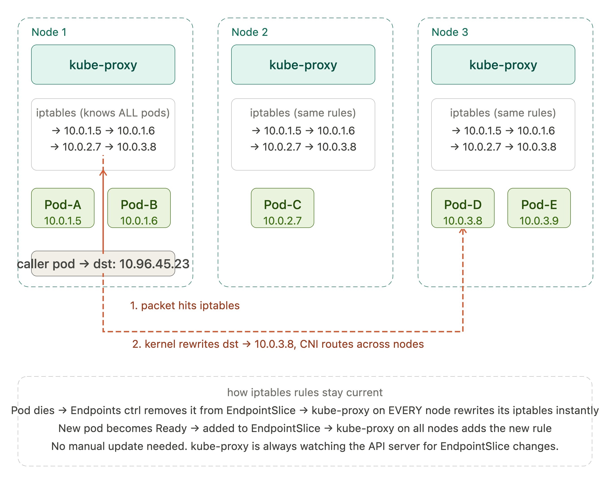

**Step 1 — packet leaves the caller pod.** Destination is the Service ClusterIP `10.96.45.23:80`. The pod has no idea how many backends exist or where they are.

**Step 2 — iptables intercepts on the same node.** The kernel checks its rules before the packet even leaves the node. The iptables chain for `10.96.45.23:80` uses probability-based rules to pick one of 5 pod IPs uniformly at random. This time it picks Pod-D at `10.0.3.8` on Node 3.

**Step 3 — kernel rewrites the destination IP.** The packet's destination changes from `10.96.45.23` to `10.0.3.8`. This happens in the kernel in microseconds — no process involvement.

**Step 4 — CNI overlay routes the packet to Node 3.** The packet now has a real pod IP as its destination. The CNI plugin (Calico, Flannel, Cilium, etc.) has set up routing so every node knows how to reach every pod IP. The packet travels across the underlying network to Node 3.

**Step 5 — Pod-D receives the packet.** It sees its own IP as the destination. It has no knowledge the request came from another node or that a Service was involved.

**How the probability math works in iptables:**

iptables doesn't have a native "pick random" operation. It uses a chain of statistic match rules:

```
Rule 1: 20% probability → send to Pod-A, else continue
Rule 2: 25% probability → send to Pod-B, else continue   (25% of remaining 80% = 20% overall)
Rule 3: 33% probability → send to Pod-C, else continue   (33% of remaining 60% = 20% overall)
Rule 4: 50% probability → send to Pod-D, else continue   (50% of remaining 40% = 20% overall)
Rule 5: 100% probability → send to Pod-E                 (100% of remaining 20% = 20% overall)
```

Each rule is adjusted so that the final result is equal probability across all pods. This is why iptables mode has a subtle performance problem at scale — a request to a service with 1000 pods must traverse 999 rules before hitting the last one. IPVS mode uses a hash table and avoids this completely.

**The EndpointSlice is the source of truth.** When a pod dies, the Endpoints controller removes it from the EndpointSlice object within seconds. kube-proxy on every node sees this change via its watch stream and immediately regenerates the iptables rules — removing the dead pod and re-calculating the probabilities for the remaining pods. This is the complete loop: pod health → EndpointSlice → kube-proxy → iptables rules → traffic stops going to dead pods.

### End-to-End Request Flow

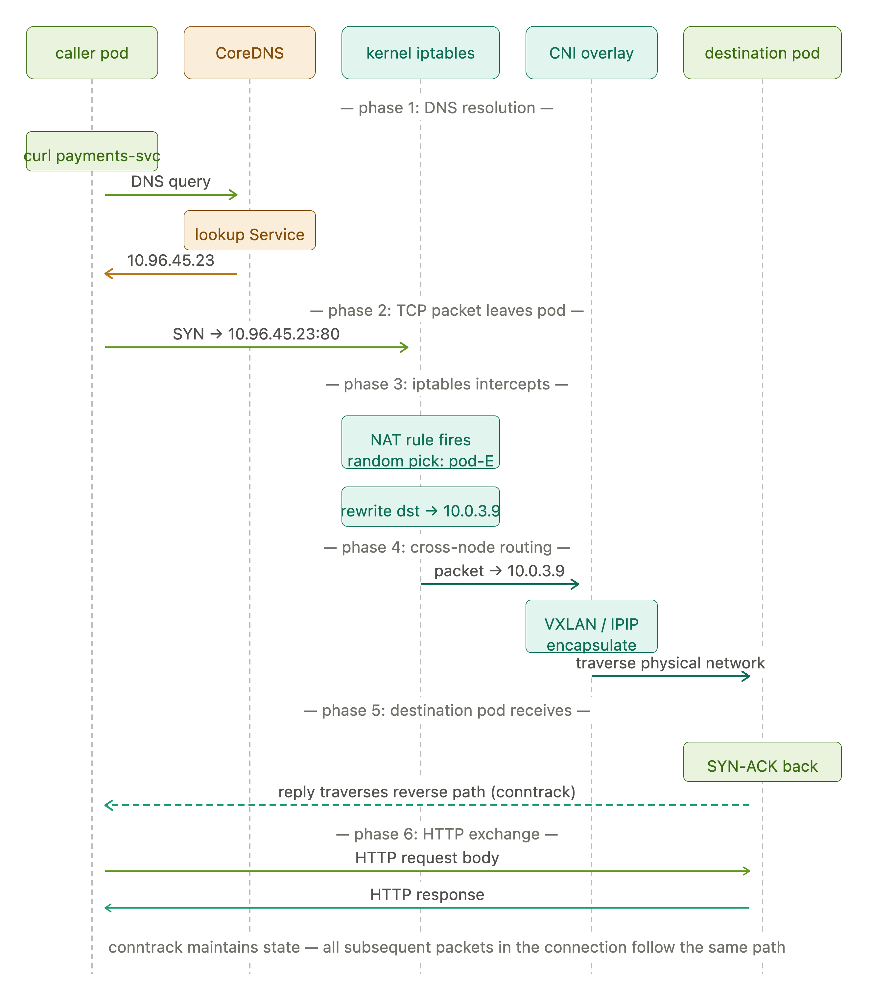

**Step-by-step what happens for `curl http://payments-svc/api/charge`:**

**1. DNS resolution.** The container's `/etc/resolv.conf` is set by kubelet to point at CoreDNS's ClusterIP (e.g., `10.96.0.10`). The DNS query for `payments-svc` is sent to CoreDNS.

**2. CoreDNS looks up the Service.** CoreDNS has an in-memory table of every Service (it watches the API server). It returns the Service's ClusterIP, e.g., `10.96.45.23`. CoreDNS does not know about pods — it returns the virtual Service IP, not a real pod IP.

**3. Application sends the SYN.** The caller initiates a TCP connection to `10.96.45.23:80`. The packet leaves the application but does NOT leave the node yet.

**4. iptables intercepts in the kernel.** The packet hits the NAT table on the caller's node. The rule chain for `10.96.45.23:80` evaluates. A statistic-match rule picks one of the backend pod IPs at random — say `10.0.3.9` (Pod-E on Node 3). The kernel rewrites the destination IP from `10.96.45.23` to `10.0.3.9`. The original destination is recorded in the kernel's **conntrack table** for return-path matching.

**5. CNI overlay routes cross-node.** The packet now has destination `10.0.3.9`. The CNI plugin (Calico, Flannel, Cilium) determines this is on Node 3. Depending on the CNI:
- **Calico in BGP mode:** route directly via the physical network — each node advertises its pod CIDRs
- **Flannel VXLAN:** wrap the packet in a VXLAN header, send to Node 3's host IP, Node 3 unwraps and delivers
- **Cilium eBPF:** custom kernel-bypass routing

The packet arrives at Node 3 with destination `10.0.3.9`.

**6. Destination pod receives.** Node 3's kernel sees `10.0.3.9` belongs to Pod-E's veth interface. The packet is delivered to Pod-E's network namespace. The application reads the SYN, sends SYN-ACK.

**7. Return path via conntrack.** When Pod-E replies, the packet's source IP is `10.0.3.9`. The caller is expecting replies from `10.96.45.23` (what it originally sent to). The conntrack table on the caller's node remembers the NAT mapping, so when the reply comes back, the kernel rewrites the source IP from `10.0.3.9` back to `10.96.45.23` before delivering to the caller's application.

**8. HTTP exchange.** TCP handshake complete. Application sends HTTP request body. All subsequent packets follow the same path because conntrack maintains the connection state.

**The roles in one line each:**

- **API server** — informs every other component about what Services and pods exist
- **CoreDNS** — translates service names to ClusterIPs
- **kube-proxy** — programs iptables on every node based on API server data
- **iptables (kernel)** — does the actual load balancing decision and IP rewrite
- **CNI** — routes packets between nodes, manages pod IPs and namespaces
- **conntrack** — keeps connection state so replies route back correctly

**Critical insight:** at request time, neither the API server, kube-proxy, nor CoreDNS sees your application traffic. Only the kernel handles each packet. The control plane components are involved only in *setup* — they program rules and DNS entries. The data plane is purely kernel-level.

That's why Kubernetes networking scales so well: every packet decision happens in the local kernel of the calling node, at line rate, with no userspace process in the path.

### How Kubernetes Service Load Balances Traffic

The surprising answer: **there is no single load balancer process**. Load balancing happens in the **Linux kernel of every node**, using rules programmed by kube-proxy.

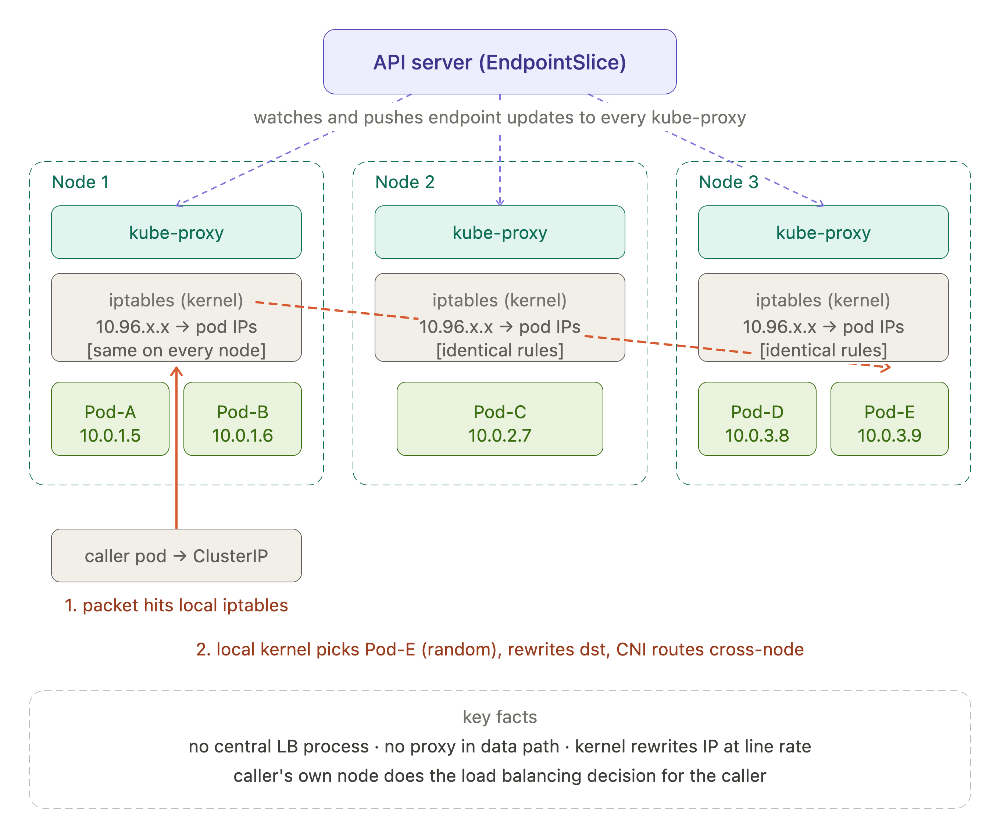

**The mechanism in detail:**

When you create a Service, three things happen:
1. The API server assigns it a virtual IP (the ClusterIP) from a reserved range
2. The Endpoints controller (inside kube-controller-manager) watches pods matching the Service selector and builds an `EndpointSlice` object listing healthy pod IPs
3. kube-proxy on every node watches `EndpointSlice` objects and programs iptables (or IPVS) rules in the local kernel

**The actual load balancing decision happens on the caller's node, in the kernel, in microseconds.** When a pod sends a packet to `10.96.45.23:80`:

- The packet hasn't even left the node yet
- iptables NAT rules match on the destination IP
- A statistic-match rule chain picks one pod IP at random with equal probability
- The kernel rewrites the destination IP in the packet header
- The packet now has a real pod IP and routes via the CNI overlay network

**Why this design is brilliant:**

- **No single point of failure.** Every node has identical rules.
- **No latency hop.** A traditional load balancer adds a network hop. Here, the rewrite happens in the kernel on the caller's own node — zero added hops for the LB decision itself.
- **Linear scaling.** Add more nodes, you have more load balancers automatically.

**The two modes:**

| | iptables mode | IPVS mode |
|---|---|---|
| Implementation | Sequential rule chain | Hash table |
| Lookup complexity | O(N) — every rule evaluated | O(1) — direct hash |
| Scale ceiling | Slow above ~5,000 services | Handles 50,000+ services |
| LB algorithms | Random only | Round-robin, least-conn, source-hash, weighted |
| Default | Yes | Opt-in via `--proxy-mode=ipvs` |

**eBPF replacement:** Cilium and other modern CNIs replace kube-proxy entirely. They install eBPF programs in the kernel that intercept service traffic earlier in the network stack, often before iptables even runs. Same concept, faster execution.

### NodePort vs Ingress

These are often confused because both expose services externally. They operate at different layers.

| | NodePort | Ingress |
|---|---|---|
| Layer | L4 (TCP/UDP port) | L7 (HTTP/HTTPS) |
| Routing | IP:port → service | hostname/path → service |
| SSL termination | No | Yes |
| One per service? | Yes — every service gets its own port | No — one Ingress routes many services |
| Use case | Dev/testing, non-HTTP protocols | Production HTTP APIs and web apps |
| Requires | Nothing extra | An Ingress controller (nginx, traefik, etc.) |

Example: with NodePort you'd have `myserver.com:31234` and `myserver.com:31567` for two services. With Ingress you'd have `myserver.com/api` and `myserver.com/app` — clean URLs, one port 443.

NodePort is a building block. In production, a LoadBalancer Service fronts the Ingress controller, and Ingress handles all the routing logic.

### LoadBalancer Service vs Ingress

| | LoadBalancer Service | Ingress |
|---|---|---|
| Layer | L4 (TCP) | L7 (HTTP/HTTPS) |
| One per service? | Yes — each Service gets its own cloud LB | No — one Ingress routes many services |
| SSL termination | No (pass-through) | Yes |
| Path/host routing | No | Yes (`/api` → service A, `/app` → service B) |
| Cloud LB cost | One LB per service — expensive at scale | One LB for the Ingress controller |
| Requires | Cloud provider support | An Ingress controller deployed in cluster |


### Service Type Example

#### ClusterIP — Internal-only (default)

The most common type. Reachable only from inside the cluster.

```yaml
apiVersion: v1
kind: Service
metadata:
  name: payments-svc                  # DNS name within namespace
  namespace: default
spec:
  type: ClusterIP                     # explicit (this is also the default)

  selector:                           # which pods to route to
    app: payments                     # any pod with label app=payments

  ports:
    - name: http
      protocol: TCP
      port: 80                        # the Service's port (what callers use)
      targetPort: 8080                # the pod's port (where containers listen)

    - name: metrics                   # multi-port: each needs a name
      protocol: TCP
      port: 9090
      targetPort: 9090

  sessionAffinity: ClientIP           # optional: same client → same pod
  sessionAffinityConfig:
    clientIP:
      timeoutSeconds: 10800           # 3-hour sticky session
```

**How callers reach it:**

```
curl http://payments-svc/api          # same namespace
curl http://payments-svc.default/api  # cross-namespace
curl http://payments-svc.default.svc.cluster.local/api  # full FQDN
```

**Auto-assigned ClusterIP** lives in the `serviceSubnet` range (configured at cluster init, often `10.96.0.0/12`).


#### NodePort — Exposed on every node's IP at a fixed port

Opens a port on every node's external IP, in the range 30000-32767.

```yaml
apiVersion: v1
kind: Service
metadata:
  name: web-nodeport
spec:
  type: NodePort

  selector:
    app: web

  ports:
    - protocol: TCP
      port: 80                         # ClusterIP port (internal)
      targetPort: 8080                 # pod port
      nodePort: 31000                  # external port on EVERY node
                                       # (optional — auto-assigned if omitted)

  externalTrafficPolicy: Local         # important — see below
```

**How callers reach it:**

```
curl http://<any-node-ip>:31000      # any node in cluster
curl http://node-1.example.com:31000
curl http://node-2.example.com:31000  # works too — every node listens
```

Even if no pod is running on `node-2`, kube-proxy on `node-2` will accept the connection and forward to a pod on whichever node has one.

**The `externalTrafficPolicy` field is critical:**

| Value | Behavior |
|---|---|
| `Cluster` (default) | Traffic routed to any pod cluster-wide. Source IP is **lost** (SNAT'd to node IP). |
| `Local` | Traffic only routed to pods on the receiving node. Source IP preserved. If no local pod, connection refused. |

Use `Local` when you need real client IPs (rate limiting, audit logging). Pair with an external LB that health-checks each node.

**When to use NodePort:** dev/testing, simple on-prem setups without a cloud LB, or as a building block for Ingress.


#### LoadBalancer — Cloud-provisioned external LB

Asks the cloud provider (AWS, GCP, Azure) to provision a real load balancer with a public IP.

```yaml
apiVersion: v1
kind: Service
metadata:
  name: api-public
  annotations:
    # AWS-specific: which type of LB
    service.beta.kubernetes.io/aws-load-balancer-type: nlb

    # AWS: internal vs internet-facing
    service.beta.kubernetes.io/aws-load-balancer-scheme: internet-facing

    # AWS: cross-zone load balancing
    service.beta.kubernetes.io/aws-load-balancer-cross-zone-load-balancing-enabled: "true"

    # GCP equivalent annotation
    # cloud.google.com/load-balancer-type: "External"
spec:
  type: LoadBalancer

  selector:
    app: api

  ports:
    - port: 443                          # public port on the LB
      targetPort: 8443                   # pod port
      protocol: TCP

  loadBalancerSourceRanges:              # firewall: restrict who can reach
    - 203.0.113.0/24                     # only this CIDR allowed
    - 198.51.100.5/32                    # plus this specific IP

  externalTrafficPolicy: Local           # preserve client IP

  # IP families (1.20+)
  ipFamilyPolicy: PreferDualStack
  ipFamilies:
    - IPv4
    - IPv6
```

**What happens when you apply it:**

1. The cloud-controller-manager sees the Service
2. Calls AWS/GCP/Azure API to provision an LB
3. LB is created, gets a public IP (e.g., `52.x.x.x`)
4. cloud-controller-manager writes the IP back into the Service's `status.loadBalancer.ingress[].ip`
5. The LB is configured to route traffic to all worker nodes on the assigned NodePort
6. `kubectl get svc` now shows the EXTERNAL-IP

**A LoadBalancer is actually a NodePort + cloud LB.** Internally, every LoadBalancer Service also gets a NodePort. The cloud LB just routes external traffic to that NodePort on the worker nodes.

**Cost reality:** Each LoadBalancer Service = one cloud LB = monthly cost. Production clusters typically have ~3-5 LoadBalancer Services total (one per public entry point), not one per microservice. For per-app routing, use Ingress on top of a single LoadBalancer.

#### ExternalName — DNS alias to an external host

No proxying, no traffic routing. Just a DNS-level alias.

```yaml
apiVersion: v1
kind: Service
metadata:
  name: external-database
  namespace: default
spec:
  type: ExternalName

  externalName: prod-db.cluster-xyz.us-east-1.rds.amazonaws.com
  # CoreDNS returns this hostname when pods look up "external-database"
```

**How it works:**

```
Pod calls: external-database.default.svc.cluster.local
        ↓
CoreDNS returns CNAME → prod-db.cluster-xyz.us-east-1.rds.amazonaws.com
        ↓
DNS resolution continues → resolves to actual AWS RDS IP
        ↓
Pod connects directly to RDS
```

**No selector, no kube-proxy, no iptables involvement.** This is purely a DNS trick.

**Use cases:**
- Reference external databases (RDS, Cloud SQL) by a stable Kubernetes name
- Migrate apps gradually — switch the ExternalName to point to a new backend without changing app code
- Cross-cluster references

**Limitation:** Can only point to a hostname, not an IP. If you need to reference an external IP, create a Service without a selector and a manual Endpoints object (covered next).

#### Headless Service — Direct pod IPs, no ClusterIP

`spec.clusterIP: None`. DNS returns pod IPs directly instead of a virtual IP.

```yaml
apiVersion: v1
kind: Service
metadata:
  name: mongo-headless
spec:
  clusterIP: None                       # this is what makes it headless

  selector:
    app: mongo

  ports:
    - port: 27017
      targetPort: 27017

  publishNotReadyAddresses: true        # include unready pods in DNS
                                        # critical for StatefulSet bootstrap
```

**How DNS responds:**

```bash
nslookup mongo-headless
# returns:
#   mongo-headless → 10.0.1.5
#   mongo-headless → 10.0.2.7
#   mongo-headless → 10.0.3.8
```

**No load balancing happens.** The client gets all pod IPs and chooses one itself.

**With a StatefulSet, each pod also gets its own DNS entry:**
```
mongo-0.mongo-headless.default.svc.cluster.local → 10.0.1.5
mongo-1.mongo-headless.default.svc.cluster.local → 10.0.2.7
mongo-2.mongo-headless.default.svc.cluster.local → 10.0.3.8
```

This is how databases find their peers for replication — they need stable, individual addresses, not a load-balanced VIP.

**Use cases:** StatefulSets (MongoDB, Kafka, Cassandra), custom client-side load balancing, anything needing direct pod addressing.


## Endpoints and EndpointSlices

These are the "behind the scenes" objects that make Services work.

### What they are

When you create a Service with a selector, Kubernetes automatically creates an **EndpointSlice** that lists every pod IP currently matching the selector. kube-proxy reads EndpointSlices to program iptables rules.

```
Service (defines: which pods, which port)
   ↓ (automatically maintained by Endpoints controller)
EndpointSlice (lists: actual pod IPs that are Ready)
   ↓ (kube-proxy reads this)
iptables rules in kernel
```

### Endpoints (the original, deprecated)

The original API. One Endpoints object per Service. Limited to ~1000 endpoints due to etcd object size limits.

```yaml
apiVersion: v1
kind: Endpoints
metadata:
  name: payments-svc                   # MUST match the Service name
  namespace: default
subsets:
  - addresses:
      - ip: 10.0.1.5
        nodeName: worker-1
        targetRef:
          kind: Pod
          name: payments-7d4b9c-abc1
      - ip: 10.0.2.7
        nodeName: worker-2
        targetRef:
          kind: Pod
          name: payments-7d4b9c-xyz2
    notReadyAddresses:                 # pods failing readiness probes
      - ip: 10.0.3.8
        nodeName: worker-3
    ports:
      - name: http
        port: 8080
        protocol: TCP
```

### EndpointSlices (the modern replacement)

Introduced in 1.16, GA in 1.21. Splits endpoints across multiple objects (max 100 per slice by default) for scalability.

```yaml
apiVersion: discovery.k8s.io/v1
kind: EndpointSlice
metadata:
  name: payments-svc-abc123            # auto-generated name
  namespace: default
  labels:
    kubernetes.io/service-name: payments-svc   # links to Service
addressType: IPv4                      # or IPv6, FQDN
ports:
  - name: http
    protocol: TCP
    port: 8080
endpoints:
  - addresses:
      - 10.0.1.5
    conditions:
      ready: true                      # passes readinessProbe
      serving: true                    # container is running
      terminating: false               # not being shut down
    targetRef:
      kind: Pod
      name: payments-7d4b9c-abc1
    nodeName: worker-1
    zone: us-east-1a                   # for topology-aware routing
  - addresses:
      - 10.0.2.7
    conditions:
      ready: true
      serving: true
      terminating: false
    targetRef:
      kind: Pod
      name: payments-7d4b9c-xyz2
    nodeName: worker-2
    zone: us-east-1b
```

### Must-know facts

| Fact | Detail |
|---|---|
| Auto-managed | The Endpoints controller (or EndpointSlice controller) creates and maintains these — you don't write them |
| Match by selector | Only pods matching the Service's selector are included |
| Ready filter | Only pods with `Ready` condition are included by default |
| EndpointSlice scaling | Up to 100 endpoints per slice (configurable); Service with 1000 pods gets ~10 slices |
| Topology hints | `zone` field enables topology-aware routing (prefer same-zone endpoints) |
| Both objects exist | Kubernetes maintains both Endpoints and EndpointSlices for backward compatibility |
| kube-proxy reads EndpointSlices | In modern Kubernetes — Endpoints is legacy |
| Manual mode | Create a Service without a selector + manual Endpoints to point to external IPs |

### Manual Endpoints for external services

```yaml
# Service without selector — Kubernetes won't auto-populate endpoints
apiVersion: v1
kind: Service
metadata:
  name: external-database
spec:
  ports:
    - port: 5432
      protocol: TCP
# notice: no selector

---
# You provide the endpoints manually
apiVersion: v1
kind: Endpoints
metadata:
  name: external-database              # MUST match Service name
subsets:
  - addresses:
      - ip: 192.0.2.50                 # external server IP
      - ip: 192.0.2.51                 # second external server
    ports:
      - port: 5432
        protocol: TCP
```

Pods can now connect to `external-database:5432` and traffic is load-balanced across the two external IPs. Useful for legacy services that aren't pods.


## What Happens When You Apply a Service YAML?

There are **three separate controllers** involved, not one.

#### The three controllers

| Controller | Watches | Job |
|---|---|---|
| **Service controller** (in kube-controller-manager) | Service objects | Allocates ClusterIP. For type=LoadBalancer, calls cloud API. |
| **Endpoints controller** (in kube-controller-manager) | Services + Pods | Maintains the legacy `Endpoints` object |
| **EndpointSlice controller** (in kube-controller-manager) | Services + Pods | Maintains modern `EndpointSlice` objects |

All three run inside the same `kube-controller-manager` binary, but each is an independent goroutine with its own Informer and Reconcile loop.

#### The full sequence

```
You apply service.yaml
        ↓
1. API server validates + writes Service to etcd
        ↓
2. Service controller sees ADDED event
   - Allocates a ClusterIP from the service-cidr range
   - Patches Service.spec.clusterIP
   - If type=LoadBalancer: calls cloud API to provision LB
   - Writes LB IP back into Service.status.loadBalancer.ingress
        ↓
3. Endpoints controller sees ADDED event for Service
   - Lists all pods matching the selector
   - Filters to those with Ready condition
   - Creates Endpoints object with their IPs
        ↓
4. EndpointSlice controller does the same
   - Creates one or more EndpointSlice objects (max 100 endpoints each)
   - Includes zone, nodeName, conditions for each endpoint
        ↓
5. kube-proxy on EVERY node sees:
   - Service ADDED → records the ClusterIP
   - EndpointSlice ADDED → notes the backend pod IPs
   - Rewrites local iptables rules to route Service IP → pod IPs
        ↓
6. CoreDNS sees the Service ADDED event
   - Adds DNS record: svcname.namespace.svc.cluster.local → ClusterIP
        ↓
7. Service is now reachable from any pod
```

#### Why three controllers, not one?

- **Separation of concerns.** Service controller deals with IP allocation and cloud LB lifecycle. Endpoints controllers deal with tracking which pods are healthy backends.
- **Different watch patterns.** Service controller only cares about Service changes. Endpoints controllers also watch Pods constantly (every readiness probe state change triggers an update).
- **Different scale concerns.** A pod becoming Ready triggers EndpointSlice updates 100x per minute in a busy cluster. The Service controller is idle most of the time.

#### What happens when a pod becomes unready?

```
Pod's readinessProbe fails
        ↓
kubelet updates Pod.status.conditions[type=Ready].status = "False"
        ↓
Endpoints controller sees Pod UPDATED event
        ↓
Removes pod from Endpoints subsets
        ↓
EndpointSlice controller does the same
        ↓
kube-proxy on every node sees EndpointSlice UPDATED
        ↓
Rewrites iptables to skip this pod
        ↓
New traffic stops flowing to the unhealthy pod (existing connections via conntrack continue)
```

All this happens in seconds. The control loops keep the data plane in sync with pod health.


## Ingress Controller

An Ingress object is just a set of routing rules stored in etcd. It does nothing by itself. An **Ingress controller** is a separate pod (or DaemonSet) that reads those rules and actually enforces them.

**What the Ingress controller does:**

1. Watches the API server for `Ingress` objects using an Informer
2. Translates Ingress rules into its own config format (nginx config, Envoy routes, HAProxy backend config)
3. Writes the config to its proxy process and triggers a reload
4. Receives external HTTP/S traffic
5. Routes requests to the appropriate Service's ClusterIP based on Host header and URL path
6. Terminates TLS (decrypts HTTPS, forwards plain HTTP internally)

**Architecture:**

```
Internet
   ↓
Cloud LB (one LoadBalancer Service exposing the controller)
   ↓
Ingress Controller pods (nginx/traefik/envoy)
   ↓ reads Ingress rules, routes by host+path
   ├── api.myapp.com/v1/* → api-v1-svc:80
   ├── api.myapp.com/v2/* → api-v2-svc:80
   └── admin.myapp.com/*  → admin-svc:8080
```

**Popular implementations:**

| Controller | Technology inside | Strengths |
|---|---|---|
| ingress-nginx | nginx | Most common, battle-tested |
| Traefik | Traefik proxy | Auto-discovers routes, great dashboard |
| AWS ALB Ingress | AWS Application LB | Native AWS, works with WAF/Cognito |
| Kong | Kong Gateway | Rich plugin ecosystem |
| Contour | Envoy | Used by Knative, GKE |
| HAProxy Ingress | HAProxy | High throughput |

**Example nginx Ingress with TLS:**

```yaml
apiVersion: networking.k8s.io/v1
kind: Ingress
metadata:
  name: app-ingress
  annotations:
    nginx.ingress.kubernetes.io/rewrite-target: /        # strip path prefix
    nginx.ingress.kubernetes.io/rate-limit: "100"        # 100 rps per IP
    nginx.ingress.kubernetes.io/ssl-redirect: "true"     # force HTTPS
    cert-manager.io/cluster-issuer: "letsencrypt-prod"   # auto-provision TLS
spec:
  ingressClassName: nginx                # which controller handles this
  tls:
    - hosts:
        - api.myapp.com
        - admin.myapp.com
      secretName: myapp-tls             # cert-manager writes cert here
  rules:
    - host: api.myapp.com
      http:
        paths:
          - path: /v1
            pathType: Prefix
            backend:
              service:
                name: api-v1-svc
                port: { number: 80 }
          - path: /v2
            pathType: Prefix
            backend:
              service:
                name: api-v2-svc
                port: { number: 80 }
    - host: admin.myapp.com
      http:
        paths:
          - path: /
            pathType: Prefix
            backend:
              service:
                name: admin-svc
                port: { number: 8080 }
```

**Must-know facts:**

| Fact | Detail |
|---|---|
| Not built-in | You must install an Ingress controller. The Ingress *object* is built-in; the controller is not. |
| `ingressClassName` | Selects which controller handles the Ingress. Multiple controllers can coexist. |
| Annotations are controller-specific | `nginx.ingress.kubernetes.io/*` only works with ingress-nginx, not Traefik |
| TLS termination | Controller decrypts HTTPS, forwards HTTP internally to Services |
| WebSocket support | Most controllers support it but require an annotation to enable keep-alive |
| Path types | `Exact` (exact match), `Prefix` (prefix match), `ImplementationSpecific` (controller decides) |
| Ingress vs Gateway API | Gateway API (now GA) is the modern replacement with better multi-tenant support and more expressive routing |
| One LB for all | The point of Ingress: one cloud LB fronting the controller, the controller routes to many Services |

## ConfigMaps

A **ConfigMap** stores non-secret configuration (env vars, config files, CLI flags) separately from your container image.

**Why it helps:**
- Same image runs in dev/staging/prod with different configs.
- Change config without rebuilding the image.
- Mount as env vars or as files inside the pod.

### ConfigMap Example

```yaml
# ── ConfigMap definition ─────────────────────────────────────────
apiVersion: v1                  # Kubernetes API version for core objects
kind: ConfigMap                 # Type of object we are creating
metadata:
  name: app-config              # Name used to reference this ConfigMap in pods

data:                           # The actual config key-value pairs
  LOG_LEVEL: "debug"            # Simple string value; will be injected as env var
  app.properties: |             # Multi-line file content (the | means literal block)
    timeout=30                  #   this will become a FILE inside the container
    retries=3                   #   at the path you mount it to

---
# ── Pod that uses the ConfigMap ───────────────────────────────────
apiVersion: v1
kind: Pod
metadata:
  name: myapp                   # Name of this pod
spec:
  containers:
    - name: app                 # Container name inside the pod
      image: myapp:1.0          # Docker image to run

      env:                      # Environment variables for this container
        - name: LOG_LEVEL       # Name of the env var inside the container
          valueFrom:
            configMapKeyRef:    # Pull value FROM a ConfigMap (not hardcoded)
              name: app-config  # Which ConfigMap to read from
              key: LOG_LEVEL    # Which key inside that ConfigMap

      volumeMounts:             # Mount a volume at a path inside the container
        - name: config-vol      # Must match the volume name below
          mountPath: /etc/config # Container sees files at this path

  volumes:                      # Define volumes available to this pod
    - name: config-vol          # Name referenced in volumeMounts above
      configMap:
        name: app-config        # Populate this volume from our ConfigMap
                                # Each key in `data` becomes a FILE at mountPath
                                # e.g. /etc/config/app.properties
                                # e.g. /etc/config/LOG_LEVEL
```

**Net result inside the container:**
```bash
echo $LOG_LEVEL              # prints: debug       (from env var)
cat /etc/config/app.properties   # prints: timeout=30 / retries=3  (from file mount)
```

**One powerful feature**: if you update the ConfigMap, the mounted files inside running pods update automatically (within ~1 minute) without a pod restart. Environment variables do NOT update — they're baked in at startup.

## Secrets

**Secret** = like a ConfigMap, but for sensitive data (passwords, tokens, TLS certs). Values are base64-encoded at rest and can be encrypted in etcd.

**Create:**
```yaml
apiVersion: v1
kind: Secret
metadata:
  name: db-secret
type: Opaque
data:
  username: YWRtaW4=        # "admin" in base64
  password: czNjcjN0UHdk    # "s3cr3tPwd"
```

Or via CLI (auto-encodes):
```bash
kubectl create secret generic db-secret \
  --from-literal=username=admin \
  --from-literal=password=s3cr3tPwd
```

Secrets work exactly like ConfigMaps but the values are base64-encoded at rest and Kubernetes keeps them out of logs and `kubectl describe pod` output by default.

Two ways to use them:

**As environment variables:**
```yaml
env:
  - name: DB_PASSWORD          # env var name inside the container
    valueFrom:
      secretKeyRef:
        name: db-secret        # name of the Secret object
        key: password          # key inside the Secret
```

**As a file (more secure — process can read it only when needed):**
```yaml
volumeMounts:
  - name: secret-vol
    mountPath: /etc/secrets    # container sees files here
    readOnly: true             # best practice: secrets are read-only

volumes:
  - name: secret-vol
    secret:
      secretName: db-secret   # each key becomes a file
                               # e.g. /etc/secrets/password
                               # e.g. /etc/secrets/username
```

File mounting is preferred for sensitive values — the secret never appears in the process environment (where other processes could read it via `/proc`).

**Important:** base64 is *not* encryption. Use **encryption at rest** (KMS) and tools like **External Secrets Operator**, **HashiCorp Vault**, or **Sealed Secrets** for real security.

## Volume / PV / PVC

Normally a container's filesystem is temporary. When the container dies, all files are gone. Volumes solve this.

Think of it like a USB drive: you plug it into the container at a specific folder path. The container reads/writes to that path. If the container dies and restarts, the USB drive (volume) is still there with all data intact.

**Three types you'll use most:**

`emptyDir` — temporary shared space between containers in the same pod. Gone when the pod dies.

`hostPath` — mounts a folder from the actual node's disk. Risky (node-specific), but useful for logs.

`persistentVolumeClaim (PVC)` — requests real durable storage (AWS EBS, GCP disk, NFS). Survives pod deletion.

```yaml
apiVersion: v1
kind: Pod
metadata:
  name: mongo
spec:
  containers:
    - name: mongo
      image: mongo:6
      volumeMounts:
        - name: data-vol        # which volume to use (must match below)
          mountPath: /data/db   # where inside the container to plug it in

  volumes:
    - name: data-vol            # volume definition
      persistentVolumeClaim:
        claimName: mongo-pvc    # the PVC that provisions real disk
```

Inside the container, `/data/db` is backed by real persistent disk. MongoDB writes there. Pod restarts, data is still there.

### PersistentVolume and PersistentVolumeClaim

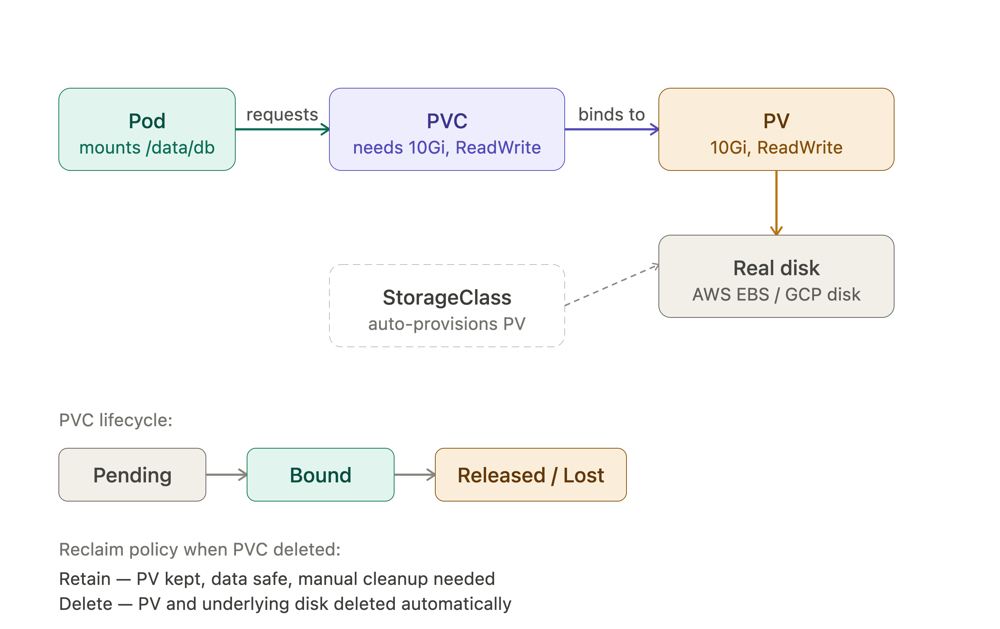

Think of it like renting office space:

- PV (PersistentVolume) = the actual office space that exists (provisioned by an admin or auto-provisioned)
- PVC (PersistentVolumeClaim) = your rental request ("I need 10Gi, read-write")
- StorageClass = the property management company that automatically finds and provisions space matching your request

The pod never talks to the disk directly — it talks to the PVC. This decouples the app from the underlying storage technology. Same PVC spec works whether your cluster runs on AWS, GCP, or bare metal.

**Must-know facts:**
- One PVC binds to exactly one PV — one-to-one relationship.
- `accessModes`: `ReadWriteOnce` (one node), `ReadWriteMany` (multiple nodes simultaneously — needs NFS or similar), `ReadOnlyMany`.
- StorageClass with `volumeBindingMode: WaitForFirstConsumer` delays disk provisioning until the pod is scheduled — important for zone-aware storage.
- Deleting a PVC does not automatically delete data if `reclaimPolicy: Retain` is set.
- StatefulSets create PVCs automatically per pod via `volumeClaimTemplates`.

### PVC/PV Sequence During Pod Start and Stop

**Pod start:**

```
kubectl apply pod.yaml
        ↓
1. API server writes Pod to etcd (status: Pending, nodeName: "")
        ↓
2. Scheduler picks a node — considers zone of the PVC's bound PV
   (pods with zone-specific PVs must schedule to same zone)
        ↓
3. API server patches Pod.spec.nodeName = "worker-2"
        ↓
4. Kubelet on worker-2 sees pod assigned to it
        ↓
5. Kubelet calls kube-controller-manager ADController:
   "attach this PVC's PV to worker-2"
        ↓
6. ADController calls cloud CSI driver
   (e.g., aws-ebs-csi-driver) to attach EBS volume to EC2 instance
        ↓
7. Cloud API: attach volume (takes 5-30s)
   Node sees new block device: /dev/xvdba
        ↓
8. Kubelet's VolumeManager watches for attachment
   Once attached, kubelet mounts the filesystem:
   mount /dev/xvdba /var/lib/kubelet/pods/<pod-uid>/volumes/pvc-xxxx
        ↓
9. Kubelet bind-mounts from above path into container:
   mount --bind /var/lib/kubelet/pods/... /data/db   (inside container)
        ↓
10. Container starts with /data/db backed by the EBS volume
```

**Pod stop:**

```
kubectl delete pod (or Deployment scales down)
        ↓
1. API server sets Pod.deletionTimestamp
        ↓
2. Kubelet sees deletionTimestamp
        ↓
3. preStop hook fires (if defined) — runs inside container
        ↓
4. SIGTERM sent to container PID 1
        ↓
5. Container shuts down (or SIGKILL after grace period)
        ↓
6. Kubelet unmounts the bind mount from inside the container
        ↓
7. Kubelet unmounts the volume from the node path
   umount /var/lib/kubelet/pods/<pod-uid>/volumes/pvc-xxxx
        ↓
8. Kubelet signals ADController: "detach this PV from worker-2"
        ↓
9. ADController calls CSI driver to detach from cloud
   (EBS volume detaches from EC2 instance — takes 5-30s)
        ↓
10. PVC returns to "Bound" state (still bound to PV, just not attached to any node)
    PV is available for another pod to mount
        ↓
11. Pod object deleted from etcd
```

**Key insight:** The PVC/PV bond persists across pod lifecycle. Deleting a pod does not delete the PVC or PV. The data survives. Only `kubectl delete pvc` removes the claim, and only if `reclaimPolicy: Delete` is set does the PV and underlying cloud disk get deleted.

## Permissions (RBAC)

Kubernetes uses Role-Based Access Control. Three questions: *Who* are you? *What* can you do? *Where* can you do it?

Four objects:

| Object | What it defines |
|---|---|
| `ServiceAccount` | The identity of a pod or process |
| `Role` | A list of allowed actions (verbs) on resources, within one namespace |
| `ClusterRole` | Same as Role but cluster-wide |
| `RoleBinding` | Links a ServiceAccount to a Role |

```yaml
# 1. Identity — who the pod runs as
apiVersion: v1
kind: ServiceAccount
metadata:
  name: my-operator              # name for this identity
  namespace: default             # exists in this namespace

---
# 2. Permissions — what actions are allowed
apiVersion: rbac.authorization.k8s.io/v1
kind: Role
metadata:
  name: pod-reader               # name of this permission set
  namespace: default             # only valid in this namespace
rules:
  - apiGroups: [""]              # "" means the core API group (pods, services, etc.)
    resources: ["pods"]          # which resource type
    verbs: ["get", "list", "watch"]  # what actions are allowed
                                 # other verbs: create, update, patch, delete

---
# 3. Binding — glue identity to permissions
apiVersion: rbac.authorization.k8s.io/v1
kind: RoleBinding
metadata:
  name: read-pods-binding
  namespace: default
subjects:
  - kind: ServiceAccount
    name: my-operator            # the identity from step 1
    namespace: default
roleRef:
  kind: Role
  name: pod-reader               # the permissions from step 2
  apiGroup: rbac.authorization.k8s.io

---
# 4. Pod that uses this identity
apiVersion: v1
kind: Pod
metadata:
  name: my-app
spec:
  serviceAccountName: my-operator  # use the identity above
  containers:
    - name: app
      image: myapp:1.0
      # this pod can now GET/LIST/WATCH pods but nothing else
```

The API server checks this chain on every request: does this ServiceAccount have a RoleBinding to a Role that permits this verb on this resource?

## Affinity and Anti-Affinity

Two questions answer everything:
- **Affinity** — "schedule me *near* something"
- **Anti-affinity** — "schedule me *away from* something"

"Near" and "away from" can mean: near a specific *node* (node affinity) or near/away from other *pods* (pod affinity/anti-affinity).

### Two flavours of enforcement

| | Meaning |
|---|---|
| `requiredDuringSchedulingIgnoredDuringExecution` | Hard rule. Pod stays `Pending` forever if no node matches. |
| `preferredDuringSchedulingIgnoredDuringExecution` | Soft rule. Scheduler tries, but schedules anyway if no match. |

"IgnoredDuringExecution" means: if a node's labels change *after* a pod is already running, the pod is NOT evicted. It only affects scheduling.

### Node Affinity — "I want to run on nodes with GPU"

```yaml
apiVersion: v1
kind: Pod
metadata:
  name: ml-trainer
spec:
  affinity:
    nodeAffinity:

      # HARD rule — pod will NOT schedule if no node matches
      requiredDuringSchedulingIgnoredDuringExecution:
        nodeSelectorTerms:
          - matchExpressions:
              - key: gpu            # node must have label gpu=true
                operator: In
                values: ["true"]

      # SOFT rule — prefer nodes in us-east-1a, but not required
      preferredDuringSchedulingIgnoredDuringExecution:
        - weight: 80               # higher weight = stronger preference (1–100)
          preference:
            matchExpressions:
              - key: topology.kubernetes.io/zone
                operator: In
                values: ["us-east-1a"]

  containers:
    - name: trainer
      image: tensorflow:2.0
```

The scheduler filters nodes to only those with `gpu=true` (hard), then among those, prefers `us-east-1a` nodes (soft, weight 80).

### Pod Anti-Affinity — "Spread my replicas across nodes"

This is the most common real-world use case. You have 3 replicas of a web server and you don't want all 3 landing on the same node (single point of failure).

```yaml
apiVersion: apps/v1
kind: Deployment
metadata:
  name: web-server
spec:
  replicas: 3
  selector:
    matchLabels:
      app: web-server
  template:
    metadata:
      labels:
        app: web-server        # this label is used by anti-affinity below
    spec:
      affinity:
        podAntiAffinity:

          # HARD rule — refuse to schedule on a node that already
          # has a pod with label app=web-server
          requiredDuringSchedulingIgnoredDuringExecution:
            - labelSelector:
                matchExpressions:
                  - key: app
                    operator: In
                    values: ["web-server"]  # same label as this pod
              topologyKey: kubernetes.io/hostname
              # topologyKey = "what counts as a boundary"
              # hostname = one pod per node
              # zone     = one pod per availability zone

      containers:
        - name: web
          image: nginx:1.25
```

What happens: Pod-1 lands on Node-A. Pod-2 sees Node-A already has `app=web-server` → rejected. Pod-2 lands on Node-B. Pod-3 lands on Node-C. All 3 are on different nodes.

If you only have 2 nodes and `required` is set, the 3rd pod stays `Pending` forever — there is no eligible node.

### Pod Affinity — "Run me near the cache"

Your app has very high traffic to Redis. You want app pods to run on the *same node* as a Redis pod to avoid network hops.

```yaml
apiVersion: v1
kind: Pod
metadata:
  name: api-server
spec:
  affinity:
    podAffinity:

      # HARD rule — only schedule on a node that already
      # has a pod with label app=redis
      requiredDuringSchedulingIgnoredDuringExecution:
        - labelSelector:
            matchExpressions:
              - key: app
                operator: In
                values: ["redis"]   # must co-locate with Redis pod
          topologyKey: kubernetes.io/hostname
          # same hostname = same node

  containers:
    - name: api
      image: myapi:1.0
```

The scheduler only considers nodes that already have a Redis pod running on them.

### Combined example — zone spread + node spread

Real production pattern: spread across zones (for HA), but also ensure no two replicas land on the same node within a zone.

```yaml
spec:
  affinity:
    podAntiAffinity:

      # HARD: max one pod per node
      requiredDuringSchedulingIgnoredDuringExecution:
        - labelSelector:
            matchExpressions:
              - key: app
                operator: In
                values: ["payments"]
          topologyKey: kubernetes.io/hostname   # boundary = node

      # SOFT: prefer different availability zones
      preferredDuringSchedulingIgnoredDuringExecution:
        - weight: 100
          podAffinityTerm:
            labelSelector:
              matchExpressions:
                - key: app
                  operator: In
                  values: ["payments"]
            topologyKey: topology.kubernetes.io/zone  # boundary = zone
```

Result: pods are guaranteed on different nodes (hard), and the scheduler strongly prefers placing them in different zones (soft).


### topologyKey is the key concept

`topologyKey` tells the scheduler what "unit of separation" to use. It references a node label:

| topologyKey | Means |
|---|---|
| `kubernetes.io/hostname` | Each node is its own unit (most granular) |
| `topology.kubernetes.io/zone` | Each AZ is a unit (us-east-1a, us-east-1b) |
| `topology.kubernetes.io/region` | Each region is a unit |

For anti-affinity with `topologyKey: zone` — the scheduler ensures no two matching pods share the same zone, not just the same node.

### Operators available in `matchExpressions`

| Operator | Meaning |
|---|---|
| `In` | Label value is in this list |
| `NotIn` | Label value is not in this list |
| `Exists` | Label key exists (any value) |
| `DoesNotExist` | Label key does not exist |
| `Gt` / `Lt` | Numeric greater/less than (node affinity only) |

### Affinity vs Taint/Toleration — when to use which

| Scenario | Use |
|---|---|
| "Only GPU pods on GPU nodes" | Taint the node + toleration on pod + node affinity |
| "Spread replicas for HA" | Pod anti-affinity |
| "Co-locate app with its cache" | Pod affinity |
| "Prefer newer nodes" | Node affinity (soft) |

Taints *push* pods away from nodes. Affinity *pulls* pods toward or away from nodes/pods. They complement each other — taint ensures only tolerating pods *can* run there, affinity ensures the right pods *want* to run there.

## Taints

A taint is a label on a node that says "don't schedule pods here unless they explicitly tolerate this." It's the opposite of node affinity — instead of pods choosing nodes, nodes repel pods.

**Format:** `key=value:effect`

Three effects:

| Effect | Meaning |
|---|---|
| `NoSchedule` | Don't schedule new pods here (existing pods unaffected) |
| `PreferNoSchedule` | Try to avoid, but not hard |
| `NoExecute` | Don't schedule AND evict existing pods that don't tolerate it |

**Example — dedicated GPU node:**

```bash
# Taint the node
kubectl taint nodes gpu-node-1 gpu=true:NoSchedule
```

Now no pod can run on `gpu-node-1` unless it has this toleration:

```yaml
spec:
  tolerations:
    - key: "gpu"          # must match the taint key
      operator: "Equal"
      value: "true"       # must match the taint value
      effect: "NoSchedule" # must match the taint effect
  containers:
    - name: ml-trainer
      image: tensorflow:latest
```

Pods without this toleration are simply not scheduled there. Pods with it can run there (but won't exclusively — combine with `nodeAffinity` to force them there).

**Must-know facts:**
- Control plane nodes are tainted `node-role.kubernetes.io/control-plane:NoSchedule` by default — that's why your pods don't land there.
- `NoExecute` with `tolerationSeconds` lets pods stay for a grace period before eviction: useful for tolerating temporary node problems.
- Node controller automatically adds taints like `node.kubernetes.io/not-ready:NoExecute` when a node goes unhealthy.
- Remove a taint: `kubectl taint nodes gpu-node-1 gpu=true:NoSchedule-` (trailing `-` removes it).
- A pod can have multiple tolerations.

## Tolerations

A toleration is a declaration on a **pod** that says: "I can tolerate this taint — don't block me from that node."

Taints and tolerations always work as a pair:
- **Taint** lives on the **node** — repels pods
- **Toleration** lives on the **pod** — overrides that repulsion

Without a matching toleration, a tainted node is invisible to the scheduler for that pod.

### Anatomy of a toleration

```yaml
tolerations:
  - key: "gpu"              # must match taint key
    operator: "Equal"       # Equal = match key AND value
    value: "true"           # must match taint value
    effect: "NoSchedule"    # must match taint effect
    tolerationSeconds: 300  # only used with NoExecute (explained below)
```

### Operators

| Operator | Meaning |
|---|---|
| `Equal` | key, value, AND effect must all match |
| `Exists` | only key needs to match — value is ignored |

`Exists` with no key = tolerate **every** taint on every node. Used by DaemonSets (they must run everywhere).

### Effects

| Effect | What taint does | What toleration overrides |
|---|---|---|
| `NoSchedule` | New pods won't be scheduled here | Pod can now be scheduled here |
| `PreferNoSchedule` | Scheduler avoids this node but not strictly | Pod can be scheduled here freely |
| `NoExecute` | No new pods + evict existing pods | Pod won't be evicted |

### Full YAML example — 3 scenarios in one file

```yaml
apiVersion: v1
kind: Pod
metadata:
  name: my-pod
spec:

  tolerations:

    # ── Scenario 1: Dedicated GPU node ──────────────────────────
    # Node has taint: kubectl taint nodes gpu-node gpu=true:NoSchedule
    # This pod can schedule there
    - key: "gpu"
      operator: "Equal"
      value: "true"
      effect: "NoSchedule"

    # ── Scenario 2: Tolerate a degraded node temporarily ────────
    # Node gets auto-tainted: node.kubernetes.io/not-ready:NoExecute
    # Without this, pod is evicted in 300s when node goes NotReady
    # With this, pod stays alive on the node for 300 more seconds
    # before being evicted — gives node time to recover
    - key: "node.kubernetes.io/not-ready"
      operator: "Exists"        # value doesn't matter
      effect: "NoExecute"
      tolerationSeconds: 300    # wait 300s before evicting

    # ── Scenario 3: Tolerate ALL taints (DaemonSet style) ───────
    # No key = matches every taint on every node
    # Used when a pod MUST run on every node regardless
    - operator: "Exists"        # no key specified = wildcard

  containers:
    - name: app
      image: myapp:1.0
```

### Toleration on a DaemonSet (must-know pattern)

DaemonSets need to run on every node including control plane nodes and degraded nodes. They use wildcard tolerations:

```yaml
apiVersion: apps/v1
kind: DaemonSet
metadata:
  name: log-collector
spec:
  template:
    spec:
      tolerations:

        # Run on control plane nodes (tainted by default)
        - key: "node-role.kubernetes.io/control-plane"
          operator: "Exists"
          effect: "NoSchedule"

        # Stay on not-ready nodes (don't get evicted)
        - key: "node.kubernetes.io/not-ready"
          operator: "Exists"
          effect: "NoExecute"

        # Stay on unreachable nodes
        - key: "node.kubernetes.io/unreachable"
          operator: "Exists"
          effect: "NoExecute"

      containers:
        - name: log-collector
          image: fluentd:latest
```

Without these tolerations, `fluentd` would never run on control plane nodes and would be evicted the moment a node becomes unreachable.

### Auto-added tolerations — must know

Kubernetes automatically adds two tolerations to **every pod** (since 1.18):

```yaml
# Added automatically — you don't write these
- key: "node.kubernetes.io/not-ready"
  operator: "Exists"
  effect: "NoExecute"
  tolerationSeconds: 300

- key: "node.kubernetes.io/unreachable"
  operator: "Exists"
  effect: "NoExecute"
  tolerationSeconds: 300
```

This means by default every pod tolerates node failure for 5 minutes before being rescheduled. You can override this by setting your own `tolerationSeconds` value.

### Must-know facts

| Fact | Detail |
|---|---|
| Toleration ≠ guarantee | A toleration allows scheduling on a tainted node but doesn't force it. Combine with `nodeAffinity` to force it. |
| Multiple tolerations | A pod must tolerate **all** taints on a node to be scheduled there — one unmatched taint blocks it |
| `tolerationSeconds: 0` | Pod is evicted immediately when `NoExecute` taint appears |
| No `tolerationSeconds` on `NoExecute` | Pod is never evicted — stays indefinitely |
| `tolerationSeconds` ignored on `NoSchedule` | Only meaningful for `NoExecute` |
| Control plane default taint | `node-role.kubernetes.io/control-plane:NoSchedule` — why your pods never land on master nodes |
| Node pressure taints | Kubernetes auto-taints nodes under memory/disk pressure: `node.kubernetes.io/memory-pressure`, `node.kubernetes.io/disk-pressure` |
| Removing a taint | `kubectl taint nodes my-node gpu=true:NoSchedule-` (trailing `-` removes it) |
| Effect omitted in toleration | Matches that key across **all** effects |

### Taint + Toleration + Affinity together

Toleration alone is permissive — it says "I *can* go there." It doesn't say "I *must* go there." To dedicate a node exclusively to specific workloads you need all three:

```yaml
# 1. Taint the node (repels everything)
# kubectl taint nodes gpu-node-1 dedicated=gpu:NoSchedule

# 2. Pod spec — tolerate the taint (permits entry)
tolerations:
  - key: "dedicated"
    operator: "Equal"
    value: "gpu"
    effect: "NoSchedule"

# 3. Node affinity — forces the pod to land there
affinity:
  nodeAffinity:
    requiredDuringSchedulingIgnoredDuringExecution:
      nodeSelectorTerms:
        - matchExpressions:
            - key: dedicated
              operator: In
              values: ["gpu"]
```

Taint repels all other pods. Toleration lets this pod in. Affinity makes sure this pod goes there. Three parts, one complete solution.

## nodeSelector and nodeAffinity Example

```yaml
apiVersion: v1
kind: Pod
metadata:
  name: ml-training
spec:

  # ── Option A: nodeSelector — simple, exact label match ──
  nodeSelector:
    disktype: ssd              # only nodes labeled disktype=ssd
    gpu: "true"                # AND nodes labeled gpu=true

  # ── Option B: nodeAffinity — expressive, supports operators ──
  # (use ONE of nodeSelector or nodeAffinity, not both for same dimension)
  affinity:
    nodeAffinity:

      # HARD rule — refuse to schedule if no matching node
      requiredDuringSchedulingIgnoredDuringExecution:
        nodeSelectorTerms:
          - matchExpressions:
              - key: kubernetes.io/arch
                operator: In
                values: ["amd64"]            # x86 nodes only
              - key: node.kubernetes.io/instance-type
                operator: In
                values: ["g5.xlarge", "g5.2xlarge"]  # specific instance types

      # SOFT rule — prefer if possible, but not required
      preferredDuringSchedulingIgnoredDuringExecution:
        - weight: 80                          # weights 1-100
          preference:
            matchExpressions:
              - key: topology.kubernetes.io/zone
                operator: In
                values: ["us-east-1a"]        # prefer this zone
        - weight: 40
          preference:
            matchExpressions:
              - key: node-age
                operator: Gt                  # numeric: greater than
                values: ["7"]                 # prefer nodes > 7 days old

  containers:
    - name: trainer
      image: tensorflow:2.15
```

**Operators for nodeAffinity:** `In`, `NotIn`, `Exists`, `DoesNotExist`, `Gt`, `Lt`. nodeSelector only supports exact match.

**Practical rule of thumb:** use `nodeSelector` for simple cases (90% of the time). Use `nodeAffinity` when you need OR conditions, numeric comparisons, or preferences (soft rules).

## Autoscaling in Kubernetes

Kubernetes has three independent autoscaling mechanisms that operate at different layers. They are complementary, not alternatives.

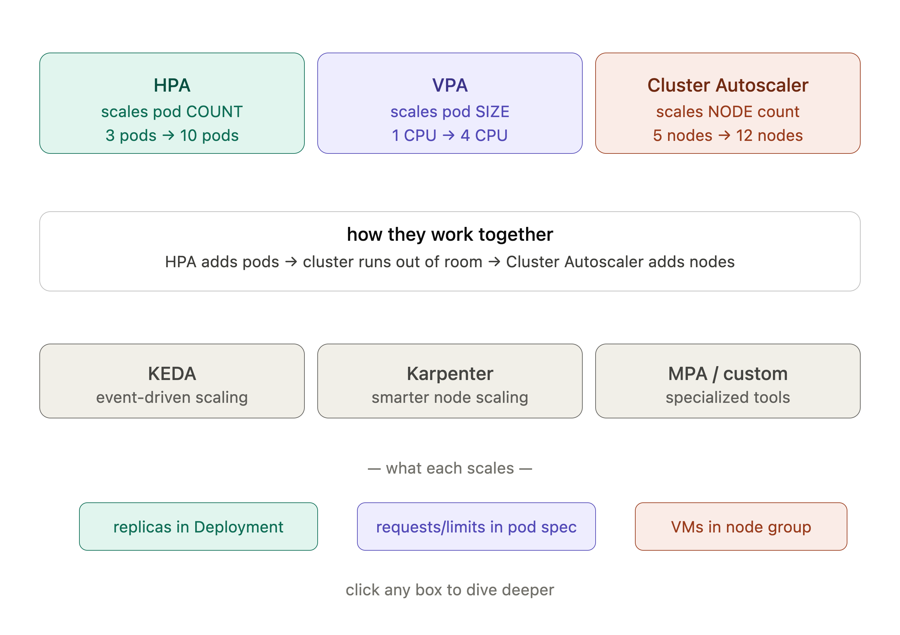


## HPA (Horizontal Pod Autoscaler)

HPA automatically scales the number of pod replicas in a Deployment based on observed metrics.

**How it works:**

```
Metrics server collects CPU/RAM from each pod every 15s
        ↓
HPA controller checks metrics every 30s
        ↓
Computes: desiredReplicas = ceil(currentReplicas × currentMetric / targetMetric)
        ↓
Updates Deployment's replicas field
        ↓
ReplicaSet controller creates/deletes pods
```

**Example: CPU based HPA**
```yaml
apiVersion: autoscaling/v2
kind: HorizontalPodAutoscaler
metadata:
  name: api-hpa
  namespace: default
spec:
  scaleTargetRef:                # what to scale
    apiVersion: apps/v1
    kind: Deployment
    name: api-server             # the Deployment we manage

  minReplicas: 2                 # floor — never below this
  maxReplicas: 20                # ceiling — never above this

  metrics:
    - type: Resource
      resource:
        name: cpu
        target:
          type: Utilization      # percentage of requested CPU
          averageUtilization: 60 # scale up when avg > 60%

  behavior:                      # fine-grained tuning (v2 API)
    scaleUp:
      stabilizationWindowSeconds: 0    # scale up immediately
      policies:
        - type: Percent
          value: 100                   # double pod count
          periodSeconds: 15
        - type: Pods
          value: 4                     # or add 4, whichever is higher
          periodSeconds: 15
      selectPolicy: Max

    scaleDown:
      stabilizationWindowSeconds: 300  # wait 5min before scaling down
      policies:
        - type: Percent
          value: 50                    # halve pod count at most
          periodSeconds: 60
```

**Critical prerequisite:** the target Deployment **must** declare resource requests, or HPA can't calculate utilization percentages:

```yaml
# in your Deployment spec
containers:
  - name: api
    image: api:1.0
    resources:
      requests:
        cpu: 500m              # required for HPA to work
        memory: 512Mi
```

If 4 pods are running at 90% CPU average: `ceil(4 × 90/60) = ceil(6) = 6` → HPA scales to 6 pods.

**Example — Custom metric (requests per second)**

```yaml
apiVersion: autoscaling/v2
kind: HorizontalPodAutoscaler
metadata:
  name: api-hpa-rps
spec:
  scaleTargetRef:
    apiVersion: apps/v1
    kind: Deployment
    name: api-server

  minReplicas: 2
  maxReplicas: 50

  metrics:
    - type: Pods                       # per-pod custom metric
      pods:
        metric:
          name: http_requests_per_second   # from Prometheus adapter
        target:
          type: AverageValue
          averageValue: "1000"          # target: 1000 rps per pod
```

If total traffic is 50,000 rps with 10 pods, each handles 5,000 rps — HPA scales to 50 pods to bring per-pod load to 1,000.

**Must-know facts about HPA**

| Fact | Detail |
|---|---|
| Polling interval | Default 15s, configurable via `--horizontal-pod-autoscaler-sync-period` |
| Tolerance | Default 10% — won't scale if metric is within 10% of target (prevents thrashing) |
| Stabilization | Scale-up is immediate; scale-down waits 5 minutes by default |
| Cooldown | Use `stabilizationWindowSeconds` and the per-policy `periodSeconds` |
| metrics-server required | Without it, you get `<unknown>` for current CPU/memory |
| Cannot scale to zero | Use KEDA for that |
| Multiple metrics | Each metric computes a desired count; HPA picks the **highest** |
| Memory metric caveat | Memory rarely shrinks → memory-based HPA can scale up but rarely down |
| External metrics | Queue depth, cloud provider metrics — via External Metrics API adapters |

## Vertical Pod Autoscaler (VPA)

Adjusts **how much CPU and memory each pod gets** rather than how many pods exist. Useful when you don't know the right resource requests in advance, or when workload size varies in ways that horizontal scaling can't help (e.g., a single big query in a database).

### How it works

VPA has three components:

```
Recommender — analyzes historical usage, suggests new requests
        ↓
Updater — evicts pods that are mis-sized
        ↓
Admission controller — rewrites pod specs at creation time
```

VPA is **not** built into Kubernetes — you install it separately as a deployment.

### Example — basic VPA in recommendation mode

```yaml
apiVersion: autoscaling.k8s.io/v1
kind: VerticalPodAutoscaler
metadata:
  name: api-vpa
spec:
  targetRef:
    apiVersion: apps/v1
    kind: Deployment
    name: api-server

  updatePolicy:
    updateMode: "Off"               # just recommend, don't change anything

  resourcePolicy:
    containerPolicies:
      - containerName: '*'
        minAllowed:
          cpu: 100m
          memory: 128Mi
        maxAllowed:
          cpu: 4
          memory: 8Gi
        controlledResources: ["cpu", "memory"]
```

Run `kubectl describe vpa api-vpa` to see recommendations like:

```
Recommendation:
  Target:        cpu: 587m,  memory: 262144k
  Lower Bound:   cpu: 412m,  memory: 262144k
  Upper Bound:   cpu: 1042m, memory: 539464k
```

### Example — VPA in auto mode

```yaml
spec:
  updatePolicy:
    updateMode: "Auto"      # actually applies recommendations
```

**Modes:**

| Mode | Behavior |
|---|---|
| `Off` | Recommendation only. Safest. |
| `Initial` | Sets requests at pod creation, never modifies running pods |
| `Recreate` | Evicts pods to apply new requests (causes restart) |
| `Auto` | Currently same as Recreate; will support in-place updates in future |
| `InPlaceOrRecreate` | (1.27+) tries in-place resize first, falls back to recreate |

### The HPA + VPA conflict

You **cannot** safely use HPA and VPA on the **same resource** (CPU or memory). They'll fight:
- HPA sees high CPU → adds pods
- VPA sees high CPU → raises CPU request per pod
- They oscillate

The recommended pattern:
- HPA on CPU + VPA on memory only, or vice versa
- Or use HPA on custom metrics (rps, queue depth) and VPA on CPU/memory

### Must-know facts about VPA

| Fact | Detail |
|---|---|
| Not built-in | Install separately from `kubernetes/autoscaler` repo |
| Causes pod restarts | `Auto` mode evicts pods to resize them |
| In-place resize | Kubernetes 1.27+ supports it in alpha, no restart needed |
| Recommends based on history | Needs days of data for good recommendations |
| Cannot scale to zero | Like HPA |
| Doesn't change limits | By default only modifies requests, not limits |
| Use with Goldilocks | UI dashboard for VPA recommendations across the cluster |


## Cluster Autoscaler

Adjusts **the number of nodes** in your cluster. When pods can't be scheduled because no node has room, Cluster Autoscaler asks the cloud provider to add a node. When nodes are underutilized, it drains and removes them.

CA runs as a Deployment (typically one replica) in `kube-system`. It runs one main loop every 10 seconds.

**Scale-up algorithm:**

Every 10 seconds CA fetches all pods in `Pending` state with the condition `reason: Unschedulable`. For each pending pod:

1. It reads every node group's configuration (min/max size, instance type, labels, taints).
2. For each node group, it *simulates* adding one node. A simulated node is a fake Node object built from the node group's configuration. CA then runs the scheduler's filter plugins against this fake node for the pending pod. This is a local simulation — no cloud API is called yet.
3. If the simulated node would allow the pod to schedule, that node group is a candidate.
4. Among candidates, CA picks the one with the least wasted resources (the tightest fit for the pod's requests). On equal waste, it falls back to a configurable expander strategy: `random`, `least-waste`, `priority`, or `price`.
5. CA calls the cloud API (AWS `SetDesiredCapacity`, GCP `resize`, Azure `UpdateVMSSCapacity`) to add one node to the chosen group.
6. CA waits up to `--max-node-provision-time` (default 15 minutes) for the node to join. If it doesn't, CA marks the scale-up as failed and tries again.

**Scale-down algorithm:**

CA also checks every 10 seconds whether any node can be removed. For a node to be removable:

- Its CPU and memory utilization must both be below `--scale-down-utilization-threshold` (default 50%) — measured as requests/allocatable, not actual usage
- Must have been below threshold for `--scale-down-unneeded-time` (default 10 minutes) continuously
- All pods on it must be successfully reschedulable on other existing nodes (CA simulates this)
- No blocking conditions:
  - A pod with `cluster-autoscaler.kubernetes.io/safe-to-evict: "false"` annotation
  - A pod with local storage (`emptyDir` or `hostPath`)
  - A pod protected by a PodDisruptionBudget that would be violated
  - A pod in `kube-system` namespace without a matching PDB
  - A DaemonSet pod (they'll just restart)
  - The node was added recently (cooldown period)

If all conditions pass, CA cordons the node (marks it unschedulable) then drains it (deletes pods gracefully). After all pods are evicted, it calls the cloud API to terminate the VM.

**Key configuration flags:**

```yaml
# In the CA Deployment command args
- --scale-down-unneeded-time=10m
- --scale-down-delay-after-add=10m      # don't scale down right after scaling up
- --scale-down-delay-after-failure=3m   # backoff after a failed scale-down
- --scale-down-utilization-threshold=0.5
- --max-node-provision-time=15m
- --expander=least-waste
- --balance-similar-node-groups        # spread across similar groups/AZs
- --skip-nodes-with-local-storage=true
- --skip-nodes-with-system-pods=true
```

### Example — AWS EKS configuration

Cluster Autoscaler runs as a Deployment in `kube-system`. Configuration is mostly via flags and node group tags.

```yaml
apiVersion: apps/v1
kind: Deployment
metadata:
  name: cluster-autoscaler
  namespace: kube-system
spec:
  template:
    spec:
      containers:
        - name: cluster-autoscaler
          image: registry.k8s.io/autoscaling/cluster-autoscaler:v1.29.0
          command:
            - ./cluster-autoscaler
            - --cloud-provider=aws
            - --namespace=kube-system
            - --node-group-auto-discovery=asg:tag=k8s.io/cluster-autoscaler/enabled,k8s.io/cluster-autoscaler/my-cluster
            - --balance-similar-node-groups          # spread across AZs
            - --skip-nodes-with-system-pods=false
            - --scale-down-unneeded-time=10m         # node idle for 10m → remove
            - --scale-down-delay-after-add=10m       # don't remove right after adding
            - --scale-down-utilization-threshold=0.5 # < 50% utilized → candidate
            - --max-node-provision-time=15m
```

Then tag your AWS Auto Scaling Group:

```
Key: k8s.io/cluster-autoscaler/enabled
Value: true

Key: k8s.io/cluster-autoscaler/my-cluster
Value: owned
```

### Configuring per-node-group limits

In your AWS ASG (or GCP MIG, Azure VMSS):
- `MinSize`: minimum nodes (e.g., 2)
- `MaxSize`: maximum nodes (e.g., 20)
- `DesiredCapacity`: managed by Cluster Autoscaler

### Helping the autoscaler with `PodDisruptionBudget`

When scaling down, Cluster Autoscaler respects PDBs:

```yaml
apiVersion: policy/v1
kind: PodDisruptionBudget
metadata:
  name: api-pdb
spec:
  minAvailable: 2          # always keep 2 pods running
  selector:
    matchLabels:
      app: api-server
```

Without this, autoscaler could evict all your pods at once during a scale-down.

### Must-know facts about Cluster Autoscaler

| Fact | Detail |
|---|---|
| Cloud-specific | Different builds for AWS, GCP, Azure, etc. |
| Scale-up trigger | Only Pending pods due to insufficient resources |
| Scale-down trigger | Node < 50% utilized for 10+ minutes |
| Won't scale down nodes with | System pods, pods with local storage, pods without controllers, pods with PDB violations |
| Cannot move pods using local storage | They block scale-down |
| Respects node selectors and taints | Will pick the right node group for a Pending pod |
| Slow on cold start | New nodes take 1–5 minutes to boot and join |
| Doesn't bin-pack | Just adds when needed, removes when idle |

## KEDA — Kubernetes Event-Driven Autoscaling

KEDA extends HPA to scale on **event sources** that HPA can't natively handle: Kafka lag, RabbitMQ queue depth, AWS SQS messages, Prometheus queries, Redis lists, scheduled cron, and 60+ more.

The killer feature: **scale to zero**. HPA's `minReplicas` is 1. KEDA can go to 0 and back up.

### How it works

```
KEDA Operator runs in cluster
        ↓
Watches ScaledObject custom resources
        ↓
Polls external source (Kafka, SQS, etc.)
        ↓
When events arrive: creates an HPA targeting your Deployment
        ↓
HPA scales up from 0 → N based on event volume
        ↓
When events drain: HPA scales to minReplicas, KEDA removes it → 0
```

### Example — scale based on Kafka consumer lag

```yaml
apiVersion: keda.sh/v1alpha1
kind: ScaledObject
metadata:
  name: kafka-consumer-scaler
  namespace: default
spec:
  scaleTargetRef:
    name: kafka-consumer-deployment  # the Deployment to scale

  pollingInterval: 30                # check Kafka every 30s
  cooldownPeriod: 300                # wait 5min before scaling to zero
  idleReplicaCount: 0                # SCALE TO ZERO when idle
  minReplicaCount: 0
  maxReplicaCount: 30

  triggers:
    - type: kafka
      metadata:
        bootstrapServers: kafka.default.svc:9092
        consumerGroup: my-consumer-group
        topic: orders
        lagThreshold: "100"          # 1 replica per 100 messages of lag
        offsetResetPolicy: latest
```

If the lag is 5,000 messages → KEDA scales to 50 replicas (capped at 30 here).

### Example — scale on AWS SQS queue length

```yaml
apiVersion: keda.sh/v1alpha1
kind: ScaledObject
metadata:
  name: sqs-worker-scaler
spec:
  scaleTargetRef:
    name: worker-deployment

  minReplicaCount: 0
  maxReplicaCount: 50

  triggers:
    - type: aws-sqs-queue
      metadata:
        queueURL: https://sqs.us-east-1.amazonaws.com/123456789/my-queue
        queueLength: "5"             # 1 replica per 5 messages
        awsRegion: us-east-1
      authenticationRef:
        name: keda-aws-credentials
```

### Example — scheduled scaling (cron)

Scale to 10 pods during business hours, 1 pod at night:

```yaml
apiVersion: keda.sh/v1alpha1
kind: ScaledObject
metadata:
  name: scheduled-scaler
spec:
  scaleTargetRef:
    name: api-deployment

  minReplicaCount: 1
  maxReplicaCount: 20

  triggers:
    - type: cron
      metadata:
        timezone: America/New_York
        start: "0 9 * * 1-5"         # 9 AM Mon-Fri
        end: "0 18 * * 1-5"          # 6 PM Mon-Fri
        desiredReplicas: "10"
```

### Must-know facts about KEDA

| Fact | Detail |
|---|---|
| Built on HPA | KEDA creates HPA objects under the hood; doesn't replace it |
| 60+ built-in scalers | Kafka, RabbitMQ, NATS, Pulsar, Redis, MongoDB, Prometheus, Postgres, MySQL, CloudWatch, Azure Monitor, GCP Stackdriver, GitHub Actions, etc. |
| Scale-to-zero | KEDA's defining feature — HPA cannot do this |
| ScaledJob for batch | Separate `ScaledJob` CRD for one-off jobs from queue messages |
| Lightweight | Single operator pod, low overhead |
| Authentication | `TriggerAuthentication` CRD for credentials |

## Karpenter — Smarter Node Provisioning

Cluster Autoscaler scales pre-defined node groups (ASGs). Karpenter throws that model away — it picks the **best instance type for each Pending pod** in real time, without pre-defined groups.

### How it differs from Cluster Autoscaler

| | Cluster Autoscaler | Karpenter |
|---|---|---|
| Provisioning | Adjusts existing ASGs | Provisions directly via EC2 API |
| Instance selection | Fixed per node group | Picks optimal type per pod |
| Cold start | 1–5 min | 30–60s typical |
| Bin packing | None — adds whatever ASG fits | Actively consolidates underutilized nodes |
| Spot instances | Per-ASG | Native, with diversification |
| Configuration | Node groups + ASG tags | Single `NodePool` CRD |
| Cloud support | All major clouds | AWS (GA), Azure (Preview), GCP (limited) |

### Example — Karpenter NodePool on AWS

```yaml
apiVersion: karpenter.sh/v1
kind: NodePool
metadata:
  name: general-purpose
spec:
  template:
    spec:
      requirements:
        - key: kubernetes.io/arch
          operator: In
          values: ["amd64"]
        - key: kubernetes.io/os
          operator: In
          values: ["linux"]
        - key: karpenter.sh/capacity-type
          operator: In
          values: ["spot", "on-demand"]   # prefer spot, fallback to on-demand
        - key: karpenter.k8s.aws/instance-category
          operator: In
          values: ["c", "m", "r"]         # compute, general, memory-optimized
        - key: karpenter.k8s.aws/instance-cpu
          operator: In
          values: ["2", "4", "8", "16", "32"]
        - key: karpenter.k8s.aws/instance-generation
          operator: Gt
          values: ["2"]                    # current gen only

      nodeClassRef:
        name: default-ec2

      taints:
        - key: workload-type
          value: general
          effect: NoSchedule              # only pods that tolerate this taint

  limits:
    cpu: "1000"                            # max 1000 CPU across all nodes
    memory: 1000Gi

  disruption:
    consolidationPolicy: WhenUnderutilized
    consolidateAfter: 30s                  # very fast consolidation
    expireAfter: 720h                      # max node age: 30 days
```

When a pod is Pending, Karpenter looks at the pod's resource requests, considers all matching instance types, and provisions the cheapest one that fits.

### Must-know facts about Karpenter

| Fact | Detail |
|---|---|
| AWS-native | Originally built by AWS, now CNCF |
| Reads pod requirements | nodeSelector, affinity, tolerations all inform instance choice |
| Consolidation | Continuously checks if pods could fit on fewer/cheaper nodes |
| Spot interruption handling | Drains nodes before AWS reclaims them |
| Drift detection | Replaces nodes when AMI or config drifts from desired |
| No ASG | Karpenter bypasses ASGs entirely; manages instances directly |
| Faster than CA | Typically 30–60s vs 1–5 min for new nodes |

## Real world autoscaling in action

The complete picture:

```
Traffic spike arrives
        ↓
Pods reach 90% CPU
        ↓
HPA: "scale from 5 → 15 pods"          ← scale OUT
        ↓
Scheduler tries to place 10 new pods
        ↓
Not enough room → 6 pods Pending
        ↓
Karpenter / Cluster Autoscaler: "need more nodes"  ← scale UP
        ↓
2 new nodes provisioned in 60s
        ↓
Pods scheduled, running
        ↓
[traffic subsides 30 minutes later]
        ↓
HPA: "drop from 15 → 5 pods"
        ↓
Some nodes go to 20% utilization
        ↓
Karpenter consolidates → removes 2 nodes
```

A complete autoscaling stack uses:
- **HPA** for pod count based on request load
- **VPA in recommend mode** to right-size resource requests over time (manually applied)
- **KEDA** for event-driven workloads (queue consumers, scheduled jobs)
- **Karpenter** (or Cluster Autoscaler) for node-level capacity
- **PodDisruptionBudgets** to protect availability during scale-down

The combination is what lets a Kubernetes cluster track demand from near-zero load to extreme spikes within minutes — without manual intervention, and at near-optimal cost.

## Application as Code

Your app's operational knowledge — install steps, config, scaling rules, backup logic — lives in a **Git-tracked program**, not in a runbook or someone's head.

Example: "To back up MongoDB, take a snapshot every 6h" becomes Go code inside the operator that runs automatically.

Benefits: versioned, reviewable, testable, repeatable.

Operator are example of Application as code.

## Custom Controller

A **controller** is a loop that watches Kubernetes objects and works to make the actual state match the desired state. Built-in examples: Deployment controller, ReplicaSet controller.

A **custom controller** is one *you* write to manage *your* custom objects. It runs as a pod, watches the Kubernetes API, and reacts to changes.

```
Watch → Compare desired vs actual → Act → Repeat
```

## Custom Resource Definitions (CRDs)

**What:** A CRD lets you teach Kubernetes a *new object type*. After installing a CRD, `kubectl get <yourkind>` works just like `kubectl get pods`.

**How to create one:**

```yaml
apiVersion: apiextensions.k8s.io/v1
kind: CustomResourceDefinition
metadata:
  name: databases.example.com
spec:
  group: example.com
  versions:
    - name: v1
      served: true
      storage: true
      schema:
        openAPIV3Schema:
          type: object
          properties:
            spec:
              type: object
              properties:
                engine: { type: string }
                size:   { type: string }
  scope: Namespaced
  names:
    plural: databases
    singular: database
    kind: Database
```

**How it works:**
1. `kubectl apply -f crd.yaml` registers the new type with the API server.
2. `kubectl describe crd databases.example.com` shows its schema and status.
3. You create instances (called **Custom Resources**):
   ```yaml
   kind: Database
   spec: { engine: postgres, size: 10Gi }
   ```
4. The CRD alone does **nothing** — it's just a schema. A **custom controller (operator)** watches these objects and takes action (creates pods, volumes, etc.).

CRD = noun. Controller = verb.

## Operator

A Kubernetes Operator is a **custom controller** that packages operational knowledge (install, upgrade, backup, failover) for a specific application as code. It extends Kubernetes using **Custom Resource Definitions (CRDs)** so you manage apps the same way you manage Pods.

- Frameworks like Operator SDK, Kubebuilder, or KUDO help you build custom operator.
- [OperatorHub.io](https://operatorhub.io/) is central registry

An **operator = CRD + controller + RBAC + deployment, packaged together**. Most operators come with a **Helm chart** or **OLM (Operator Lifecycle Manager)** bundle that installs all five pieces in one shot. Installing the operator implicitly installs its CRDs.

### Top 5 Open-Source Operators

| Operator | What it manages |
|---|---|
| **Prometheus Operator** | Prometheus + Alertmanager monitoring stacks |
| **Cert-Manager** | TLS certificates (Let's Encrypt, Vault, etc.) auto-issued and renewed |
| **Strimzi** | Apache Kafka clusters, topics, users |
| **ArgoCD** | GitOps — syncs cluster state from Git repos |
| **Istio Operator** | Service mesh installation and config |

**Lifecycle** defined by the Operator Framework:  **Basic Install**, **Seamless Upgrades**, **Full Lifecycle**, **Deep Insights**, **Auto Pilot**

### CRD Workflow

```
1. Write CRD YAML (defines schema)
2. kubectl apply -f crd.yaml          → API server registers new type
3. Verify: kubectl get crd            → CRD listed
4. Verify: kubectl api-resources      → new kind appears
5. Now you CAN create custom resources, but nothing happens yet
6. Deploy the operator (controller pod) that watches this CRD
7. Create custom resources → operator acts on them
```

### Example: Prometheus Operator

**Without operator:** you write StatefulSets, ConfigMaps, Services, and manually reload config on every change.

**With operator:** you write one small YAML.

```yaml
apiVersion: monitoring.coreos.com/v1
kind: Prometheus
metadata:
  name: my-prometheus
spec:
  replicas: 2
  serviceMonitorSelector:
    matchLabels:
      team: frontend
  retention: 15d
```

**What happens:**
1. You `kubectl apply` this file.
2. The Prometheus Operator (already running in the cluster) watches for `Prometheus` resources.
3. It creates a StatefulSet with 2 replicas, generates the Prometheus config, sets up Services, and wires in any `ServiceMonitor` labeled `team: frontend`.
4. If you change `replicas` to 3, it scales. If a pod dies, it heals. If you add a ServiceMonitor, it reloads the config automatically.

You declared **what** you want. The operator handles **how**.


* What is API server in kubernetes? What it is responsible for? Who manages it?
* Show me and example of using ConfigMap.
* What are secrets and how to use them show me via example.
* Share some more important facts about kubernetes service, its type and how it works?
* What is helm? Share some important and useful facts about helm.

## Operator Lifecycle Manager (OLM)

**Problem it solves:** Installing an operator is more than just applying YAML. You need to manage upgrades, dependencies, permissions, and multiple operators across a cluster. OLM is a *manager of operators*.

**Think of it as:** `apt` but specifically for Kubernetes operators.

**Core concepts:**

| Concept | What it is |
|---|---|
| **CSV (ClusterServiceVersion)** | The operator's "package manifest" — describes version, CRDs it owns, RBAC it needs, deployment spec |
| **CatalogSource** | A registry of available operators (like an apt repo) |
| **Subscription** | "I want operator X, keep it updated on channel Y" |
| **InstallPlan** | A plan OLM generates: "to install this, I need to create these resources" |
| **OperatorGroup** | Controls which namespaces the operator watches |

**How it flows:** OLM Subscription Flow

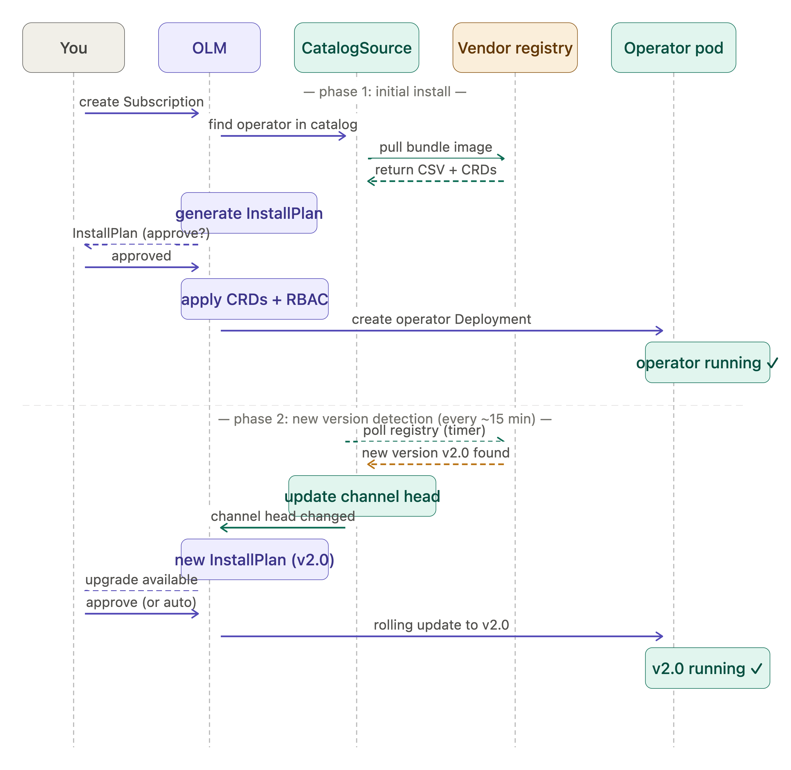

**How OLM detects new versions (the key question):** The CatalogSource is a pod running inside your cluster. It periodically polls an external container registry (like `quay.io`) on a configurable timer (~15 minutes default). The vendor pushes a new bundle image to that registry — OLM sees the new image tag, reads its metadata, and identifies that the "stable" channel now points to a newer CSV version. OLM does not get notified by the vendor — it actively polls.

**Upgrade channels:** Like `stable`, `alpha`, `fast` — you subscribe to a channel and get automatic upgrades when the vendor publishes one.

**Who uses OLM:**
- **Red Hat OpenShift** — OLM is baked in, all operators installed via OperatorHub.
- **Standalone clusters** — OLM can be installed manually via `operator-sdk olm install`.

**OLM bundle** = a container image containing:
```
/manifests/
  - clusterserviceversion.yaml   (operator metadata + deployment)
  - crd1.yaml                    (custom resource schemas)
  - rbac.yaml                    (permissions)
/metadata/
  - annotations.yaml             (channel, version info)
```

Vendors ship this bundle image. OLM unpacks and installs it.

## Helm

**Helm** is the package manager for Kubernetes. Think `apt` (advanced package tool) for Debian based linux distros like Ubuntu, but for K8s manifests.

**Key concepts:**

| Term | Meaning |
|---|---|
| **Chart** | A package — folder of templated YAML + a `values.yaml` |
| **Release** | An installed instance of a chart in a cluster |
| **Repository** | A web server hosting charts (e.g., Bitnami, Artifact Hub) |
| **Values** | Overridable config (`--set` or `-f values.yaml`) |

**Workflow:**
```bash
helm repo add bitnami https://charts.bitnami.com/bitnami
helm install my-redis bitnami/redis --set auth.password=xxx
helm upgrade my-redis bitnami/redis --set replica.replicaCount=3
helm rollback my-redis 1
helm uninstall my-redis
```

**Important facts:**
- Charts use **Go templates** — you can parameterize anything.
- Helm tracks release history → easy **rollbacks**.
- **Helm 3** removed Tiller (the server-side component); now purely client-side, much safer.
- **Artifact Hub** ([artifacthub.io](https://artifacthub.io)) is the central index.
- Many operators (Prometheus, Cert-Manager, ArgoCD) ship as Helm charts — `helm install` is often how you install an operator.
- Alternatives: **Kustomize** (template-free, patches YAML), **Carvel ytt**, raw manifests.

**When to use Helm:** anytime you'd otherwise copy-paste YAML across environments or share an app with others.

Helm charts can include **CRDs, Deployments, Services, Ingresses, ConfigMaps — and Custom Resources (instances of those CRDs)**.

A common operator chart contains all of these:

```
my-postgres-operator/
├── Chart.yaml
├── values.yaml
├── crds/                              ← CRDs go here (special folder)
│   └── postgresclusters.yaml          ← CRD definition
└── templates/
    ├── deployment.yaml                ← the operator pod
    ├── rbac.yaml                      ← ServiceAccount, Role, RoleBinding
    ├── service.yaml                   ← Service for the operator's webhook
    └── postgrescluster-instance.yaml  ← a Custom Resource INSTANCE (optional)
```

When you `helm install`:

1. Helm applies everything in `crds/` first (one-time, never updated by Helm)
2. Helm applies everything in `templates/` (the operator pod, RBAC, etc.)
3. If `templates/` contains Custom Resources, Helm creates those too

So **Helm can absolutely create the Custom Resource for you** — if it's in the chart.

Most published operator charts (Prometheus Operator, cert-manager, ArgoCD) follow a separation pattern i.e. they don't create yaml for creating custom resources based on CRDs.

### The mental model

```
Helm = packaging tool. Installs YAML at scale.
       (knows nothing about CRDs vs Deployments — to Helm they're all just objects)

Operator = controller running in cluster.
           Watches for Custom Resources of types defined by its CRDs.
           Acts on them.

Custom Resource = an INSTANCE of a CRD.
                  You (via your chart, kubectl, ArgoCD, whatever)
                  create these to tell the operator what to do.
```

Helm doesn't *know* a `PostgresCluster` is special. It just applies the YAML. The PGO operator is what gives that YAML meaning.


### Helm Command Lifecycle

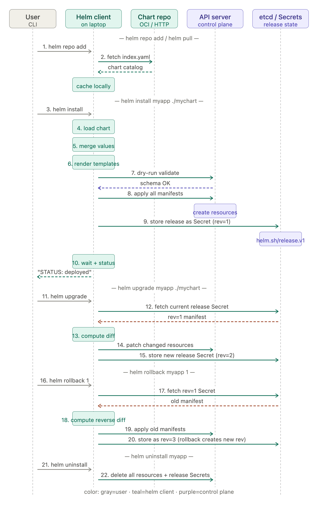

#### What runs where

**Critical fact about Helm 3:** Helm is **purely a client-side tool**. There is no Helm server, no Helm pod, no Tiller (that was Helm 2). Everything runs on your laptop or wherever `helm` is invoked.

| Component | Where it runs |
|---|---|
| `helm` CLI | Your laptop / CI runner |
| Chart files (templates, values) | Read from disk or downloaded to local cache |
| Template rendering | In the `helm` process on your laptop |
| Release state (Secrets) | Stored in the cluster, in the namespace where the release lives |

Helm talks to the API server using your kubeconfig — same credentials as kubectl.

#### Detailed command walkthroughs

**`helm repo add bitnami https://charts.bitnami.com/bitnami`**
- Downloads `index.yaml` from the URL
- Caches it under `~/.config/helm/repositories/`
- The catalog of available charts in that repo
- Done. No cluster interaction.

**`helm install myapp ./mychart`** (steps 3–10)

1. **Load chart from disk.** Reads `Chart.yaml`, `values.yaml`, and all `templates/*.yaml`.
2. **Merge values.** Built-in defaults from `values.yaml` are overlaid with any `--set` flags or `-f extra-values.yaml`.
3. **Render templates.** Helm runs the Go template engine in-process, producing pure Kubernetes YAML. Try it locally with `helm template`.
4. **Server-side validation.** Helm sends the rendered manifests to the API server as a dry-run. If any object fails admission webhooks or schema validation, install aborts with no changes.
5. **Apply manifests.** Helm sends real `create` requests to the API server, one per resource.
6. **Watch readiness (if `--wait` is set).** Helm polls the API server until all Deployments report `available`, all Jobs complete, etc.
7. **Store release Secret.** Helm creates a Secret named `sh.helm.release.v1.myapp.v1` in the release namespace. The Secret's data is a gzipped, base64-encoded blob containing the chart, values, and rendered manifests.

That last step is the magic — **release state lives in cluster as Kubernetes Secrets**. This is what enables upgrade and rollback. Run:

```bash
kubectl get secrets -l owner=helm
# sh.helm.release.v1.myapp.v1
```

**`helm upgrade myapp ./mychart`** (steps 11–15)

1. **Fetch current release Secret.** Helm reads `sh.helm.release.v1.myapp.v1` from the namespace to know what's currently deployed.
2. **Render new templates** with new values.
3. **Compute three-way diff.** Helm compares: old manifest (in the Secret) vs new manifest (just rendered) vs live cluster state (fetched from API server). This is the same algorithm `kubectl apply` uses.
4. **Patch only what changed.** Resources that didn't change are left alone. Changed resources get a patch. New resources get created. Resources that exist live but aren't in the new manifest are deleted (if Helm believes it created them — tracked via labels).
5. **Store new release Secret.** Creates `sh.helm.release.v1.myapp.v2` — the old v1 Secret stays so rollback works.

**`helm rollback myapp 1`** (steps 16–20)

1. **Fetch revision 1's Secret.** `sh.helm.release.v1.myapp.v1`.
2. **Extract the old manifest** from the gzipped blob.
3. **Compute diff between current (v2) and target (v1).**
4. **Apply patches** to revert.
5. **Store as revision 3.** Rollback doesn't delete or restore old revisions — it creates a new one. So after rollback, you have v1, v2, v3 where v3 has the same content as v1.

Helm keeps history forever by default; configure with `--history-max`.

**`helm uninstall myapp`** (steps 21–22)

1. **List all resources tracked by this release** (via the labels Helm puts on every resource: `app.kubernetes.io/managed-by=Helm`).
2. **Send delete requests** to the API server for each.
3. **Delete all release Secrets** (`sh.helm.release.v1.myapp.v*`).
4. **Done.** No rollback possible after uninstall unless you use `--keep-history`.

#### Why Helm 3 has no server component

Helm 2 had Tiller, a server-side component that needed cluster-wide admin rights and was a security nightmare. Helm 3 eliminated Tiller entirely. All the logic moved to the client. The client uses **your** RBAC permissions. If you can't create Deployments, Helm can't either. This is also why Helm 3 doesn't need any installation in the cluster — pull the binary and go.

#### Inspection commands

```bash
helm list                          # list all releases in current namespace
helm list -A                       # all namespaces
helm history myapp                 # show all revisions
helm get manifest myapp            # show rendered manifests of current revision
helm get values myapp              # show values used for current revision
helm get all myapp --revision 1    # everything about a specific revision
helm template myapp ./mychart      # render templates locally without applying
helm template myapp ./mychart --debug   # show what gets sent to API server
```

All of these are client-side reads — they fetch the release Secret(s) from the cluster and unpack them locally.

### Creating a Private Helm Chart

**Step 1 — Scaffold the chart:**

```bash
helm create my-app
```

This creates:
```
my-app/
├── Chart.yaml         # metadata
├── values.yaml        # default config
├── charts/            # subchart dependencies
└── templates/         # YAML templates
    ├── deployment.yaml
    ├── service.yaml
    ├── _helpers.tpl
    └── NOTES.txt
```

**Step 2 — Edit `Chart.yaml`:**

```yaml
apiVersion: v2
name: my-app
description: My private application
version: 1.0.0          # chart version
appVersion: "2.5.1"     # app version inside
```

**Step 3 — Define defaults in `values.yaml`:**

```yaml
replicaCount: 2
image:
  repository: my-private-registry.io/my-app
  tag: "2.5.1"
  pullPolicy: IfNotPresent
service:
  type: ClusterIP
  port: 80
```

**Step 4 — Write templates that consume values:**

```yaml
# templates/deployment.yaml
apiVersion: apps/v1
kind: Deployment
metadata:
  name: {{ .Release.Name }}-app
spec:
  replicas: {{ .Values.replicaCount }}
  selector:
    matchLabels:
      app: {{ .Release.Name }}
  template:
    metadata:
      labels:
        app: {{ .Release.Name }}
    spec:
      containers:
        - name: app
          image: "{{ .Values.image.repository }}:{{ .Values.image.tag }}"
          imagePullPolicy: {{ .Values.image.pullPolicy }}
          ports:
            - containerPort: 8080
```

**Step 5 — Validate and lint:**

```bash
helm lint my-app/
helm template my-app/ --debug    # render locally
```

**Step 6 — Package into a `.tgz`:**

```bash
helm package my-app/
# produces my-app-1.0.0.tgz
```

**Step 7 — Host privately. Three common options:**

**Option A: OCI registry (recommended, modern):**
```bash
# Push to ECR / GCR / Harbor as an OCI artifact
helm registry login my-registry.io
helm push my-app-1.0.0.tgz oci://my-registry.io/charts

# Install from it
helm install myapp oci://my-registry.io/charts/my-app --version 1.0.0
```

**Option B: ChartMuseum / Harbor as HTTP repo:**
```bash
# Push via chart-museum API
curl --data-binary "@my-app-1.0.0.tgz" \
  https://chartmuseum.internal/api/charts

# Add as a Helm repo
helm repo add internal https://chartmuseum.internal
helm install myapp internal/my-app
```

**Option C: S3 bucket with `helm-s3` plugin:**
```bash
helm s3 push my-app-1.0.0.tgz my-charts-bucket
helm install myapp my-charts-bucket/my-app
```

**Step 8 — Update workflow:**

Bump `version` in `Chart.yaml` for any chart change. Bump `appVersion` when the app version changes. Re-package, re-push.


## Real-World Encryption at Rest for Secrets — AWS KMS Example

Default behavior: Kubernetes Secrets are stored in etcd as **base64-encoded plaintext**. Anyone with etcd access can read them. Encryption at rest fixes this.

**The most common production pattern: KMS provider with AWS KMS (mirrored on GCP/Azure/Vault).**

### How it works

```
You create a Secret
      ↓
API server intercepts before writing to etcd
      ↓
Calls KMS provider (a sidecar pod on the API server host)
      ↓
KMS provider calls AWS KMS API to encrypt the Secret's data
      ↓
AWS KMS returns ciphertext
      ↓
API server writes ciphertext + key reference to etcd
      ↓
When reading: API server fetches ciphertext, calls KMS to decrypt, returns plaintext
```

**Envelope encryption (the standard pattern):**

- AWS KMS holds a **Key Encryption Key (KEK)** — never leaves AWS
- For each Secret, Kubernetes generates a random **Data Encryption Key (DEK)**
- The Secret's content is encrypted with the DEK (fast, local)
- The DEK is encrypted with the KEK (one KMS call)
- Both are stored in etcd

This means only one KMS call per write, not one per byte. Reads use a local cache of DEKs.

### Setup steps

**1. Create the KMS key in AWS:**

```bash
aws kms create-key --description "K8s Secrets Encryption"
# returns ARN: arn:aws:kms:us-east-1:123:key/abc-123
```

**2. Deploy the KMS provider as a static pod on each control plane node:**

```yaml
# /etc/kubernetes/manifests/aws-kms-provider.yaml
apiVersion: v1
kind: Pod
metadata:
  name: aws-encryption-provider
  namespace: kube-system
spec:
  hostNetwork: true
  containers:
    - name: provider
      image: kubernetes-sigs/aws-encryption-provider:v0.3.0
      command:
        - /aws-encryption-provider
        - --key=arn:aws:kms:us-east-1:123:key/abc-123
        - --region=us-east-1
        - --listen=/var/run/kmsplugin/socket.sock
      volumeMounts:
        - name: kms-socket
          mountPath: /var/run/kmsplugin
  volumes:
    - name: kms-socket
      hostPath:
        path: /var/run/kmsplugin
```

**3. Configure the API server with encryption configuration:**

```yaml
# /etc/kubernetes/encryption-config.yaml
apiVersion: apiserver.config.k8s.io/v1
kind: EncryptionConfiguration
resources:
  - resources:
      - secrets        # encrypt all Secret objects
    providers:
      - kms:
          name: aws-kms
          endpoint: unix:///var/run/kmsplugin/socket.sock
          cachesize: 1000
          timeout: 3s
      - identity: {}   # fallback: read existing unencrypted secrets
```

**4. Pass the config to the API server:**

```yaml
# in kube-apiserver static pod manifest
spec:
  containers:
    - name: kube-apiserver
      command:
        - kube-apiserver
        - --encryption-provider-config=/etc/kubernetes/encryption-config.yaml
```

**5. Rotate existing Secrets to apply encryption:**

```bash
kubectl get secrets -A -o json | kubectl replace -f -
```

This re-writes every Secret, forcing them through the encryption path.

### What this protects against

- ✓ etcd backup theft — backups contain only ciphertext
- ✓ Disk theft of control plane nodes
- ✓ Read access to etcd directly (bypassing API server)
- ✗ Compromised API server — it has decryption access
- ✗ Compromised cluster admin with RBAC for `get secrets`

For deeper security, use **External Secrets Operator** with HashiCorp Vault — secrets never touch etcd at all.

## Miscelleneous

`hostPort` is a pod-level setting that maps a container port directly to the node's IP:

```yaml
spec:
  containers:
    - name: app
      ports:
        - containerPort: 8080
          hostPort: 8080      # bind to this node's IP:8080 directly
```

## kubectl commands reference

```bash
kubectl config view                          # show full config (sanitized)
kubectl config view --raw                    # show with secrets unredacted
kubectl config get-contexts                  # list all contexts
kubectl config current-context               # show active context
kubectl config use-context dev               # switch to dev
kubectl config set-context --current --namespace=billing   # change ns in current ctx

# Build a context from scratch
kubectl config set-cluster mycluster \
  --server=https://api.example.com:6443 \
  --certificate-authority=/path/to/ca.crt

kubectl config set-credentials alice \
  --client-certificate=/path/to/alice.crt \
  --client-key=/path/to/alice.key

kubectl config set-context dev --cluster=mycluster --user=alice
kubectl config use-context dev

# Merge multiple kubeconfigs
KUBECONFIG=~/.kube/config:~/.kube/prod-config kubectl config view --flatten > merged.yaml

# Delete a context
kubectl config delete-context dev
kubectl config delete-cluster mycluster
kubectl config delete-user alice

# Check rollout status (live, watches until done or fails)
kubectl rollout status deployment/web
# Waiting for deployment "web" rollout to finish: 2 of 3 updated replicas are available...
# deployment "web" successfully rolled out

# View full rollout history
kubectl rollout history deployment/web
# REVISION  CHANGE-CAUSE
# 1         initial deploy
# 2         bump image to 1.25
# 3         add env var CACHE_TTL

# View diff of a specific revision
kubectl rollout history deployment/web --revision=2
# Shows the full pod template spec at that revision

# Undo last rollout (go to previous revision)
kubectl rollout undo deployment/web

# Undo to a specific revision
kubectl rollout undo deployment/web --to-revision=1

# Pause a rollout mid-deploy (stops rolling update)
kubectl rollout pause deployment/web
# Useful for canary testing: pause at 1 new pod, observe, then resume

# Resume a paused rollout
kubectl rollout resume deployment/web

# Restart all pods (force rolling restart without changing the template)
kubectl rollout restart deployment/web
# Adds an annotation to the template to force a hash change
# Same as changing something trivial — triggers rolling update

# Works on other resources too:
kubectl rollout restart daemonset/fluentd
kubectl rollout restart statefulset/mongo

kubectl annotate deployment/web kubernetes.io/change-cause="bump image to nginx:1.25" # Populating CHANGE-CAUSE

kubectl get rs -w   # watch ReplicaSets scale up/down in real time
```

---

## Sources
- [Kubernetes objects](https://kubernetes.io/docs/concepts/overview/working-with-objects/)
- [control plane](https://kubernetes.io/docs/concepts/overview/components/)
- [StatefulSets](https://kubernetes.io/docs/concepts/workloads/controllers/statefulset/)
- [Services](https://kubernetes.io/docs/concepts/services-networking/service/)
- [ConfigMaps](https://kubernetes.io/docs/concepts/configuration/configmap/)
- [API server](https://kubernetes.io/docs/concepts/overview/components/#kube-apiserver)
- [client-go informers](https://pkg.go.dev/k8s.io/client-go/tools/cache)
- [Controllers](https://kubernetes.io/docs/concepts/architecture/controller/)
- [kubelet](https://kubernetes.io/docs/reference/command-line-tools-reference/kubelet/)
- [CRDs](https://kubernetes.io/docs/concepts/extend-kubernetes/api-extension/custom-resources/)
- [Kubernetes docs on Operators](https://kubernetes.io/docs/concepts/extend-kubernetes/operator/)
- [Operator Capability Levels](https://operatorframework.io/operator-capabilities/)
- [OLM](https://olm.operatorframework.io/docs/)
- [Helm docs](https://helm.sh/docs/)
- [Envelope Encryption](https://www.packetlabs.net/posts/what-is-envelope-encryption/)